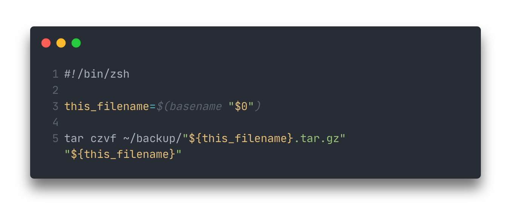

# Цель работы

Изучить основы программирования в оболочке ОС UNIX/Linux. Научиться писать небольшие командные файлы.

# Задание

Написать 4 скрипта (командных файла)

# Выполнение лабораторной работы

Первым заданием было написание скрипта, который при запуске должен архивировать сам себя 
(то есть файл, в котором содержится код данного скрипта) и копировать этот файл в директорию `~/backup`.

Ниже приведен листинг скрипта (рис. [-@fig:000]).

{#fig:000}

Следующим заданием было написать командный файл, обрабатывающий любое количество входных аргументов.
В случае написанного скрипта он просто выводил все приведенные аргументы.

Ниже приведен листинг командного файла (рис. [-@fig:001]).

.png){#fig:001 width=70%}

В предпоследнем задании было необходимо написать командный файл, являющийся аналогом `ls` 
без использования самой команды `ls` и `dir`. Командный файл должен был выводить информацию о 
доступе к файлам в директории.

Ниже приведен листинг командного файла (рис. [-@fig:002]).

.png){#fig:002}

Последнее задание заключалось в написании командного файла, считающего количество файлов 
в указанной директории с указанным расширением.

Ниже приведен листинг командного файла (рис. [-@fig:003]).

.png){#fig:003}

# Выводы

По выполнении лабораторной работы мы изучили основы программирования в оболочке ОС UNIX/Linux, а также научились писать небольшие командные файлы.

# Контрольные вопросы

1. Командная оболочка -- командный интерпретатор, в котором пользователь может либо давать команды операционной системе по отдельности, либо запускать скрипты, состоящие из списка команд.
Примерами командных оболочек являются `bash`, `zsh`, `tcsh`, `ksh`, `sh`, `fish`. 
Некоторые отличаются друг от друга кардинально, например синтаксисом, а некоторые только частью взаимодействия пользователя.
2. **POSIX** (Portable Operating System Interface for Computer Environments) -- набор стандартов описания интерфейсов взаимодействия операционной системы и прикладных программ.
3.
  - Переменные: `имя_переменной=текст переменной`, например `var=some text`
  - Массивы: `set -A имя_переменной предмет1 предмет2`, например `set -A colours red green blue`
4. Команда **let** является показателем того, что последующие аргументы представляют собой выражение, подлежащее вычислению.
Команда read позволяет читать значения переменных со стандартного ввода.
5. Сложение, вычитание, умножение, деление, а также побитовые операции.
6. Выполнение арифметической операции без возврата результата.
7. 
- HOME
- IFS
- MAIL
- TERM
- LOGNAME
8. Символы, имеющие для командного процессора специальный смысл. 
9. Используя метасимвол `\`.
10. Создавать в любом текстовом редакторе. 
Запуск производится либо через команду `bash командный_файл [аргументы]` (вместо bash возможна альтернативная командная оболочка), 
либо, если есть права на выполнение файла, то напрямую писать название файла, т.е. просто `командный_файл`.
11. Используя ключевое слово function, 
после которого следует имя функции и список команд, заключённых в фигурные скобки.
12. Используя команду `test` с флагом `-d` для проверки файла на то, что это каталог.
13.
  - `set` -- для создания массива, просмотр значения всех переменных
  - `typeset` -- можно использовать для объявления и присвоения переменной, а также работы с функциями
  - `unset` -- для изъятия переменной из программы, а также удаления функции
14. Через пробел.
15.
  - $* -- отображается вся командная строка или параметры оболочки
  - $? -- код завершения последней выполненной команды
  - $$ -- уникальный идентификатор процесса, в рамках которого выполняется командный процессор
  - $! -- номер процесса, в рамках которого выполняется последняя вызванная на выполнение в командном режиме команда
  - $- -- значение флагов командного процессора
  - ${#*} -- возвращает целое число — количество слов, которые были результатом $*
  - ${#name} -- возвращает целое значение длины строки в переменной name
  - ${name[n]} -— обращение к n-му элементу массива
  - ${name[*]} —- перечисляет все элементы массива, разделённые пробелом
  - ${name[@]} —- то же самое, но позволяет учитывать символы пробелы в самих переменных
  - ${name:-value} -— если значение переменной name не определено, то оно будет заменено на указанное value
  - ${name:value} —- проверяется факт существования переменной
  - ${name=value} -— если name не определено, то ему присваивается значение value
  - ${name?value} —- останавливает выполнение, если имя переменной не определено, и выводит value как сообщение об ошибке
  - ${name+value} -— это выражение работает противоположно ${name-value}. Если переменная определена, то подставляется value
  - ${name#pattern} -— представляет значение переменной name с удалённым самым коротким левым образцом (pattern)
  - ${#name[*]} и ${#name[@]} -— эти выражения возвращают количество элементов в массиве name.