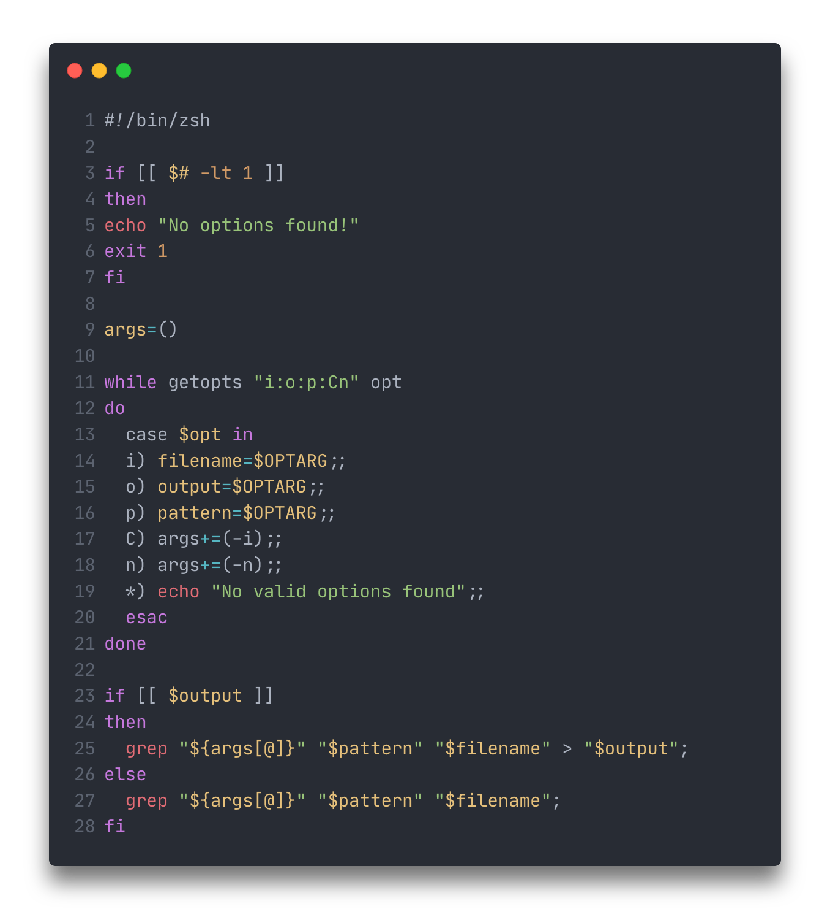
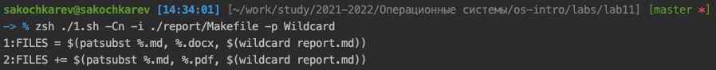
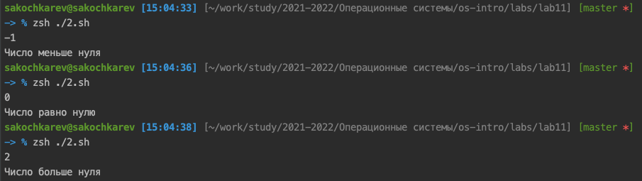
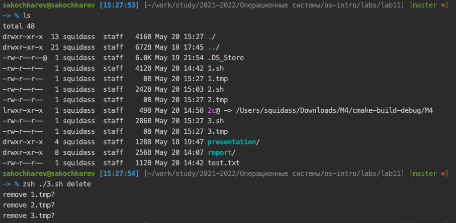
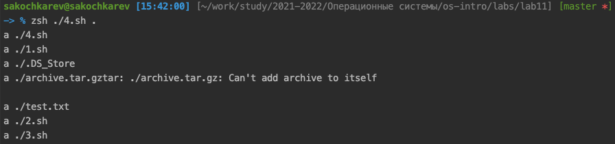

# Цель работы

Изучить основы программирования в оболочке ОС UNIX. Научится писать более сложные командные файлы с использованием логических управляющих конструкций и циклов.

# Задание

1. Написать командный файл используя `getopts` и `grep`
2. Написать программу на C и использовать командный файл как интерфейс
3. Написать командный файл создающий и удаляющий файлы
4. Написать командный файл пакующий определенные файлы

# Выполнение лабораторной работы

Первым заданием было написание командного файла, который использует команды `getopts` и `grep` для выполнения поиска с указанными параметрами.

Ниже приведен листинг итогового командного файла (рис. ), а также результат его работы (рис. ).

Следующим заданием было написание программы на языке C, которая читает ввод пользователя в виде числа и сравнивает это число с нулем. В зависимости от результата, программа завершается с разным кодом. В дополнение к данной программе должен был быть написан командный файл, выступающий интерфейсом для программы. Он должен запускать программу и считывать код выхода. В зависимости от кода выхода программа должна выводить сообщение.

Ниже приведен листинг итогового программного файла (рис. ), командного файла (рис. ), а также результат его работы (рис. ).

.png)

.png)

Предпоследним заданием было написание программы, которая создает и удаляет эти созданные файлы.

Ниже приведен листинг итогового командного файла (рис. ), а также результат его работы (рис. ).

.png)

И последним заданием было написание командного файла, который должен паковать все файлы в указанной директории, время изменения которых не позднее недели. 

Ниже приведен листинг итогового командного файла (рис. ), а также результат его работы (рис. ).

.png)

# Выводы

По выполнении лабораторной работы мы изучили основы программирования в оболочке ОС UNIX, а также научились писать более сложные командные файлы с использованием логических управляющих конструкций и циклов.

# Контрольные вопросы

1. Команда `getopts` предназначена для парсинга аргументов командной строки. Она используется для обработки всех входящих аргументов и позволяет устанавливать и выполнять действия на основе переданных аргументов.
2. Метасимволы позволяют задать шаблон имен файлов, например `*.txt` для всех файлов с расширением `.txt` или более сложный `[0-9]*\.tmp` для всех файлов формата `<число>.tmp`.
3. 
  - for
  - if 
  - case
  - while
4.
  - break -- для полного прерывания цикла
  - continue -- для пропуска оставшихся команд внутри итерации
5. Команды `true` и `false` сами по себе просто возвращают значение `true` или `false` соответственно. Значения же нужны для булеановых переменных и проверок. Например устанавлить значение переменной в цикле как `true`, чтобы после завершения цикла можно было понять, что цикл сделал что-то конкретное.
6. Данная строка проверяет, что существует некий файл(ы), находящийся в директории `man<переменная s>/` (например `man123/`) с названием `<переменная i>.<переменная s>` (например `test.123`). Пример полного пути к файлу для проверки -- `mantxt/test.txt`. Если файл существует и является обычным файлов, то выполняется `then`.
7. Можно сказать, что `until` является противоположностью `while`: если while выполняется пока его условие действительно, то until выполняется пока условие не верно, однако в любом случае выполняется хотя бы один раз.