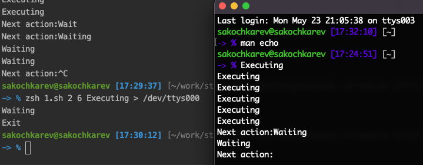
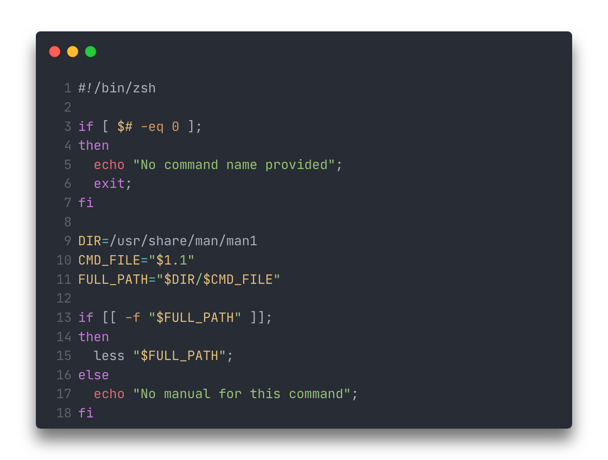
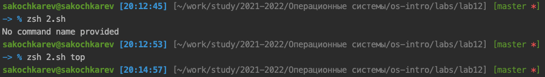
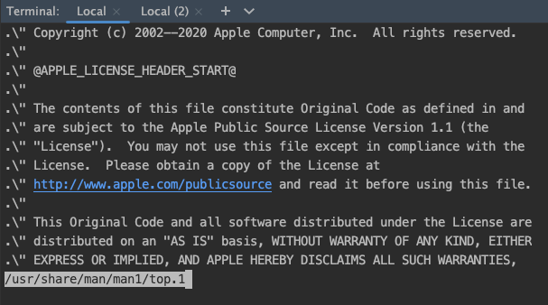
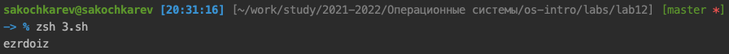

# Цель работы

Изучить основы программирования в оболочке ОС UNIX. Научиться писать более сложные командные файлы с использованием логических управляющих конструкций и циклов.

# Задание

1. Написать командный файл, реализующий упрощенный механизм семафоров.
2. Написать командный файл, аналог команды man.
3. Написать командный файл, генерирующий случайную строку.

# Выполнение лабораторной работы

Первым заданием было написание командного файла, реализующего упрощенный механизм семафоров.

Ниже приведен листинг итогового командного файла (рис. [-@fig:004]), а также результат его работы (рис. [-@fig:005]).

.png){#fig:006}

{#fig:007}

Следующим заданием было написание командного файла, который альтернирует поведение команды man. Командный файл принимает один аргумент -- название команды, мануал которой пользователь хочет просмотреть. 
Для работы командного файла была использована директория `/usr/share/man/man1`, в которой происходил поиска мануала приведенной команды. Далее мануал выводился с помощью команды `less`.

Ниже приведен листинг итогового командного файла (рис. [-@fig:001]), а также результат его работы (рис. [-@fig:002], [-@fig:003]).

{#fig:001}

{#fig:002}

{#fig:003}

Последним заданием было написание командного файла, который, используя встроенную переменную `$RANDOM` выводит случайную последовательности латинских букв. 

Ниже приведен листинг итогового командного файла (рис. [-@fig:004]), а также результат его работы (рис. [-@fig:005]).

.png){#fig:004}

{#fig:005}

# Выводы

По выполнении лабораторной работы мы изучили основы программирования в оболочке ОС UNIX, а также научились писать более сложные командные файлы с использованием логических управляющих конструкций и циклов.

# Контрольные вопросы

1. Синтаксическая ошибка заключается в отсутствии пробелов вокруг выражения в `[]`. Правильная строка:
```shell
while [ $1 != "exit" ]
```
2. Можно использовать подстановку переменных в строку. Например:
```shell
string1="hello"
string2="world"
result="${string1} ${world}"
```
3. Подобный `seq` функционал можно реализовать используя формат `(())` вместе с Си-подобным итерированием, например:
```shell
for ((i=0; i<10; i++)); do
  echo $i;
done
```
4. `3`.
5.
  - Прокаченное авто-дополнение
  - Переход без cd
  - Поправление ошибок
  - Переходы по истории
6. Да, синтаксис верен.
7. Сравнивая bash, например, с высокоуровневым языком программирования Python, `bash` уступает во многих сферах и применениях, так как это не нацеленный на разработку ПО язык, однако в среде UNIX, особенно в коммандных файлах (скриптах), ему практически нет равных.