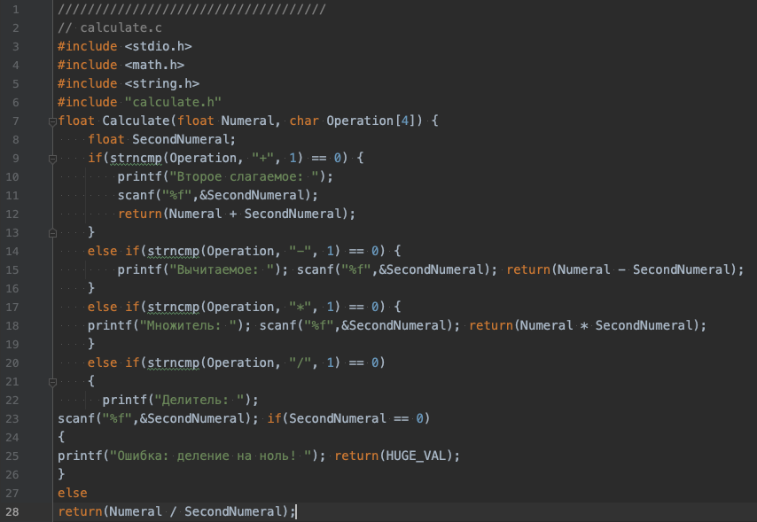
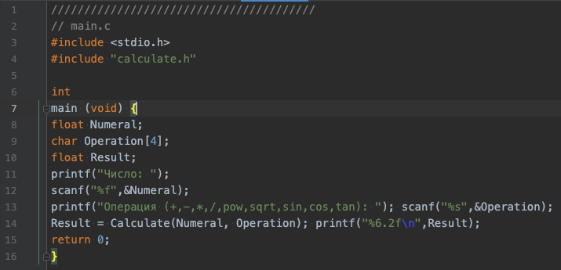

# Цель работы

Приобрести простейшие навыки разработки, анализа, тестирования и отладки приложений в ОС типа UNIX/Linux на примере создания на языке программирования С калькулятора с простейшими функциями.

# Задание

Написать программу и проанализировать ее код и выполнение.

# Выполнение лабораторной работы

Первым делом мы создали в домашнем каталоге подкаталог `~/work/os/lab_prog` командой `mkdir -p ~/work/os/lab_prog` (рис. [-@fig:001]).

{#fig:001}

Далее в нем были созданы три файла `calculate.h, calculate.c, main.c` (рис. [-@fig:002]).

{#fig:002}

В каждый из этих файлов были написаны соответствующие коды (рис. [-@fig:003], [-@fig:004], [-@fig:005]).

{#fig:003}

{#fig:004}

{#fig:005}

После этого была выполнена компиляция данных файлов (рис. [-@fig:006]).

{#fig:006}

Далее был создан `Makefile` (рис. [-@fig:007]), где был написан соответствующий код (рис. [-@fig:008]).

{#fig:007}

{#fig:008}

Код содержит в себе переменные с используемым компилятором, а также флагами для компиляции. В нем находится четыре цели, все из которых, кроме `clean` выполняют сам процесс компиляции. Цель `clean` позволяет удалить результаты компиляции.

Далее, используя `gdb` была выполнена отладка программы `calcul` (рис. [-@fig:009]).

{#fig:009}

В конце, используя утилиту `splint`, были проанализированы коды файлов `calculate.c` (рис. [-@fig:010]) и `main.c` (рис. [-@fig:011]).

{#fig:010}

{#fig:011}

# Выводы

По выполнении данной лабораторной работы мы приобрели простейшие навыки разработки, анализа, тестирования и отладки приложений в ОС типа UNIX/Linux на примере создания на языке программирования С калькулятора с простейшими функциями.

# Контрольные вопросы

1. Используя команду `man`. Например `man gdb`.
2. Придумать приложение, написать код, выпустить приложение.
3. В контексте языка программирования, суффикс -- это явный указатель типа литерала. Например:
```c
float f1 = 1.0L;
float f2 = 1.0;
float f3 = 1.0f;
float f4 = 1;
float f5 = 1ULL;
float f6 = (char)1;
float f7 = true; 
```
4. Для компилирования текстовых файлов с кодом программы в исполняемые файлы.
5. Для сборки разрабатываемого приложения и собственно компиляции.
6. Пример структуры:
```makefile
#
# Makefile for abcd.c
#
CC = gcc
CFLAGS =

# Compile abcd.c normaly
abcd: abcd.c
    $(CC) -o abcd $(CFLAGS) abcd.c
clean:
    -rm abcd *.o *~
# End Makefile for abcd.c
```
где *abcd* -- цель, строка ниже -- команда выполняемая при выполнении цели. *clean* -- тоже цель, однако не входящая в общий список целей при выполнении `make`. Она позволяет удалить результаты компиляции.
7. Программы отладки частично декомпилируют исполняемый файл. Для того, что декомпиляция была корректной, необходимо использовать флаг `-g` при компиляции.

8.

| Команда          | Описание действия                                                                                                                          |
|------------------|--------------------------------------------------------------------------------------------------------------------------------------------|
| backtrace        | вывод на экран пути к текущей точке останова (по сути вывод названий всех функций)                                                         |
| break            | установить точку останова (в качестве параметра может быть указан номер строки или название функции)                                       |
| clear            | удалить все точки останова в функции                                                                                                       |
| continue         | продолжить выполнение программы                                                                                                            |
| delete           | удалить точку останова                                                                                                                     |
| display          | добавить выражение в список выражений, значения которых отображаются при достижении точки останова программы                               |
| finish           | выполнить программу до момента выхода из функции                                                                                           |
| info breakpoints | вывести на экран список используемых точек останова                                                                                        |
| info watchpoints | вывести на экран список используемых контрольных выражений                                                                                 |
| list             | вывести на экран исходный код (в качестве параметра может быть указано название файла и через двоеточие номера начальной и конечной строк) |
| next             | выполнить программу пошагово, но без выполнения вызываемых в программе функций                                                             |
| print            | вывести значение указываемого в качестве параметра выражения                                                                               |
| run              | запуск программы на выполнение                                                                                                             |
| set              | установить новое значение переменной                                                                                                       |
| step             | пошаговое выполнение программы                                                                                                             |
| watch            | установить контрольное выражение, при изменении значения которого программа будет остановлена                                              |

9. 
    - Запускаем отладчик GDB, загрузив в него программу для отладки
    - Для запуска программы внутри отладчика вводим команду run
    - Для постраничного (по 9 строк) просмотра исходного код используем команду list
    - Для просмотра строк с 12 по 15 основного файла используем list с параметрами
    - Для просмотра определённых строк не основного файла используем list с параметрами
    - Устанавливаем точку останова в файле calculate.c на строке номер 21
    - Выводим информацию об имеющихся в проекте точка останова
    - Запускаем программу внутри отладчика и убеждаемся, что программа остановится в момент прохождения точки останова
    - Отладчик выдаст информацию, а команда backtrace покажет весь стек вызываемых функций от начала программы до текущего места.
    - Посмотрим, чему равно на этом этапе значение переменной Numeral, введя 110. На экран должно быть выведено число 5.
    - Сравниваем с результатом вывода на экран после использования команды
    - Убираем точки останова

10. Классная реакция. Показывает синтаксические ошибки в программе.
11. Визуализатор кода может быть полезен для понимания кода программы.
12. Анализ программного кода, проверка корректности задания аргументов использованных в программе функций и типов возвращаемых значений, а также обнаруживание синтаксических и семантические ошибки.