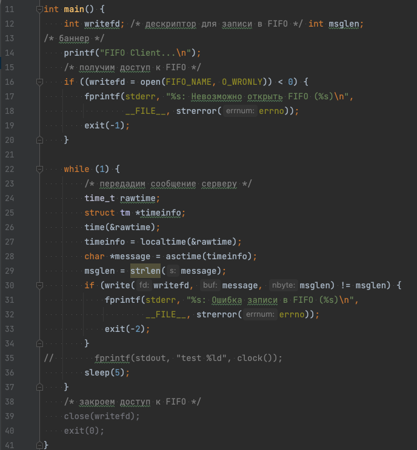

# Цель работы

Приобретение практических навыков работы с именованными каналами.

# Задание

Написать программы по примеру приведенных со следующими изменениями:
1. Работает не 1 клиент, а несколько (например, два).
2. Клиенты передают текущее время с некоторой периодичностью (например, раз в пять секунд). Используйте функцию sleep() для приостановки работы клиента.
3. Сервер работает не бесконечно, а прекращает работу через некоторое время (например, 30 сек). Используйте функцию clock() для определения времени работы сервера. Что будет в случае, если сервер завершит работу, не закрыв канал?

# Выполнение лабораторной работы

Первым делом мы взяли за основу приведенные тексты программ и создали файлы с данными текстами (рис. ) (рис. ) (рис. ).


После этого мы начали работать с программой `client.c`.

Там мы добавили второе приведенное изменение -- отправку текущего времени (timestamp) каждые 5 секунд (рис. ). Для приостановки работы клиента была использована функция `sleep()`.



Далее были произведены изменения в файле `server.c`. В нем были добавлены изменения из 3-его задания -- прекращение работы по истечению 30 секунд. Для этого была использована функция `time()`. Итоговый файл приведен на (рис.).


Во время работы над файлами изменения были протестированы.

В результате этих тестов было выяснено, что если сервер завершит работу не закрыв канал, то файл канала останется и при следующем запуске сервера он выдаст ошибку (рис.).


После выполнения всех заданий были произведены финальные тесты, которые подтвердили работоспособность и корректность выполнения всех заданий (рис. ) (рис.).


# Выводы

По выполнении данной лабораторной работы мы приобрели практические навыки работы с именованными каналами.

# Контрольные вопросы

1. Именованные каналы, в отличие от неименованных, могут использоваться неродственными процессами.
2. Нет.
3. Да, используя `mkfifo`.
4. `int pipe(int pipefd[2]);` создаёт однонаправленный канал данных, который можно использовать для взаимодействия между процессами.
5. Функция `int mkfifo(const char *pathname, mode_t mode);`создает специальный FIFO файл с именем pathname, а параметр mode задает права доступа к файлу.
6. 
При прочтении меньшего числа байтов из fifo сообщение просто выводится не полностью. 
Прочтение большего числа байтов дает уже более заметный эффект -- не находя достаточного количества информации в fifo, программа обращается к другим участкам памяти и выводит уже их, тем самым печатая информацию из других файлов.
7. Запись некорректного числа байтов непозволительна, поэтому вызов `write()` блокируется до выполнения корректной последовательности.
8. Да, два или более процессов могут одновременно записывать в один канал.
9. 
```c
ssize_t write(int fd, const void *buf, size_t count);
```
`ssize_t` -- тип возвращаемого значения
`int fd, const void *buf, size_t count` -- аргументы
Записывает байты в указанный буффер.
`1` на месте аргумента `fd` -- указание файлового дескриптора.
10. Функция `stderror` находит сообщение об ошибке, соответствующее приведенному номеру ошибки.