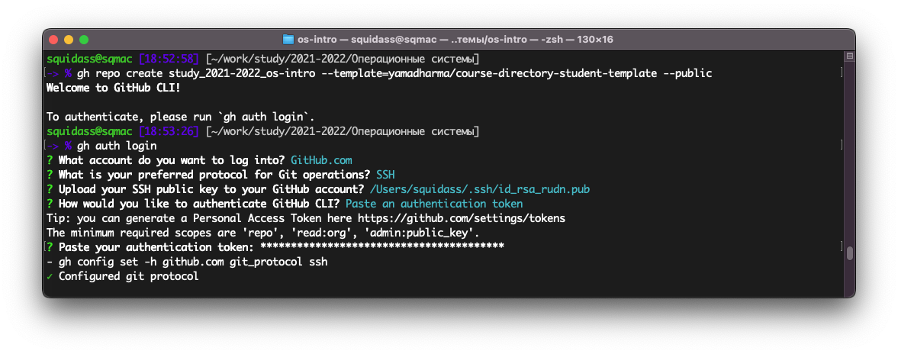

# Цель работы

Изучение идеологии и применение средств контроля версий. Освоение умения по работе с Git.

# Задание

- Создать базовую конфигурацию для работы с git. 
- Создать ключ SSH.
- Создать ключ PGP.
- Настроить подписи git.
- Зарегистрироваться на GitHub.
- Создать локальный каталог для выполнения заданий по предмету.

# Выполнение лабораторной работы

В пунктах 2.1 по 2.5 были изучены азы системы контроля версий Git, а также команды, используемые для работы.

В пункте 5 был основной процесс выполнения лабораторной работы №2.

Предварительно был создан аккаунт на GitHub (рис. [-@fig:001]).

{#fig:001}

Также предварительно были скачены утилиты git, такие как git и gh. В процессе работы над лабораторной работой была также установлена утилита git-flow (рис. [-@fig:002]).

{#fig:002}

Далее была проведена базовая конфигурация утилиты git путем введения команд конфигурации (рис. [-@fig:003], [-@fig:004]).

{#fig:003}

{#fig:004}

После этого был создан ssh ключ (рис. [-@fig:005]) и добавлен в GitHub (рис. [-@fig:006]).

{#fig:005}

{#fig:006}

Следующим шагом было создание пары ключей gpg (рис. [-@fig:007]).

{#fig:007}

После этого созданный ключ был добавлен в Github (рис. [-@fig:008], [-@fig:009]).

{#fig:008}

{#fig:009}

Конечным шагом после добавления GPG ключа в Github была дополнительная конфигурация git, чтобы все коммиты автоматически подписывались данным ключом (рис. [-@fig:010]).

{#fig:010}

После того, как все предварительные настройки были завершены, я перешел к созданию репозитория курса на основе шаблона.

Для этого были созданы рабочие директории (рис. [-@fig:011]).

{#fig:011}

Далее было необходимо создать репозиторий используя приведенный репозиторий как шаблон, однако перед этим было необходимо дать доступ к Github утилите gh (рис. [-@fig:012]).

{#fig:012}

После этого был скопирован и создан на примере приведенного репозитория собственный репозиторий для дальнейшей работы (рис. [-@fig:013]).

{#fig:013}

Далее созданный репозиторий был скопирован на локальную машину (рис. [-@fig:014]).

{#fig:014}

После была проведена процедура настройки каталога курса. Был удален лишний файл, далее с помощью приведенного документа были созданы дополнительные каталоги и после этого все файлы были отправлены на сервер (рис. [-@fig:015], [-@fig:016]).

{#fig:015}

{#fig:016}

# Выводы

Была изучена идеология и применение средств контроля версий. Было освоено умение по работе с git. Дополнительно мы познакомились с платформой Github, а также в некоторых моментах была изучена дополнительная информация для решения встретившихся проблем.

# Ответы на контрольные вопросы

1. Системы контроля версий — это набор программного обеспечения, которые предназначаются для работы нескольких человек над одним проектом.
2. 
    - Хранилище — сервер, на котором хранится вся история изменений проекта.
    - Commit — фиксация "дельта-изменений", т.е. изменений с последнего commit’a с его последующей записью как версии в истории.
    - История — список всех изменений проекта с возможностью отката в любую точку истории.
    - Рабочая копия — все файлы проекта, с которыми происходит основная работа.
3. В централизованных VCS необходим центральный репозиторий для хранения файлов. Примером таковых могут служить CVS и Subversion. В децентрализованных VCS наличие центрального репозитория не обязательно. Децентрализованными VCS являются Git, Bazaar и Mercurial.
4. Инициализация системы управления версиями git через git init. Работа над проектом используя git-flow для отдельных частей проекта. Git commit для фиксации изменений. При необходимости использование удаленного сервера для хранения с помощью remote и git push. Удаленный сервер также позволяет работать с нескольких устройств с использованием git pull.
5. При существующей версии проекта в хранилище, скопировать его оттуда через git pull. Использовать git-flow для работы над частями проекта. После окончания работы зафиксировать изменения через git commit и загрузить в хранилище через git push.
6. Ведение истории изменений, фиксирование изменений, совмещение версий, веток и др., а также откат к прошлым версиям.
7.
    - git init — инициализация проекта с системой контроля версий
    - git add — добавление файла/директории в систему контроля версий как отслеживаемое
    - git commit — фиксация изменений в отслеживаемых файлах
    - git push — загрузка локальной версии на сервер
    - git pull — выгрузка актуальной версии с сервера
    - git fetch — "часть" команды git pull, которая собирает актуальную версию, но не вносит её в работу 
    - git merge — слияние веток
8. При работе с локальным репозиторием все изменения хранятся локально и не выгружаются на удаленный сервер. Не требуется использование команд push, pull, remote и т.д. При работе с удаленным репозиторием для отображения изменения на удаленном репозитории и его актуализации, последние изменения должны быть загружены на удаленный сервер.
9. Ветви позволяют "разделять" части работы и работать отдельно над каждой имплементацией. Использование ветвей дает возможность комфортной ревизии и обработки нововведений в основную ветвь, которая чаще всего является релизной. 
10. Игнорирование файлов при commit происходит с помощью .gitignore файла. В нем указываются пути, названия, расширения и другие идентификации нежелательных объектов которые не будут учитываться в commit. Это полезно для исключения как "мусорных" файлов, которые не являются значимой частью проекта, а также конфиденциальных файлов, которые содержат в себе приватную информацию, такую как пароли и токены.