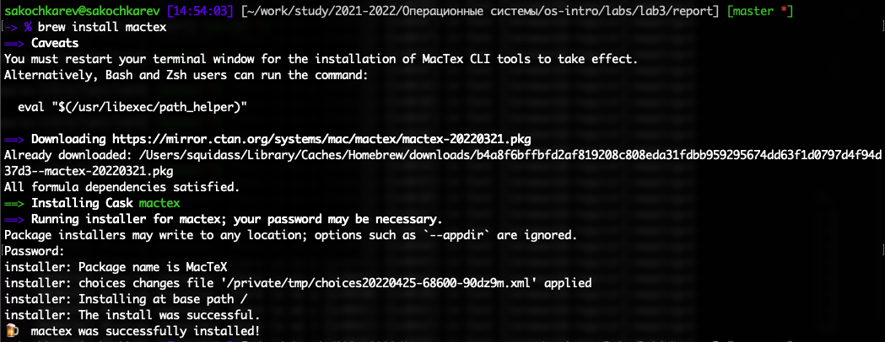

## Цель работы

Научиться оформлять отчеты с помощью легковесного языка разметки Markdown.

## Задание

- Сделать отчет по предыдущей лабораторной работе в формате Markdown.
- В качестве отчета предоставить отчеты в 3 форматах: pdf, docx и md.

# Выполнение лабораторной работы

##

Установка утилит pandoc и pandoc-crossref (утилита pandoc-citeproc встроена в пакет pandoc).

##

Далее был написан тестовый .md файл, который позже был преобразован в .pdf файл. 

## {.standout}

Однако на этом этапе возникли проблемы. Как оказалось позже, не был установлен LaTeX.

##

Далее шли долгие часы поиска решения вставших проблем. Первым шагом к решению была установка basictex. Однако попытка конвертации .md файла вновь не увенчалась успехом. Далее была установлена утилита biber, которой, как предполагалось, и не хватало для правильной работоспособности.

## {.standout}

Однако и после этого тестовый файл не компилировался. 

## 

Скачен и установлен дополнительный пакет biblatex-gost.

## {.standout}

Однако и это не дало ожидаемого результата. .md файл все так же не компилировался.

##

В попытках исправить проблемы был удален "обрезанный" basictex и установлен mactex (mactex-no-gui), который является более "полным" пакетом.

##

После установки и некоторых дополнительных изменений тестовый файл стал нормально преобразовываться.

##

- Вынесение метадата-блока в отдельный .yaml файл
- Дополнительные изменения в файле
- Проверка тестового файла

##

После того, как тестовый файл был полностью проверен, было время приступить к выполнению основного задания и переписать отчет второй лабораторной работы в формате .md. 

В результате отчет был успешно переписан.

##

Который впоследствии был преобразован в pdf и docx файлы.

## Выводы

Мы научились оформлять отчеты с помощью легковесного языка Markdown и преобразовывать их в другие форматы.