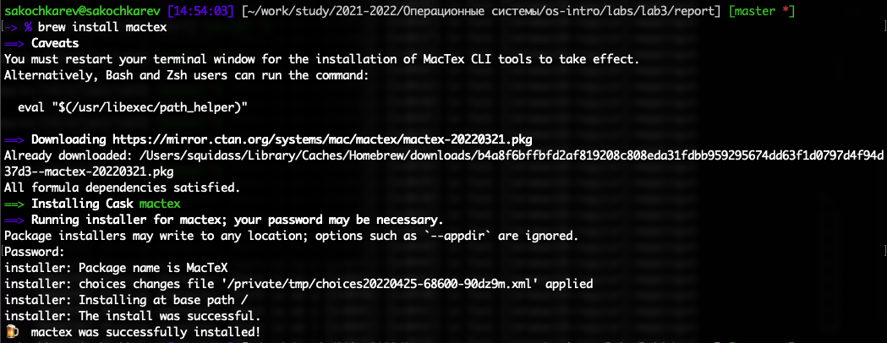

# Цель работы

Научиться оформлять отчеты с помощью легковесного языка разметки Markdown.

# Задание

- Сделать отчет по предыдущей лабораторной работе в формате Markdown.
- В качестве отчета предоставить отчеты в 3 форматах: pdf, docx и md.

# Выполнение лабораторной работы

Первым делом были установлены утилиты pandoc и pandoc-crossref (утилита pandoc-citeproc встроена в пакет pandoc) (рис. [-@fig:001]).

{#fig:001}

Далее был написан тестовый .md файл (рис. [-@fig:002]), который позже был преобразован в .pdf файл. 

{#fig:002}

Однако на этом этапе возникли проблемы. Как оказалось позже, не был установлен LaTeX.

Далее шли долгие часы поиска решения вставших проблем. Первым шагом к решению была установка basictex. Однако попытка конвертации .md файла вновь не увенчалась успехом. Далее была установлена утилита biber, которой, как предполагалось, и не хватало для правильной работоспособности (рис. [-@fig:003]).

{#fig:003}

Однако и после этого тестовый файл не компилировался. 

Следуя выводящимся ошибкам был также скачен и установлен дополнительный пакет biblatex-gost (рис. [-@fig:004]).

{#fig:004}

Однако и это не дало ожидаемого результата. .md файл все так же не компилировался.

В попытках исправить проблемы был удален "обрезанный" basictex и установлен mactex (mactex-no-gui), который является более "полным" пакетом (рис. [-@fig:005]).

{#fig:005}

После установки и некоторых дополнительных изменений тестовый файл стал нормально преобразовываться (рис. [-@fig:006]).

{#fig:006}

Далее были сделаны некоторые изменения в его формате (metadata блок был вынесен в отдельный файл).

После того, как тестовый файл был полностью проверен, было время приступить к выполнению основного задания и переписать отчет второй лабораторной работы в формате .md. 

В результате отчет был успешно переписан (рис. [-@fig:007]).

{#fig:007}

Который впоследствии был преобразован в pdf и docx файлы (рис. [-@fig:008]).

{#fig:008}

# Выводы

Мы научились оформлять отчеты с помощью легковесного языка Markdown и преобразовывать их в другие форматы.
