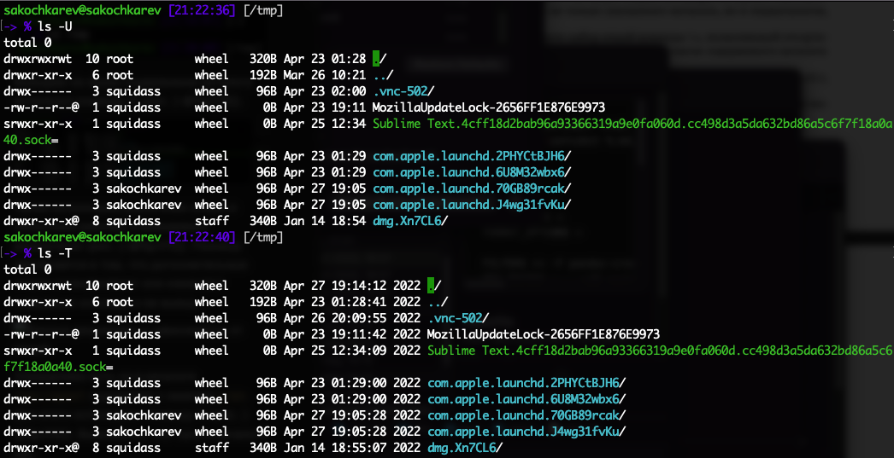

## Цель работы

Приобретение практических навыков взаимодействия пользователя с системой посредством командной строки.

# Выполнение лабораторной работы

##

##

##

##

##

Определяем есть ли в каталоге `/var/spool` подкаталог с именем `cron`.

##

##

##

##

##

##

Пробуем удалить ранее созданный каталог `~/newdir`.

##

Пробуем удалить подкаталог `~/newdir/morefun`.

##

Определяем, какую опцию команды ls нужно использовать для просмотра содержимого не только указанного каталога, но и подкаталогов, входящих в него.

##

Находим опцию, позволяющую отсортировать выводимый список по времени последнего изменения.

##

Просматриваем описание команд cd, pwd, mkdir, rmdir, rm и их пояснения.

- cd - перейти в каталог
- pwd - вернуть название рабочей директории
- mkdir - создать каталог
- rmdir - удалить каталог
- rm - удалить вхождение в каталог

##

##

##

##

##

##

Модифицируем и исполняем несколько команд из буфера команд.

##

## Выводы

Мы приобрели практические навыки взаимодействия пользователя с системой посредством командной строки.