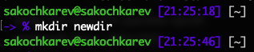
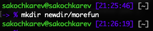
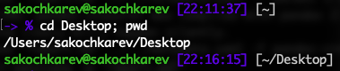

# Цель работы

Приобретение практических навыков взаимодействия пользователя с системой посредством командной строки.

# Выполнение лабораторной работы

Определяем полное имя домашнего каталога (рис. [-@fig:001]).

{#fig:001}

Переходим в каталог /tmp (рис. [-@fig:002]).

{#fig:002}

Выводим на экран содержимое каталога используя команду ls (рис. [-@fig:003]).

{#fig:003}

Также используем различные опции и объясняем разницу в выводимых результатах (рис. [-@fig:004]).
Разница заключается в том, что дополнительные опции устанавливают или изменяют поведение команды и ее вывод.

{#fig:004}

Определяем есть ли в каталоге `/var/spool` подкаталог с именем `cron`. Для этого используем команду ls (рис. [-@fig:005]). 
Выясняется, что такого каталога нет.

{#fig:005}

Переходим в домашний каталог (рис. [-@fig:006]) и просматриваем владельцев файлов и директорий с помощью команды ls (рис. [-@fig:007]).

{#fig:006}

{#fig:007}

В домашнем каталоге создаем новый каталог с именем newdir (рис. [-@fig:008]).

{#fig:008}

В созданном каталоге (`~/newdir`) создаем новый каталог с именем morefun (рис. [-@fig:009]).

{#fig:009}

В домашнем каталоге одной командой создаем три новых каталога с именами letters, memos, misk (рис. [-@fig:010]).

{#fig:010}

Затем эти каталоги удаляем одной командой (рис. [-@fig:011]).

{#fig:011}

Пробуем удалить ранее созданный каталог `~/newdir` командой rm (рис. [-@fig:012]).
После проверки выясняется, что каталог не удалился.

{#fig:012}

Пробуем удалить подкаталог `~/newdir/morefun` (рис. [-@fig:013]) той же командой rm. Каталог не удалился.

{#fig:013}

С помощью команды man определяем, какую опцию команды ls нужно использовать для просмотра содержимого не только указанного каталога, но и подкаталогов, входящих в него (рис. [-@fig:014]).

{#fig:014}

С помощью команды man находим опцию, позволяющую отсортировать выводимый список по времени последнего изменения (рис. [-@fig:015]).

{#fig:015}

Используем команду man для просмотра описания команд cd, pwd, mkdir, rmdir, rm и их пояснения (рис. [-@fig:016], [-@fig:017], [-@fig:018], [-@fig:019], [-@fig:020]).

{#fig:016}

{#fig:017}

{#fig:018}

{#fig:019}

{#fig:020}

- cd - перейти в каталог
- pwd - вернуть название рабочей директории
- mkdir - создать каталог
- rmdir - удалить каталог
- rm - удалить вхождение в каталог

Используя команду history и ее вспомогательные команды, модифицируем и исполняем несколько команд из буфера команд (рис. [-@fig:021], [-@fig:022]).

{#fig:021}

{#fig:022}

# Выводы

Мы приобрели практические навыки взаимодействия пользователя с системой посредством командной строки.

# Ответы на контрольные вопросы

1. Командная строка — это метод взаимодействия человека с компьютером через вводимый текст (команды).
2. pwd. Пример: `pwd`.

3. При помощи команды `ls` с флагом `-F`.

4. Используя флаг `-a`. Он отображает скрытые файлы и директории, т.е. начинающиеся с точки.

5. Каталог можно удалить как при помощи команды rmdir, так и используя команду rm с флагом `-r`. Команда rm более универсальна и позволяет удалять как каталоги, так и файлы.

6. Команда history выводит список всех последних использованных команд.
7. Использовать формат `!<номер_команды>:s/<что_меняем>/<на_что_меняем>`.

8.

9. Символы экранирования — символы, заменяющие управляющие символы на соответствующие текстовые подстановки. Чаще всего используется `\` (backslash).

10. При использовании флага `-l` в команде ls в вывод добавляется такая информация как "режим" файла, разрешения к файлу/директории, владелец, группа-владелец, размер, дата и время последнего изменения и имя.

11. Относительный путь к файлу — это путь, который начинается не с "корня" (`/`), а с, например, домашней директории пользователя (`~`).

12. Можно использовать краткий вывод помощи, используя флаг `—help`, например `man —help`, либо же, используя команду вывода целого мануала команды — man, например `man man`.

13. Клавиша Tab.