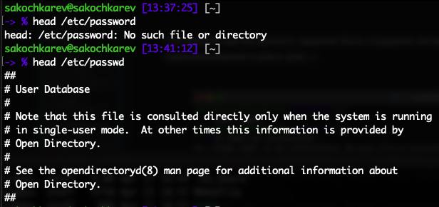

## Цель работы

Ознакомление с файловой системой Linux, её структурой, именами и содержанием каталогов. Приобретение практических навыков по применению команд для работы с файлами и каталогами, по управлению процессами (и работами), по проверке использования диска и обслуживанию файловой системы.

## Задание

- Выполнение приведенных примеров
- Выполнение приведенных действий
- Определение опций команды chmod
- Проделывание приведенных упражнений
- Изучение мануалов к определенным командам

# Выполнение лабораторной работы

## {.standout}

Первым заданием было выполнение приведенных примеров

##

Копирование файлов и каталогов

##

Рекурсивное копирование каталогов

##

Перемещение и переименование файлов и каталогов

##

Права и создание файлов и изменение их прав

##

Выполнение команды `fsck /dev/sda1`

## {.standout}

После выполнения примеров из теоретического введения мы перешли к выполнению приведенных действий

##

Копирование файла `/usr/include/sys/io.h` в домашний каталог

Был использован файл `/Library/Developer/CommandLineTools/SDKs/MacOSX.sdk/usr/include/sys/ioctl.h`.

##

Создание директории `~/ski.places` и перемещение файла equipment

##

Переименование в `equiplist`

##

Создание, перемещение и переименование файла abc1

##

Создание подкаталога equipment в каталоге `~/ski.places` и перемещение файлов equiplist и equiplist2

##

Создание каталога `~/newdir`, его перемещение в каталог `~/ski.places` и переименование в plans.

##

Определение опций команды `chmod` для присвоения перечисленным файлам определенные права доступа

## {.standout}

Далее шло второе задание с выполнением ряда действий. 

##

Просмотр содержимого файла `/etc/password`.

Начальные строки файла были просмотрены командой `head /etc/passwd`.

##

Файл `~/feathers` был скопирован в файл `~/file.old`. Скопированный файл был перемещен в `~/play`. Каталог `~/play` был скопирован в каталог `~/fun` и каталог `~/fun` в оригинальный каталог `~/play` и переименован в games.

## {.standout}

Последующие действия были связаны с правами доступа. 

##

Изменение прав доступа для файла `~/feathers` -- у владельца отбиралось право на чтение

##

Изменение прав доступа для каталога `~/play` -- у владельца данного каталога были отобраны права на выполнение

## {.standout}

Прочтение мануала по командам mount, fsck, mkfs, kill и охарактеризация с приведенными примерами

##

- Команда mount
  - Мануал
  - Монтирует файловую систему
  - Пример: `mount /media/hdd`

##

##

- Команда fsck
  - Мануал
  - Проверка и восстановление файловой системы Linux
  - Пример: `fsck /dev/sda1`

##

##

- Команда mkfs
  - Мануал
  - Создание и форматирование файловых систем Linux
  - Пример: `mkfs -t ext4 /dev/sdb1`

##

##

- Команда kill
  - Мануал
  - Посылает сигнал процессу или выводит список допустимых сигналов
  - Пример: `kill -9 1234`

##

## Выводы

По выполнении лабораторной работы мы ознакомились с файловой системой Linux, её структурой, именами и содержанием каталогов. Также были приобретены практические навыки по применению команд для работы с файлами и каталогами, по управлению процессами (и работами), по проверке использования диска и обслуживанию файловой системы.
