# Цель работы

Ознакомление с файловой системой Linux, её структурой, именами и содержанием каталогов. Приобретение практических навыков по применению команд для работы с файлами и каталогами, по управлению процессами (и работами), по проверке использования диска и обслуживанию файловой системы.

# Задание

- Выполнение приведенных примеров
- Выполнение приведенных действий
- Определение опций команды chmod
- Проделывание приведенных упражнений
- Изучение мануалов к определенным командам

# Выполнение лабораторной работы

Первым заданием было выполнение приведенных примеров.

Первым примером было копирование файлов и каталогов (рис. [-@fig:001]).

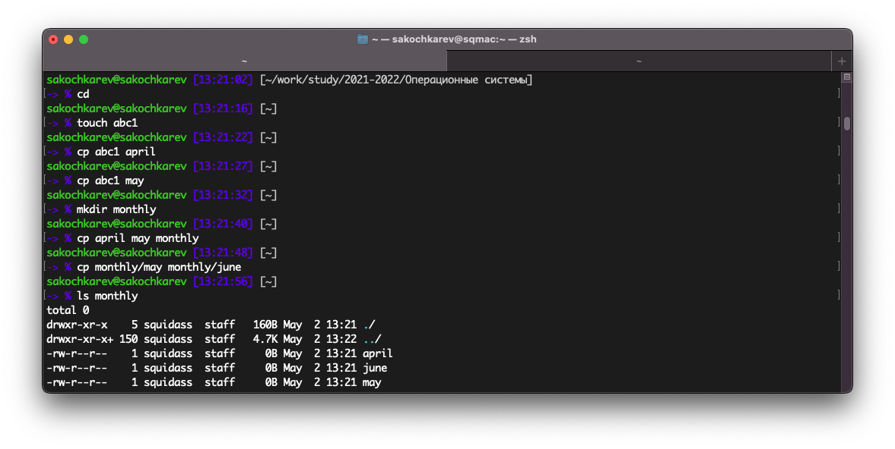{#fig:001}

Далее было выполнение примеров с рекурсивным копированием каталогов (рис. [-@fig:002]).

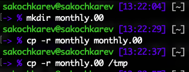{#fig:002}

После этого были выполнены примеры перемещения и переименования файлов и каталогов (рис. [-@fig:003]).

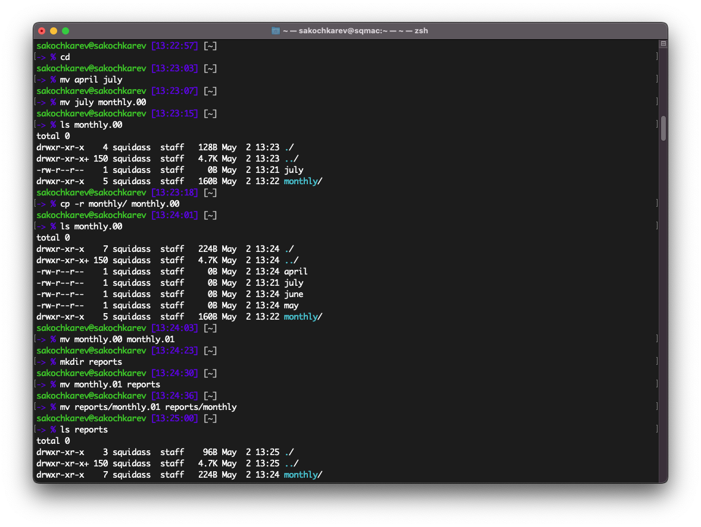{#fig:003}

Следующей темой были права и в соответствующем примере мы создавали файлы и изменяли их права (рис. [-@fig:004]).

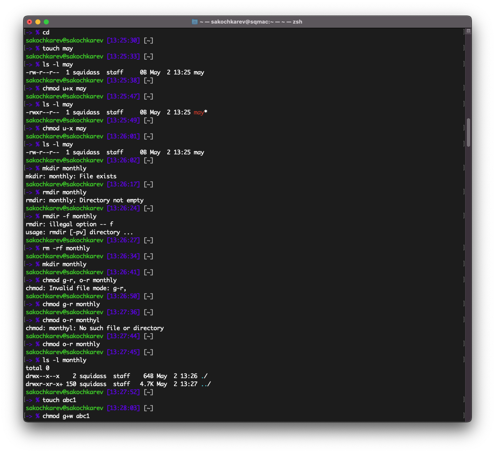{#fig:004}

Последним выполненным примером было выполнение команды `fsck /dev/sda1`, однако указанного в примере файла `/dev/sda1` не было в системе, поэтому команда вывела ошибку (рис. [-@fig:005]).

{#fig:005}

После выполнения примеров из теоретического введения мы перешли к выполнению приведенных действий.

Первым действием было копирование файла `/usr/include/sys/io.h` в домашний каталог, однако на моем устройстве такого файла не было, поэтому был использован аналогичный файл `/Library/Developer/CommandLineTools/SDKs/MacOSX.sdk/usr/include/sys/ioctl.h`. Он был скопирован в домашнюю директорию и переименован в equipment (рис. [-@fig:006]).

{#fig:006}

После в домашнем каталоге была создана директория `~/ski.places` и в созданный каталог был перемещен файл equipment (рис. [-@fig:007]).

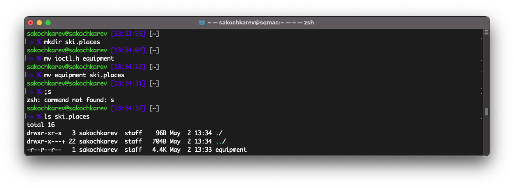{#fig:007}

После этого перемещенный файл был переименован в `equiplist` (рис. [-@fig:008]).

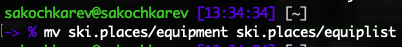{#fig:008}

Далее в домашнем каталоге был создан файл abc1. Этот файл был перемещен в созданный ранее каталог `~/ski.places` и переименован в equiplist2 одной командой (рис. [-@fig:009]). 

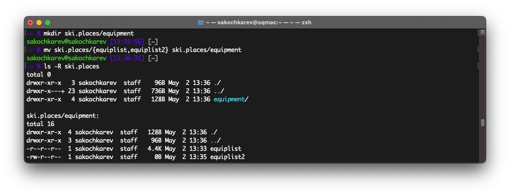{#fig:009}

После в каталоге `~/ski.places` был создан подкаталог equipment и туда были перемещены файлы equiplist и equiplist2 (рис. [-@fig:010]).

{#fig:010}

Последним шагом данного задания было создание каталога `~/newdir`, его перемещение в каталог `~/ski.places` и переименование в plans (рис. [-@fig:011]).

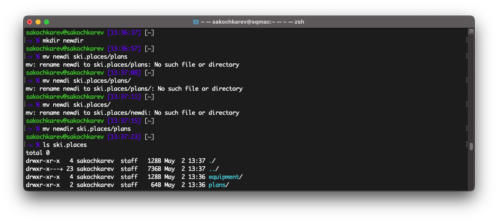{#fig:011}

Следующим заданием было определение опций команды `chmod` для присвоения перечисленным файлам определенные права доступа. Для выражения прав доступа были использованы нумеричные значения. Используя приведенную в теоретическом введении таблицу получились следующие результаты (рис. [-@fig:012]).

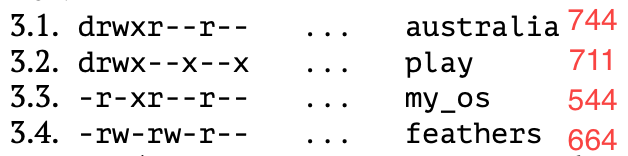{#fig:012}

Далее шло второе задание с выполнением ряда действий. 

Первым шагом был просмотр содержимого файла `/etc/password`. Однако такого файла в системе нет и было предположено, что имелся ввиду файл `/etc/passwd`. Начальные строки файла были просмотрены командой `head /etc/passwd` (рис. [-@fig:013]).

{#fig:013}

Далее файл `~/feathers` (который предварительно пришлось создать) был скопирован в файл `~/file.old`. После этого скопированный файл был перемещен в предварительно созданный каталог `~/play`. Далее каталог `~/play` был скопирован в каталог `~/fun` и каталог `~/fun` был скопирован в оригинальный каталог `~/play` и переименован в games (рис. [-@fig:014]).

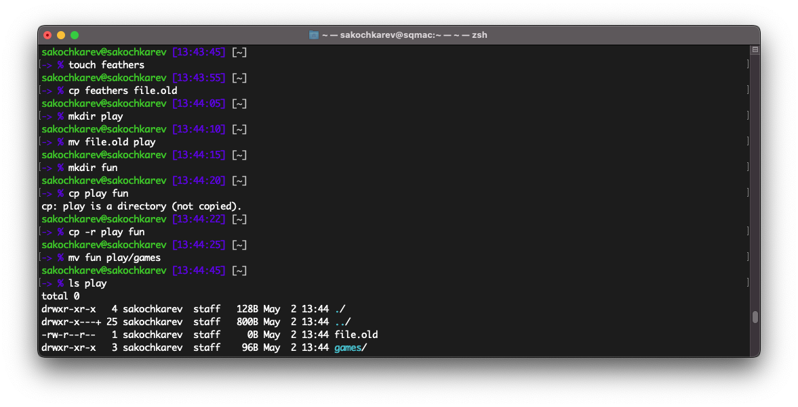{#fig:014}

Последующие действия были связаны с правами доступа. 

Для созданного ранее файла `~/feathers` права доступа были изменены так, что у владельца отбиралось право на чтение. При попытке просмотра файла командой `cat ~/feathers` или его копирования командой `cp feathers play` выдавало ошибку прав доступа. После этого права на чтение были возвращены (рис. [-@fig:015]).

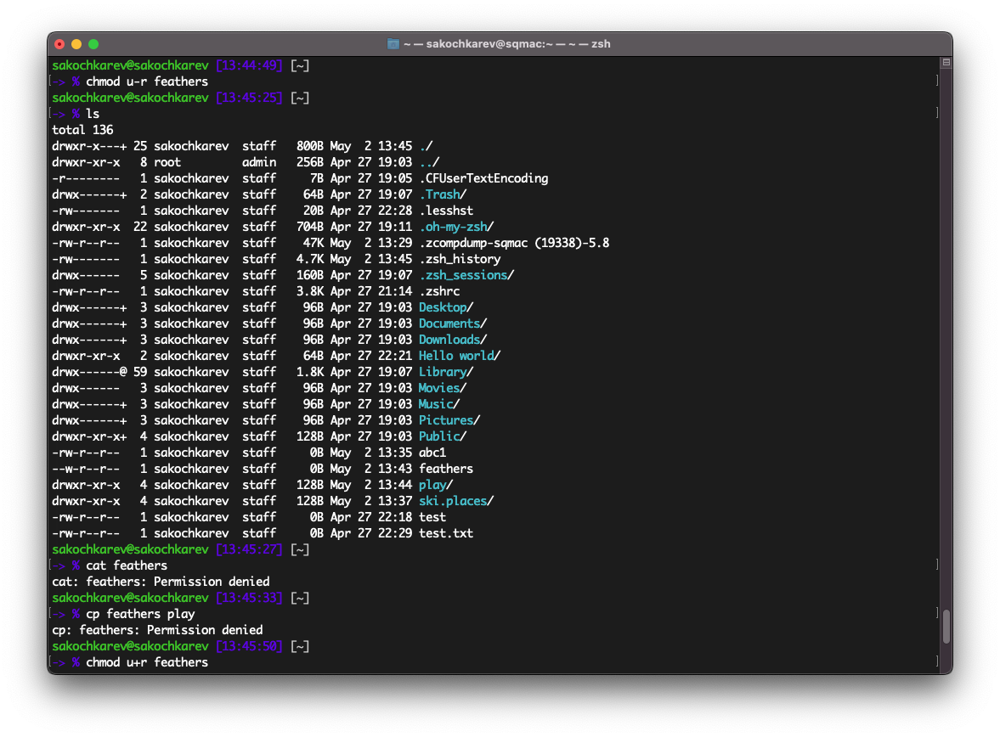{#fig:015}

Далее права были изменены для каталога `~/play`. У владельца данного каталога были отобраны права на выполнение. При попытке перехода в каталог командой `cd play` была ошибка прав доступа. После этого права на выполнение были возвращены владельцу (рис. [-@fig:016]).

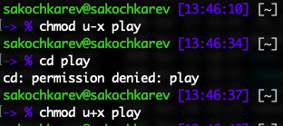{#fig:016}

Последним заданием было прочтение мануала по командам `mount, fsck, mkfs, kill` и охарактеризация с приведенными примерами.

- Команда mount
  - Мануал (рис. [-@fig:017])
  - Монтирует файловую систему
  - Пример: `mount /media/hdd`
- Команда fsck
  - Мануал (рис. [-@fig:018])
  - Проверка и восстановление файловой системы Linux
  - Пример: `fsck /dev/sda1`
- Команда mkfs
  - Мануал (рис. [-@fig:019])
  - Создание и форматирование файловых систем Linux
  - Пример: `mkfs -t ext4 /dev/sdb1`
- Команда kill
  - Мануал (рис. [-@fig:020])
  - Посылает сигнал процессу или выводит список допустимых сигналов
  - Пример: `kill -9 1234`

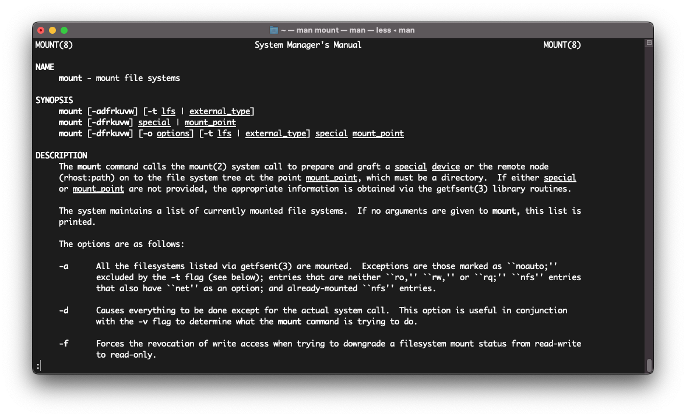{#fig:017}

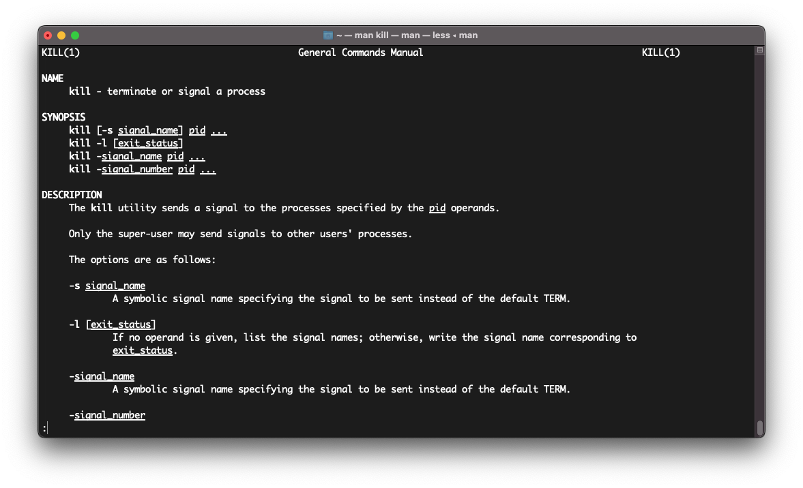{#fig:018}

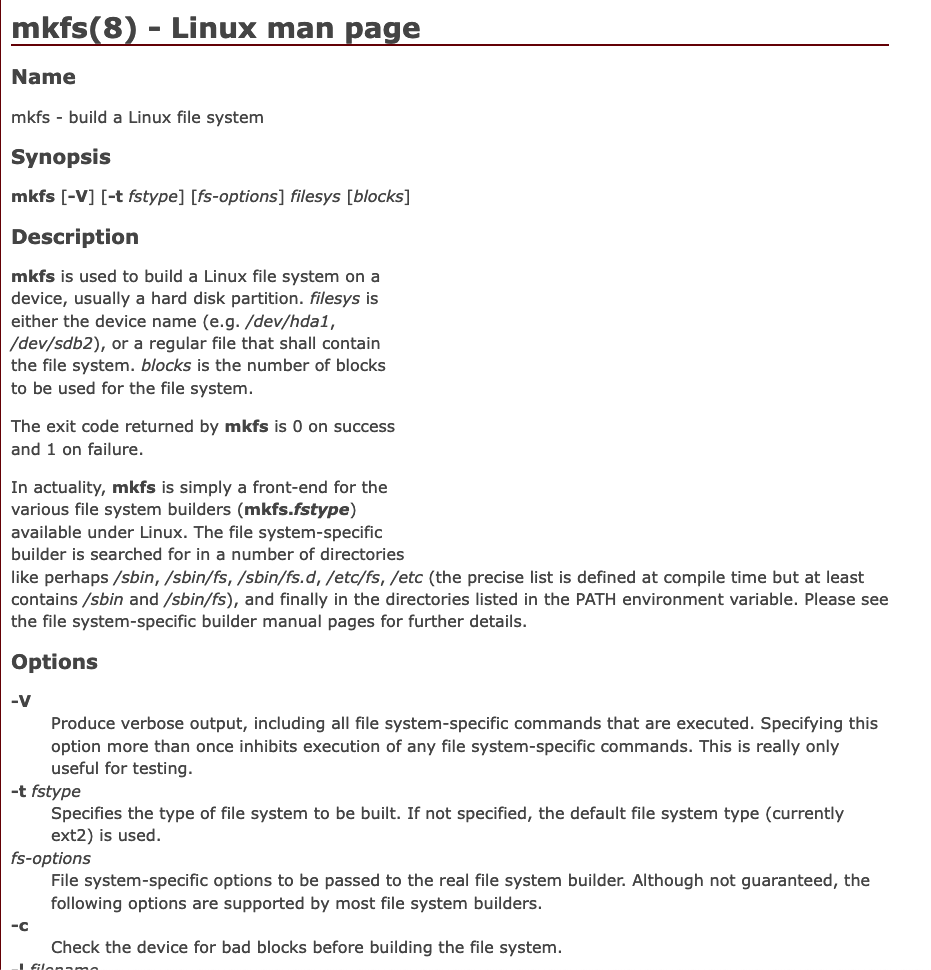{#fig:019}

{#fig:020}

# Выводы

По выполнении лабораторной работы мы ознакомились с файловой системой Linux, её структурой, именами и содержанием каталогов. Также были приобретены практические навыки по применению команд для работы с файлами и каталогами, по управлению процессами (и работами), по проверке использования диска и обслуживанию файловой системы.

# Ответы на контрольные вопросы

1. Файловые системы на машине (рис. [-@fig:021])
  - **APFS** -- Apple File System. Проприетарная файловая система, разработанная Apple и используемая в продуктах данной компании. 
  - **devfs**. Специальная файловая система, содержащая репрезентации физических девайсов.
  - **lifs** -- Linking File system. Файловая система Microsoft, используемое в ОС Windows (Vista и выше) для записи оптических дисков, отформатированных в файловую систему UDF.
2. Общая структура файловой системы APFS
  ```
    /
    ├── Applications — установленные приложения
    ├── Library — хранилище файлов программ
    ├── System — хранилище файлов системы
    ├── Users — директория с директориями пользователей
    ├── Volumes — смонтированные диски
    ├── bin — исполняемые файлы пользователя
    ├── cores 
    ├── dev — файлы устройства
    ├── etc -> private/etc
    ├── home -> /System/Volumes/Data/home — домашние директории
    ├── opt — дополнительные приложения
    ├── private — закрытая директория файлов
    ├── sbin — исполняемые файлы системы
    ├── tmp -> private/tmp — временная папка
    ├── usr — программы пользователя
    └── var -> private/var — переменные файлы
  ```
3. `mount <путь к файловой системе>`
4. Основными причинами нарушения целостности файловой системы являются как некорректное прерывание операций ввода-вывода, так и нарушение работоспособности кэша.
Для устранения повреждений файловой системы можно использовать специализированные утилиты, такие как `fsck`. Они позволяют проверить целостность и предпринять возможные меры.
5. Для этого существую специализированные утилиты, такие как `mke2fs`, которые позволяют создать файловую систему с гибкими параметрами настройки.
6.  
  - cat имя-файла -- Для просмотра файлов небольшого размера
  - less имя-файла -- Для просмотра файлов постранично
  - head имя-файла -- Команда head выводит по умолчанию первые 10 строк файла
  - tail имя-файла -- Команда tail выводит умолчанию 10 последних строк файла
7. Копирование файлов, директорий (с содержимым и без (рекурсивно)), одновременное переименование т создание ссылок.
8. Перемещение файлов, директорий (с содержимым и без (рекурсивно)), переименование файлов и каталогов.
9. Права доступа -- это совокупность правил, регламентирующих условия доступа пользователя(ей) к объектам системы. Права доступа могут быть изменены командой `chmod`.
