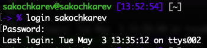
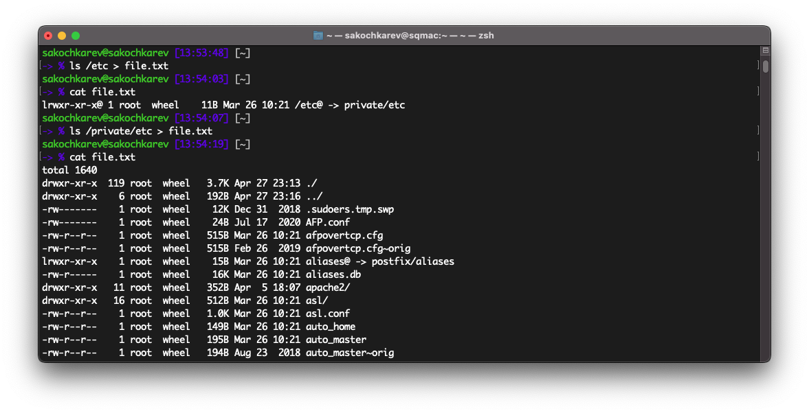
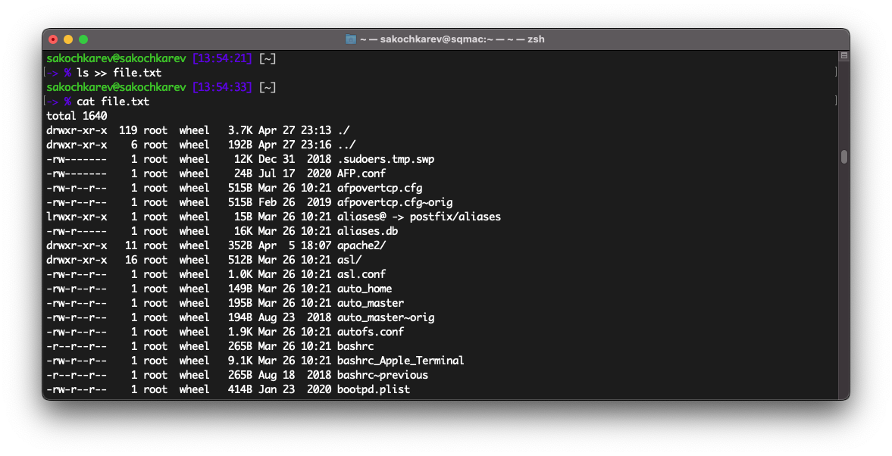
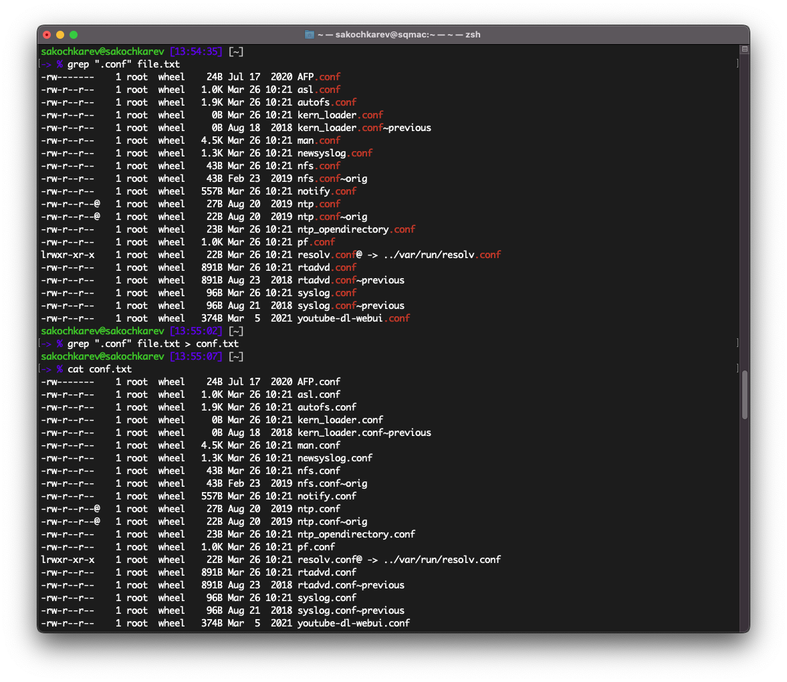
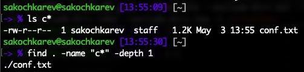
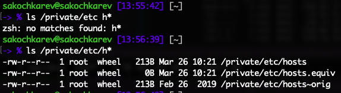
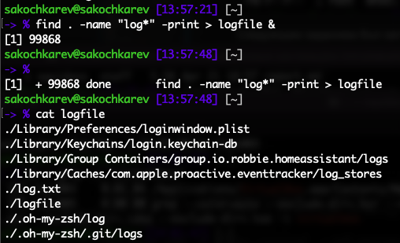
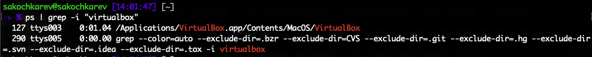
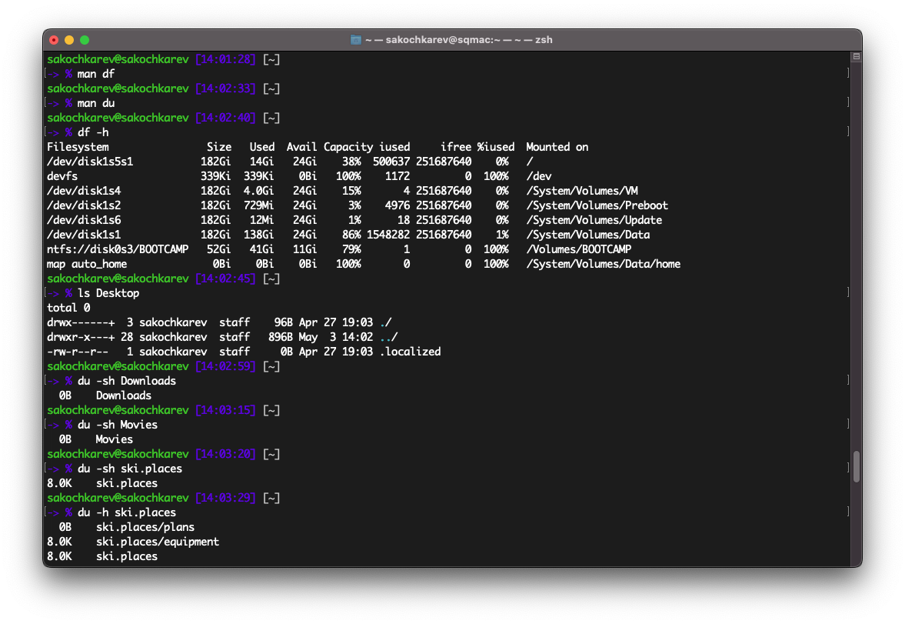
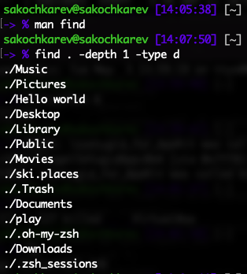

# Цель работы

Ознакомление с инструментами поиска файлов и фильтрации текстовых данных. Приобретение практических навыков: по управлению процессами (и заданиями), по проверке использования диска и обслуживанию файловых систем.

# Задание

- Выполнение последовательности действий
- Работа с файлами
- Поиск по файлам
- Перенаправление ввода-вывода
- Работа с конвейерами

# Выполнение лабораторной работы

Осуществление входа в систему под нашим пользователем

##

Запись в файл `file.txt` названия файлов в директории `/etc`

##

В `file.txt` было добавлено содержимое домашней директории

##

Из файла `file.txt` созданного ранее были выведены все файлы с расширением `.conf`. Дополнительная запись в отдельный файл `conf.txt`.

##

Для того, чтобы определить и вывести все файлы в директории, начинающиеся с буквы `c`, можно использовать команду `ls c*`, а также команду `find . -name "c*"`.

##

Выведение имен всех файлов из каталога `/etc` (`/private/etc`), начинающихся с буквы `h`

##

Запуск процесса в фоном режиме, записывающий в файл `~/logfile` файлы, имена которых начинаются с log -- `find . -name "log*" -print > logfile &`

##

## {.standout}

Далее шли задания с фоновыми процессами и работой с ними

##

Запуск из консоли в фоновом режиме программу -- `VirtualBox &`

##

Определение идентификатора процесса -- `ps | grep -i "VirtualBox"`

##

Завершение запущенного процесса командой `kill` -- `kill -9 127`

##

Ознакомление с командами `df` и `du`

##

Вывод всех директорий в домашнем каталоге

##

> В конце стоит подвести, что в работе было использовано понятие файла, как обобщенное понятие, поэтому во всех заданиях с требованиями нахождения файлов, они не были классифицированы отдельно. При необходимости соблюдения условий строгой классификации, достаточно добавить в каждую команду `find` флаг `-type f`.

## Выводы

По выполнении лабораторной работы, мы познакомились с инструментами поиска файлов и фильтрации текстовых данных. Также приобрели практические навыки по управлению процессами, проверке использования диска и обслуживанию файловых систем.
