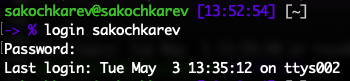
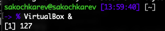
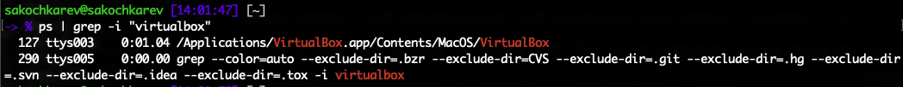
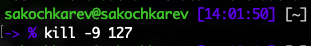

# Цель работы

Ознакомление с инструментами поиска файлов и фильтрации текстовых данных. Приобретение практических навыков: по управлению процессами (и заданиями), по проверке использования диска и обслуживанию файловых систем.

# Задание

- Выполнение последовательности действий
- Работа с файлами
- Поиск по файлам
- Перенаправление ввода-вывода
- Работа с конвейерами

# Выполнение лабораторной работы

Сперва-наперво мы осуществили вход в систему под нашим пользователем (рис. [-@fig:001]).

{#fig:001}

После этого был выполнен первый шаг, коим являлась запись в файл `file.txt` названия файлов в директории `/etc` (рис. [-@fig:002]). Стоит отметить, что на компьютере, на котором выполнялась лабораторная работа директория по пути `/etc` на самом деле является ссылкой на `/private/etc`, поэтому именно этот путь был использован заместо `/etc`.

{#fig:002}

Дополнительно к этому также в `file.txt` было добавлено содержимое домашней директории (рис. [-@fig:003]).

{#fig:003}

Далее из файла `file.txt` созданного ранее были выведены все файлы с расширением `.conf`. Этот вывод был также дополнительно записан в отдельный файл `conf.txt` (рис. [-@fig:004]).

{#fig:004}

Для того, чтобы определить и вывести все файлы в директории, начинающиеся с буквы `c`, можно использовать команду `ls c*`, а также команду `find . -name "c*"` (рис. [-@fig:005]).

{#fig:005}

Продолжая направление предыдущего задания, было необходимо вывести имена всех файлов из каталога `/etc` (`/private/etc`), начинающихся с буквы `h`. Для этого была использована команда `ls h*` (рис. [-@fig:006]).

{#fig:006}

Следующим заданием был запуск процесса в фоном режиме, который должен был записывать в файл `~/logfile` файлы, имена которых начинаются с log. Сделано это было командой `find . -name "log*" -print > logfile &` (рис. [-@fig:007]).

{#fig:007}

После окончания работы, было необходимо удалить получившийся файл (рис. [-@fig:008]).

{#fig:008}

Далее шли задания с фоновыми процессами и работой с ними.

Было необходимо запустить из консоли в фоновом режиме программу *gedit*. Так как ее не было на моем устройстве, она был заменена другой программой, а конкретно *VirtualBox*. Запуск производился командой `VirtualBox &` (рис. [-@fig:009]). 

{#fig:009}

Далее нужно было определить идентификатор только что запущенного процесса. Для этого использовалась команда `ps` с конвейером и командой `grep`. В итоге получилась команда `ps | grep -i "VirtualBox"` (рис. [-@fig:010]). Дополнительными вариантами нахождения идентификатора процесса являются команды `top` (`htop`) и встроенные GUI-утилиты, как, например, `Activity Monitor` на macOS.

{#fig:010}

Дальнейшим шагом было завершение запущенного процесса командой `kill`. Для этого был изучен соответствующий мануал (`man kill`). Результирующей командой с использованием полученного ранее идентификатора процесса было `kill -9 127` (рис. [-@fig:011]).

{#fig:011}

Далее мы ознакомились с командами `df` и `du` изучив мануал по обеим командам и выполнив их (рис. [-@fig:012]).

{#fig:012}

Последним заданием было изучение команды `find` (`man find`) и использование ее параметров для вывода всех директорий в домашнем каталоге (рис. [-@fig:013]).

{#fig:013}

> В конце стоит подвести, что в работе было использовано понятие файла, как обобщенное понятие, поэтому во всех заданиях с требованиями нахождения файлов, они не были классифицированы отдельно. При необходимости соблюдения условий строгой классификации, достаточно добавить в каждую команду `find` флаг `-type f`.

# Выводы

По выполнении лабораторной работы, мы познакомились с инструментами поиска файлов и фильтрации текстовых данных. Также приобрели практические навыки по управлению процессами, проверке использования диска и обслуживанию файловых систем.

# Ответы на контрольные вопросы

1. По умолчанию в системе открыто три потока:
    - stdin -- стандартный поток ввода
    - stdout -- стандартный поток вывода
    - stderr -- стандартный поток вывода сообщений об ошибках
2. `>` -- открывает файл в режиме перезаписывания данных (новые данные перезапишут старые данные содержащиеся в файле)

    `>>` -- открывает файл в режиме добавления данных (новые данные будут добавлены в конце файла)

3. Конвейер -- это инструмент "связывания" команд и объединения их в цепочки, в которых вывод одной команды перенаправляется в следующую и т.д.
4. Процесс -- это абстракция совокупности взаимосвязанных системных ресурсов. Отличие процесса от программы в том, что процесс -- это то, что запускает программа, которая чаще всего является исполнительным файлом.
5. PID -- Process ID (идентификатор процесса)

    GID -- Group ID (идентификатор группа, под которой запущен процесс)

6. Задачи -- это запущенные фоном программы. Ими можно управлять командой `jobs`.
7. Функции их идентичны и заключаются в менеджменте запущенных в системе процессов. Разница двух утилит заключается в "новизне" и поддерживаемости. `htop` являются более новой и улучшенной версией `top`.
8. Команда `find` являются командой по поиску файлов, директорий и других типов вхождений. Она позволяет искать вхождения по шаблону в указанных директориях. Также имеет дополнительные параметры для более тонкой настройки. Примеры:
    - `find . -name "*.txt"` -- ищет все файлы (**и другие типы вхождений**) с `.txt` в конце названия
    - `find . -name "*.txt" -type f` -- ищет все файлы (**и только файлы**) с `.txt` в конце названия
9. Одна из команд, которую можно использовать для нахождения файлов по содержанию является команда `grep`. Пример: `grep -rnw '/home/sakochkarev' -e 'hello world'`.
10. Можно использовать команду `df -h` для определения дисков и свободного места на них. Если диск разделен на несколько разделов, то можно суммировать свободное место в каждом из них и получить общее свободное место на диске. А можно просто использовать встроенный GUI дисковый менеджер. 
11. Находясь в домашнем каталоге использовать команду `du -sh`, либо находясь вне домашнего каталога использовать `du -sh ~`. Флаг `-s` суммирует объем всех вложенных файлов и директорий, получая общий объем, а `-h` просто делает объем более понятным благодаря преобразованию байтов в ближайшее деление (КБ, МБ, ГБ и т.д.).
12. Самый простой способ -- используя встроенный менеджер процессов. Например `htop`. Найдя зависший процесс в списке отправить сигнал `SIGTERM`.