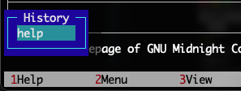

## Цель работы

Освоение основных возможностей командной оболочки Midnight Commander. Приобретение навыков практической работы по просмотру каталогов и файлов; манипуляций с ними.

## Задание

- Задания по MC
  - Операции с файлами
  - Поиск по файлам
  - Изучение интерфейса
  - Настройка оболочки
- Задания по встроенному редактору
  - Создание файла
  - Изменение: копирование, вставка, переходы и т.д.
  - Подсветка синтаксиса

# Выполнение лабораторной работы

##

##

- Выделение/отмена выделения файлов
- Копирование/перемещение файлов
- Получение информации о файле/каталоге

##

##

##

##

- Просмотрели содержимое текстового файла
- Отредактировали его
- Создали каталог
- Скопировали файлы в созданный каталог

##

##

##

##

- выполнили поиск с заданными условиями
- выбрали и повторили предыдущие команды
- перешли в домашний каталог
- проанализировали файлы меню и расширений

##

##

##

##

##

## {.standout}

Следующие задания были связаны с встроенным редактором mc.

##

Создание текстового файла `text.txt`.

##

Открыли его во встроенном редакторе.

##

Вставили в него ранее скопированный фрагмент из другого файла.

##

Манипуляции с текстом

- Удаление строки текста
- Выделение и копирование фрагмента текста на новую строку

##

- Выделение и перенос фрагмента текста на новую строку
- Сохранение файла

- Сохранение и закрытие файла

##

- Отмена последнего действия
- Переход в конец файла и добавление текста
- Переход в начало файла и добавление текста

##

##

## Выводы

По выполнении лабораторной работы мы освоили основные возможности командной оболочки Midnight Commander, а также приобрели навыки практической работы по просмотру каталогов и файлов; манипуляций с ними.
