# Цель работы

Освоение основных возможностей командной оболочки Midnight Commander. Приобретение навыков практической работы по просмотру каталогов и файлов; манипуляций с ними.

# Задание

- Задания по MC
  - Операции с файлами
  - Поиск по файлам
  - Изучение интерфейса
  - Настройка оболочки
- Задания по встроенному редактору
  - Создание файла
  - Изменение: копирование, вставка, переходы и т.д.
  - Подсветка синтаксиса

# Выполнение лабораторной работы

Первым делом мы изучили информацию об MC, вызвав в командной строке `man mc` (рис. [-@fig:001]).

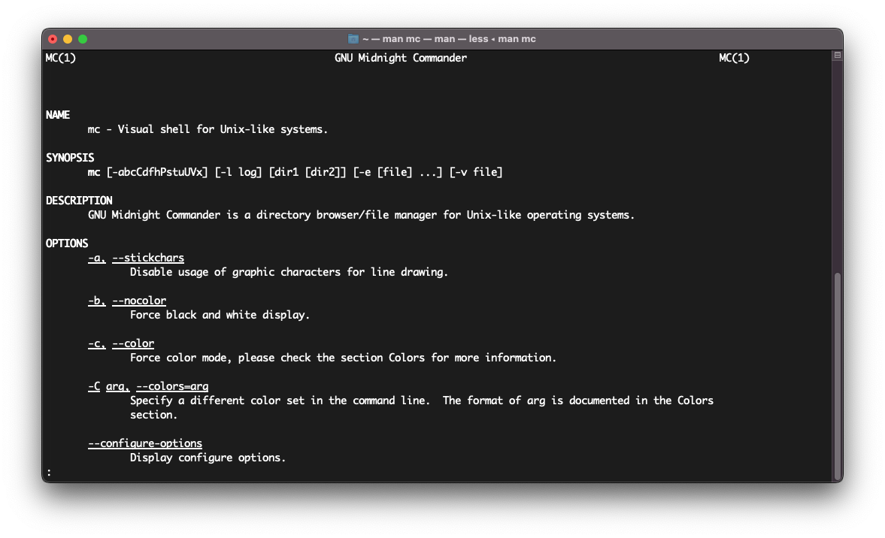{#fig:001}

Далее мы запустили саму оболочку и изучили ее структуру и меню (рис. [-@fig:002]).

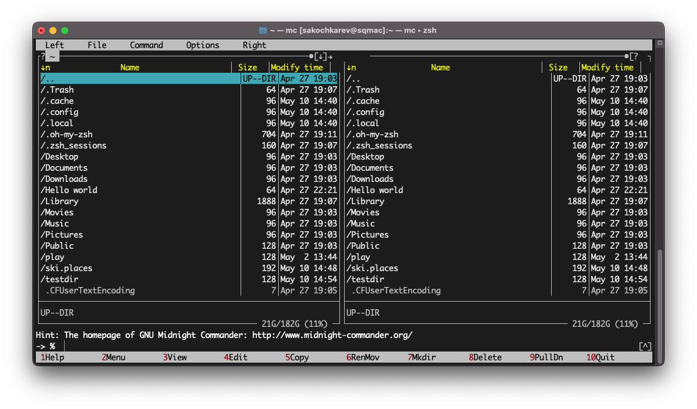{#fig:002}

После изучения был выполнен ряд операций с использованием управляющих клавиш.

- Выделение/отмена выделения файлов (рис. [-@fig:003])
- Копирование/перемещение файлов
- Получение информации о файле/каталоге (рис. [-@fig:004])

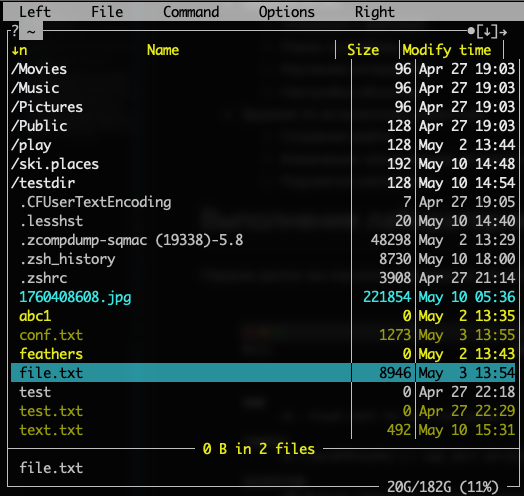{#fig:003}

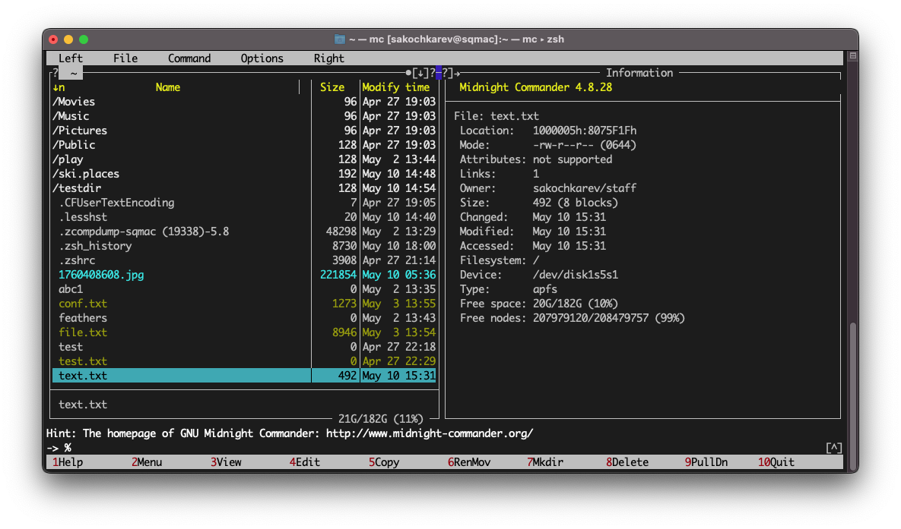{#fig:004}

Далее были выполнены основные команды меню правой панели (рис. [-@fig:005]).

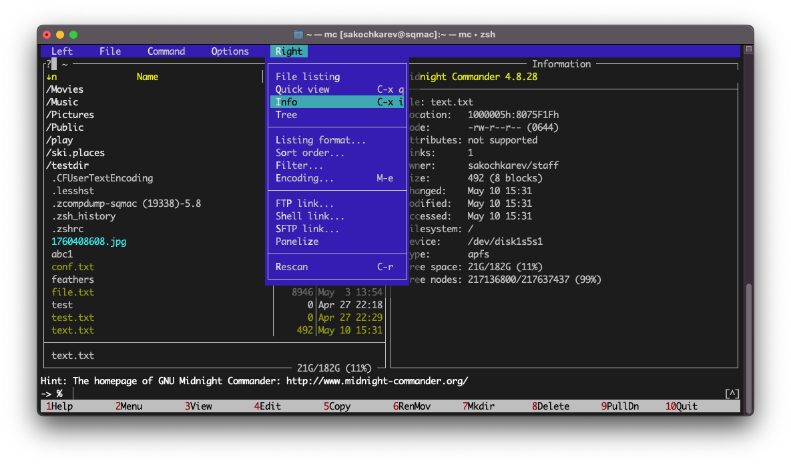{#fig:005}

После этого, используя возможности подменю "Файл" мы выполнили следующие действия.

- Просмотрели содержимое текстового файла (рис. [-@fig:006])
- Отредактировали его (рис. [-@fig:007])
- Создали каталог
- Скопировали файлы в созданный каталог (рис. [-@fig:008])

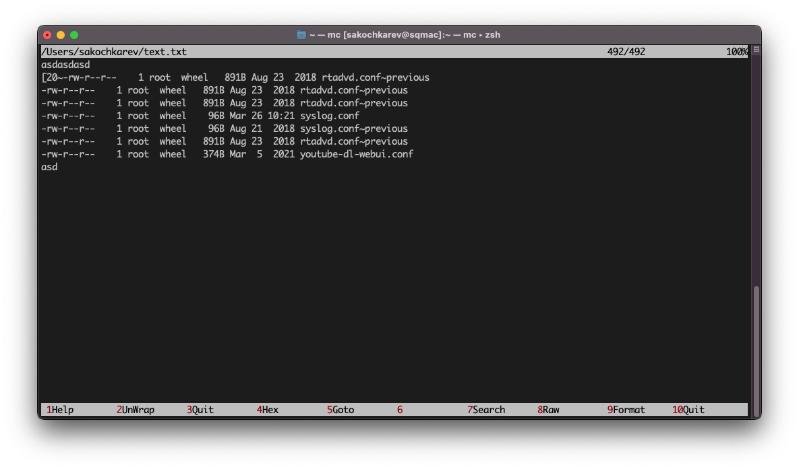{#fig:006}

{#fig:007}

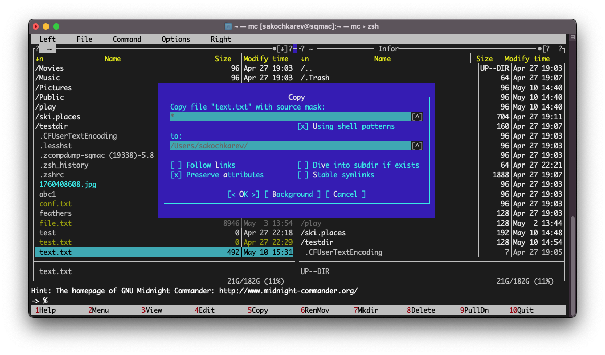{#fig:008}

Далее, используя соответствующие средства подменю "Команда" мы

- выполнили поиск с заданными условиями (рис. [-@fig:009])
- выбрали и повторили предыдущие команды (рис. [-@fig:010])
- перешли в домашний каталог
- проанализировали файлы меню и расширений (рис. [-@fig:011], [-@fig:012])

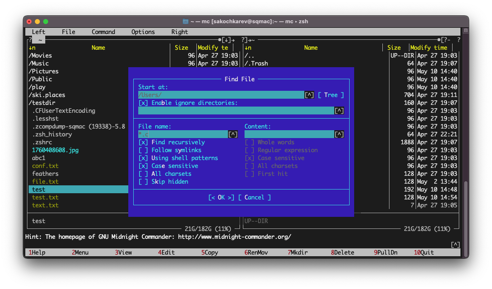{#fig:009}

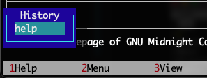{#fig:010}

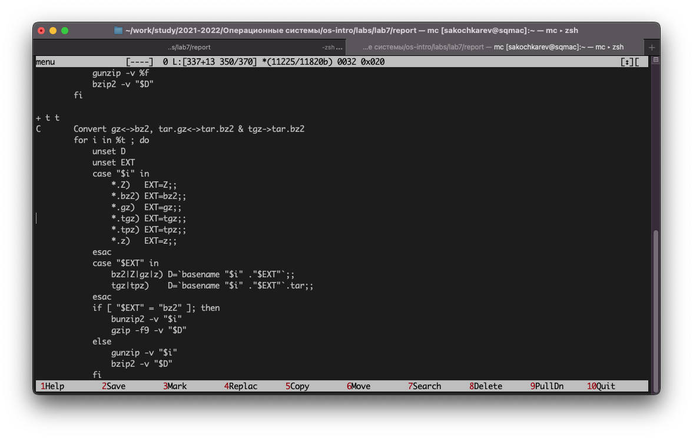{#fig:011}

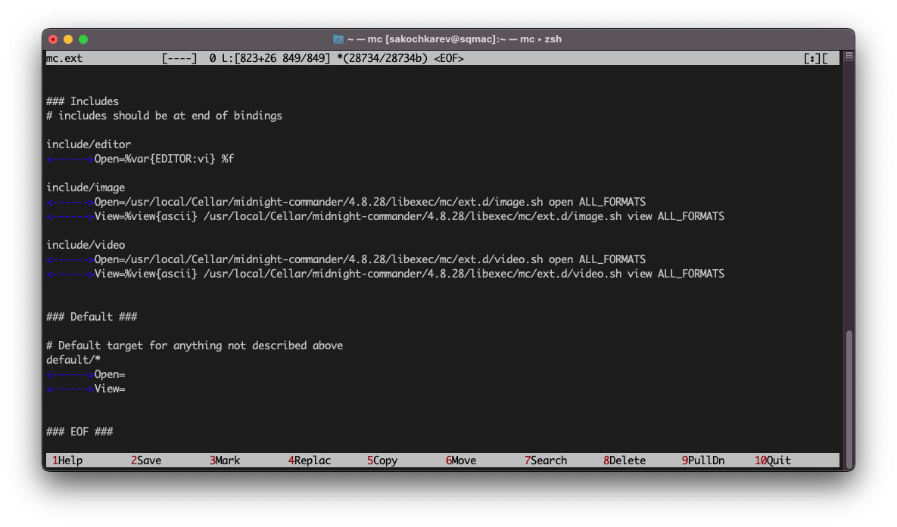{#fig:012}

Последним действием было освоение операций, определяющих структуру экрана mc с помощью вызова подменю "Настройки" (рис. [-@fig:013])

{#fig:013}

Следующие задания были связаны с встроенным редактором mc.

Первым делом мы создали текстовый файл `text.txt` (рис. [-@fig:014]).

{#fig:014}

Далее открыли его во встроенном редакторе (рис. [-@fig:015]).

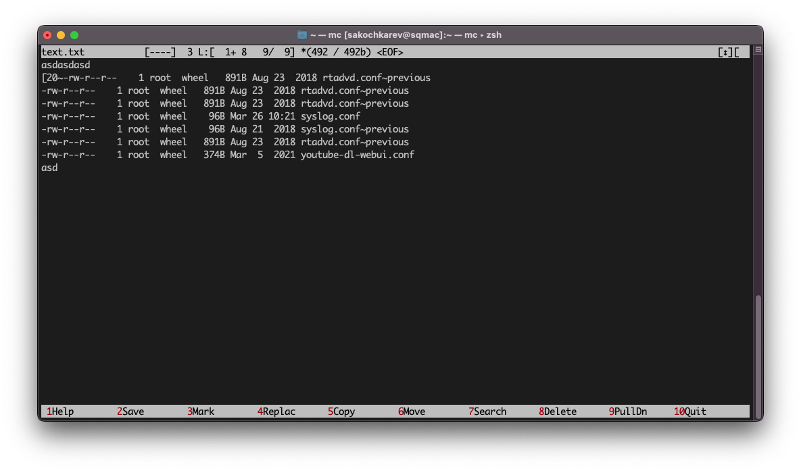{#fig:015}

Вставили в него ранее скопированный фрагмент из другого файла (рис. [-@fig:016]).

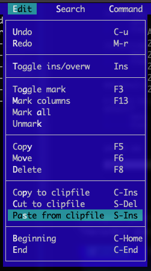{#fig:016}

После этого с текстом были проделаны некоторые манипуляции.

- Удаление строки текста
- Выделение и копирование фрагмента текста на новую строку (рис. [-@fig:017])

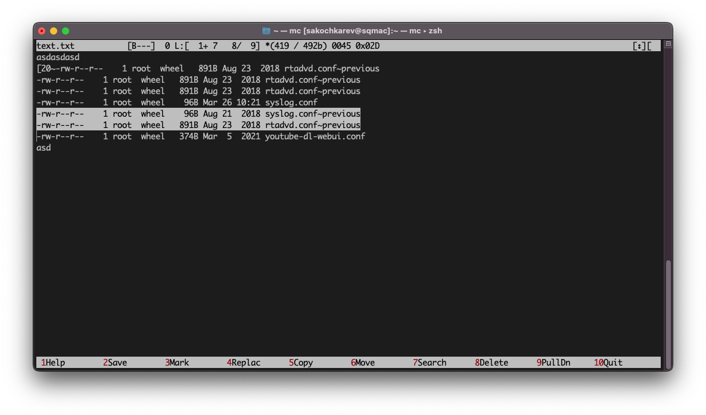{#fig:017}

- Выделение и перенос фрагмента текста на новую строку
- Сохранение файла (рис. [-@fig:018])

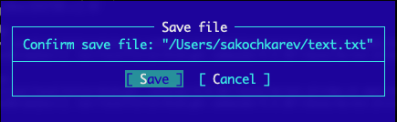{#fig:018}

- Сохранение и закрытие файла (рис. [-@fig:019])

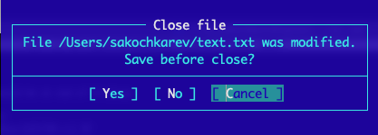{#fig:019}

А также

- Отмена последнего действия
- Переход в конец файла и добавление текста
- Переход в начало файла и добавление текста

Далее был открыт файл на некотором языке программирования (рис. [-@fig:020]) и используя меню редактора была выключена подсветка синтаксиса (рис. [-@fig:021]).

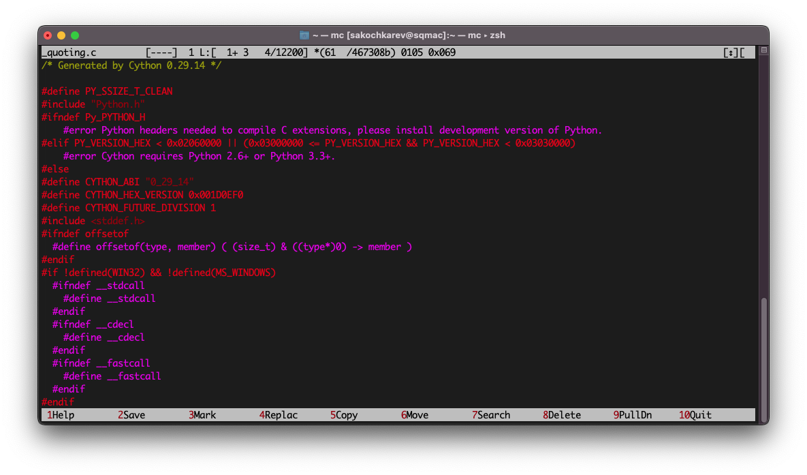{#fig:020}

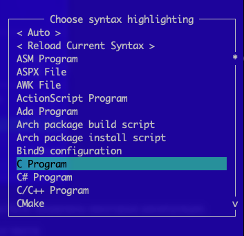{#fig:021}

На этом выполнение лабораторной работы было закончено.

# Выводы

По выполнении лабораторной работы мы освоили основные возможности командной оболочки Midnight Commander, а также приобрели навыки практической работы по просмотру каталогов и файлов; манипуляций с ними.

# Ответы на контрольные вопросы

1. 
    - Режим "Информация", в котором на панель выводятся сведения о файле или директории.
    - Режим "Дерево", в котором на панель выводится структура дерева каталогов
2. Среди таких операций можно выделить
    - Копирование файла
    - Переименование файла
    - Перемещение файла
    и другие.
3. Структура меню как левой, так и правой панелей идентичны и представляют собой набор выполняемых команд, разделенных на группы по схожему роду. Команды представляют собой действия, выполняемые с панелью, такие как изменение режима работы панели, сортировка и фильтрация отображаемых файлов и директорий и др.
4. Структура меню "Файл" представляет собой список выполняемых команд, разделенных на группы по схожему роду. Команды представляют собой действия, выполняемые с файлами и директориями, такие как копирование, перемещение, переименование и др.
5. Структура меню "Команда" представляет собой список выполняемых команд, разделенных на группы по схожему роду. Команды представляют собой действия, выполняемые как с файлами, так и с самой оболочкой. В меню входят такие команды как поиск файлов, сравнение файлов или директорий, работа с панелями и др.
6. Структура меню "Настройки" представляет собой список групп с настройками для каждой группы. Группы разделены по категориям, например "Конфигурация", "Подтверждение", "Размещение" и др. При заходе в каждую группу открывается окно настроек данной группы.
7. Встроенные команды mc представляют собой набор команд, используемых для работы с файлами, директориями, настройки панелей или оболочки в целом. Среди команд можно отметить команды прикрепленные к горячим клавишам (часто используемые), команды по доступу к верхней строке с отдельными меню и т.д.
8. Команды встроенного редактора mc представляют собой набор команд используемых для работы с текстом. Среди команд можно отметить команды копирования, вставки текста, перехода к частям текста, выделение текста и др.
9. В mc существует возможность создания т.н. "пользовательских меню". Они представляют из себя набор команд, которые выполняют определенные действия, указанные пользователем при создании меню. Меню создается через создание специального файла в указанной директории. Файл является текстовым файлом с специальным синтаксисом меню. Данное меню полностью зависит от "места применения", т.е. будет разным при применении над каталогом и файлом например. 
10. Продолжая описание пользовательских меню, можно привести пример пользовательского меню заточенного под файлы (рис. [-@fig:022]). В нем приводится список команд, содержащий в себе как общие команды для директорий и для файлов, так и специализированные команды для работы с файлом, например архивация файла.

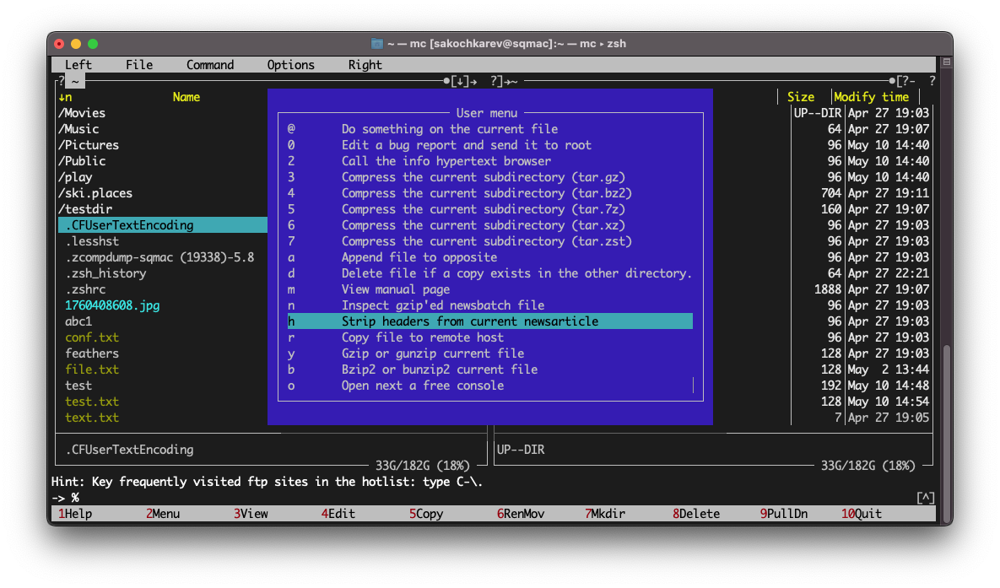{#fig:022}