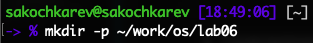
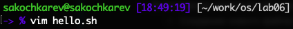
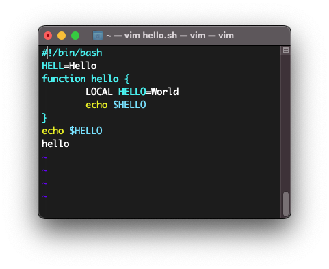
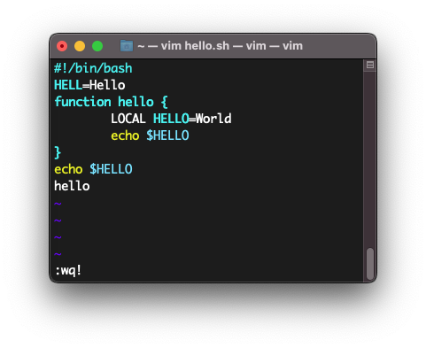
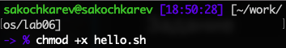
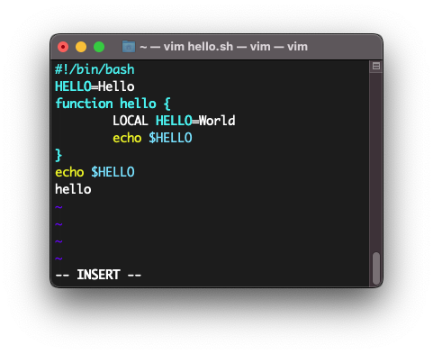
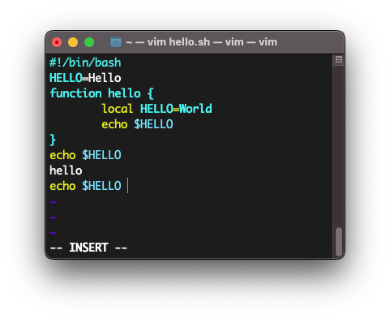
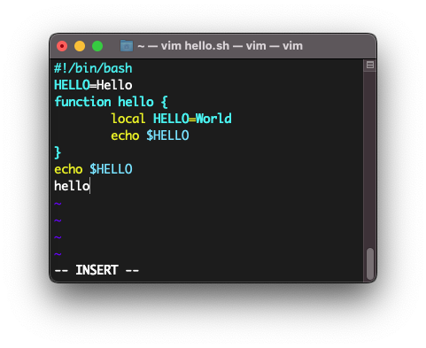
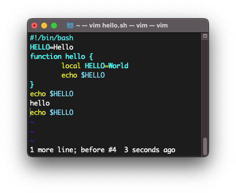
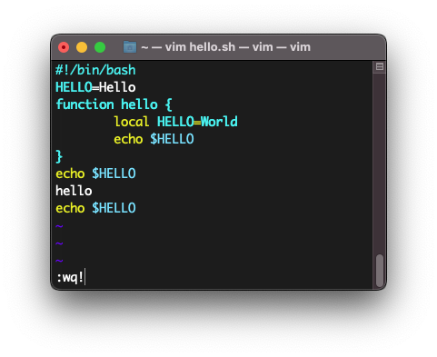

## Цель работы

Познакомиться с операционной системой Linux. Получить практические навыки работы с редактором vi, установленным по умолчанию практически во всех дистрибутивах.

## Задание

- Ознакомление с теоретическим материалом
- Ознакомление с редактором vi
- Выполнение упражнений с редактором vi
  - Создание нового файла с использованием vi
  - Редактирование существующего файла с использованием vi

# Выполнение лабораторной работы

## {.standout}

Первым делом мы ознакомились с приведенным теоретическим материалом.

## {.standout}

Также перед лабораторной работой я ознакомился с самом редактором vi.

## {.standout}

> Стоит упомянуть, что при выполнении данной лабораторной работы использовался редактор vim, отличия которого в рамках данной лабораторной работы несущественны.

## {.standout}

После ознакомления со всем материалом я приступил к выполнению основных заданий лабораторной работы.

## {.standout}

Первым заданием было создание нового файла с использованием редактора.

##

Создан каталог `~/work/os/lab06`.

##

Выполнена команда `vim hello.sh`, создала и открыла в редакторе текстовый файл `hello.sh`.

##

Переход в режим вставки и ввод приведенного текста.

##

Перевод редактора в командный режим и ввод команды `:wq!` для выхода из файла с сохранением.

##

Изменение разрешений файла -- выдача прав на выполнение файла командой `chmod +x hello.sh` .

## {.standout}

Далее шли задания по редактированию существующего файла с помощью редактора vi.

##

Открытие файла в редакторе командой `vi ~/work/os/lab06/hello.sh`.

Далее редактор был переведен в режим вставки и `HELL` было заменено на `HELLO`.

##

Курсор был установлен на четвертую строку и слово `LOCAL` было заменено на `local` .

##

Курсор был установлен на последнюю строку и после нее в режиме вставки была вставлена строка `echo $HELLO` .

##

Удаление последней строки в командном режиме.

##

Отмена предыдущего действия

##

Bыход из редактора с сохранением изменений

## Выводы

По выполнении лабораторной работы мы получили практические навыки работы с редактором vi, установленным по умолчанию практически во всех дистрибутивах, а также немного дополнительно познакомились с операционной системой Linux.
