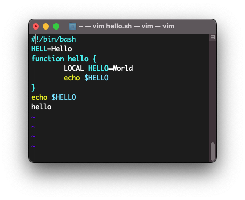
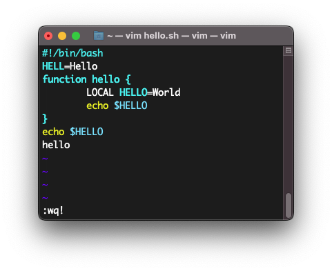
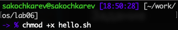
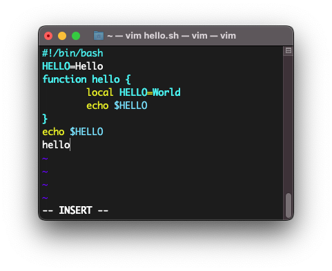
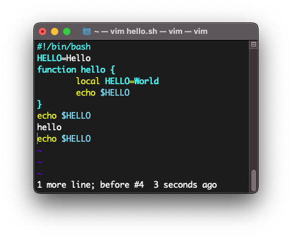
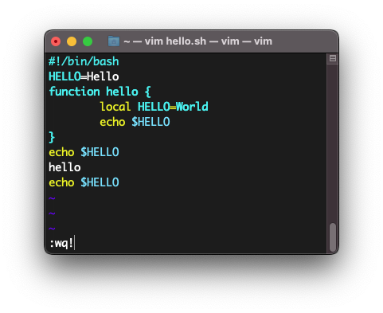

# Цель работы

Познакомиться с операционной системой Linux. Получить практические навыки работы с редактором vi, установленным по умолчанию практически во всех дистрибутивах.

# Задание

- Ознакомление с теоретическим материалом
- Ознакомление с редактором vi
- Выполнение упражнений с редактором vi
  - Создание нового файла с использованием vi
  - Редактирование существующего файла с использованием vi

# Выполнение лабораторной работы

Первым делом мы ознакомились с приведенным теоретическим материалом.

Также перед лабораторной работой я ознакомился с самом редактором vi.

> Стоит упомянуть, что при выполнении данной лабораторной работы использовался редактор vim, отличия которого в рамках данной лабораторной работы несущественны.

После ознакомления со всем материалом я приступил к выполнению основных заданий лабораторной работы.

Первым заданием было создание нового файла с использованием редактора.

Был создан каталог `~/work/os/lab06` (рис. [-@fig:001]).

{#fig:001}

Далее внутри новосозданного каталога была выполнена команда `vim hello.sh` (рис. [-@fig:002]), которая создала и открыла в редакторе текстовый файл `hello.sh`.

{#fig:002}

После открытия файла мы перешли в режим вставки и ввели приведенный текст (рис. [-@fig:003]).

{#fig:003}

После того, как мы ввели текст, редактор был переведен обратно в командный режим и была введена команда `:wq!` для выхода из файла с сохранением (рис. [-@fig:004]).

{#fig:004}

Последним шагом было изменение разрешений файла, а конкретно выдача прав на выполнение файла командой `chmod +x hello.sh` (рис. [-@fig:005]).

{#fig:005}

Далее шли задания по редактированию существующего файла с помощью редактора vi.

Первым делом был открыт ранее созданный файл в редакторе командой `vi ~/work/os/lab06/hello.sh`.

После периодичным нажатием клавиши `w` курсор был установлен в конце слова HELL второй строки.

Далее редактор был переведен в режим вставки и `HELL` было заменено на `HELLO` (рис. [-@fig:006]).

{#fig:006}

После этого курсор был установлен на четвертую строку и слово `LOCAL` было заменено на `local` (рис. [-@fig:007]).

{#fig:007}

Далее курсор был установлен на последнюю строку и после нее в режиме вставки была вставлена строка `echo $HELLO` (рис. [-@fig:008]).

{#fig:008}

После в командном режим была удалена последняя строка (рис. [-@fig:009]).

{#fig:009}

Следующим действием была отмена предыдущего действия (рис. [-@fig:010]).

{#fig:010}

И последним действием был выход из редактора с сохранением изменений (рис. [-@fig:011]).

{#fig:011}

# Выводы

По выполнении лабораторной работы мы получили практические навыки работы с редактором vi, установленным по умолчанию практически во всех дистрибутивах, а также немного дополнительно познакомились с операционной системой Linux.

# Ответы на контрольные вопросы

1. Редактор vi имеет три режима работы:
  - командный режим -- предназначен для ввода команд редактирования и навигации по редактируемому файлу
  - режим вставки -- предназначен для ввода содержания редактируемого файла
  - режим последней (или командной) строки -- используется для записи изменений в файл и выхода из редактора
2. Введя команду `:q!` в командном режиме.
3. 
  - <kbd>0</kbd> -- переход в начало строки
  - <kbd>$</kbd> -- переход в конец строки
  - <kbd>G</kbd>-- переход в конец файла
  - `n`<kbd>G</kbd> — переход на строку с номером n (например `9G`)
4. В зависимости от используемой команды редактор vi понимает слово по-разному. При использовании прописных <kbd>W</kbd> и <kbd>B</kbd> под разделителями понимаются только пробел, табуляция и возврат каретки. При использовании строчных <kbd>w</kbd> и <kbd>b</kbd> под разделителями понимаются также любые знаки пунктуации.
5.
  - <kbd>g</kbd><kbd>g</kbd> -- переход в начало файла
  - <kbd>G</kbd> -- переход в конец файла
6.
  - Вставка текста текста позволяет вставить текст относительно курсора или строки (n раз)
  - Вставка строки позволяет вставить строку относительно курсора
  - Удаление текста позволяет удалять текст посимвольно, относительно курсора, относительно строки и номерам строк
  - Отмена и повтор произведенных изменений позволяет отменить и повторить произведенные изменения
  - Копирование текста позволяет скопировать строку, n строк или слово в буфер
  - Вставка текста позволяет вставить текст из буфера относительно курсора
  - Замена текста позволяет заменить текст или слова
  - Поиск текста позволяет произвести поиск текста внутри файла
7. Как один из вариантов реализации задания -- использовать команду `10A$`<kbd>Esc</kdb>, где `10` -- кол-во символов на замену в строке.
8. Командой <kbd>u</kbd>.
9.
  - Команды копирования и перемещения текста позволяют удалять, перемещать и копировать текст (строки), а также записывать их в отдельный файл
  - Команды записи файла и выхода из редактора позволяют записать измененный текст как с выходом из редактора, так и без, а также выйти из редактора без записи изменений.
10. Можно использовать команду <kbd>$</kbd>.
11. В редакторе Vi существует огромное множество опций. Их назначение можно узнать используя команду `:help`, например `:help G`.
12. Зачастую режим работы редактора указан в последней строке.
13. 