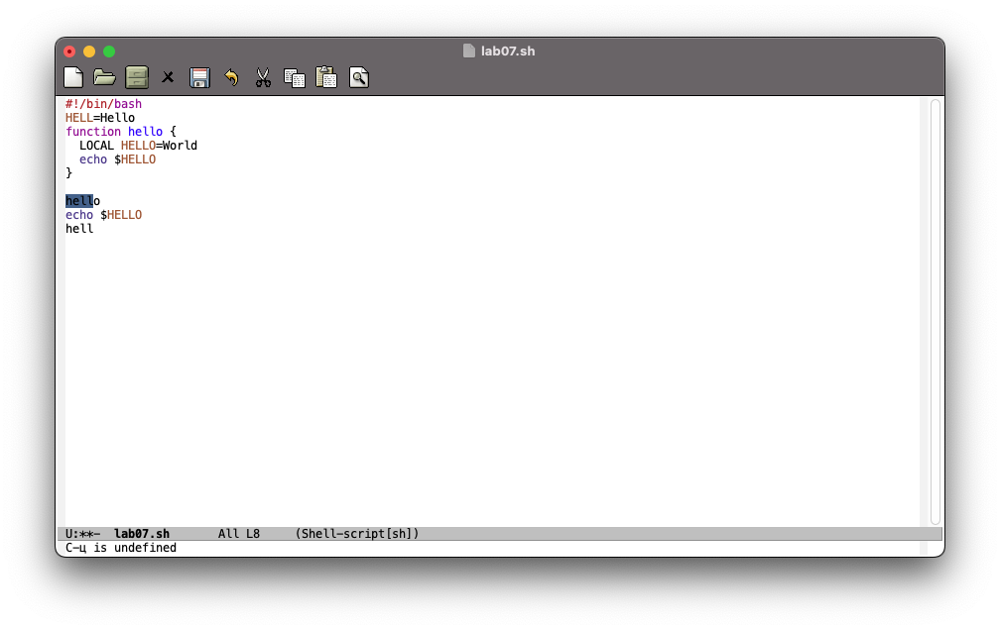

# Цель работы

Познакомиться с операционной системой Linux. Получить практические навыки работы с редактором emacs.

# Задание

- Ознакомление с теоретическим материалом
- Ознакомление с редактором emacs
- Выполнение упражнений с редактором emacs

# Выполнение лабораторной работы

Предварительно был установлен текстовый редактор emacs.

Первым делом были изучены теоретические материалы и было произведено ознакомление с редактором emacs. После этого мы перешли к выполнению упражнений.

Сперва-наперво мы открыли сам редактор emacs (рис. [-@fig:001]).

{#fig:001}

Далее был создан файл `lab07.sh` с помощью приведенной комбинации клавиш (рис. [-@fig:002]).

{#fig:002}

После этого в открытом файле был написан приведенный текст (рис. [-@fig:003]).

```sh
#!/bin/bash
HELL=Hello
function hello {
  LOCAL HELLO=World
  echo $HELLO 
}
echo $HELLO
hello
```

{#fig:003}

По окончании записи файла мы сохранили его с помощью комбинации клавиш (рис. [-@fig:004]).

{#fig:004}

Далее шли упражнения по стандартным процедурам редактирования.

Мы вырезали одной командной целую строку (рис. [-@fig:005]) и вставили ее в конец файла (рис. [-@fig:006]).

{#fig:005}

{#fig:006}

После мы выделили область текста (рис. [-@fig:007]), скопировали эту область в буфер обмена и вставили ее в конец файла (рис. [-@fig:008]).

{#fig:007}

{#fig:008}

В конце мы вновь выделили эту область (рис. [-@fig:009]) и вырезали ее (рис. [-@fig:010]).

{#fig:009}

{#fig:010}

Последнее действие мы отменили (рис. [-@fig:011]).

{#fig:011}

После шли упражнения по перемещению курсора.

Сначала мы переместили курсор в начало строки, после этого в конец строки (рис. [-@fig:012]).

{#fig:012}

А также переместили курсор в начало буфера и в конец (рис. [-@fig:013]).

{#fig:013}

Следующими шли задания по управлению буферами.

Первым делом мы вывели список активных буферов на экран (рис. [-@fig:014]).

{#fig:014}

Далее сочетанием клавиш переместились на открытое окно со списком открытых буферов и в нем переключились на другой буфер (рис. [-@fig:015]).

{#fig:015}

После этого мы закрыли окно с только что открытым буфером (рис. [-@fig:016]).

{#fig:016}

В конце мы также переключились между буферами, однако теперь без использования окна, а только используя сочетание клавиш (рис. [-@fig:017]).

{#fig:017}

Предпоследним блоком заданий были задания по управлению окнами.

Первым делом сочетаниями клавиш мы поделили фрейм на 4-е части: два окна по вертикали и два по горизонтали (рис. [-@fig:018]).

{#fig:018}

После этого в каждом из созданных окон мы создали новый файл и напечатали в нем несколько строк текста (рис. [-@fig:019]).

{#fig:019}

Последним блоком заданий были задания связанные с режимом поиска.

Для начала мы переключились в обычный режим поиска и нашли несколько слов в тексте (рис. [-@fig:020]). По результатам можно было переключаться сочетанием клавиш.

{#fig:020}

Далее мы вышли из этого режима поиска и перешли в режим замены текста (рис. [-@fig:021]).

{#fig:021}

В этом режиме первым делом мы ввели текст, который следует найти и заменить, нажали <kbd>Enter</kbd> и затем ввели текст для замены (рис. [-@fig:022]).

{#fig:022}

В буфере подсветился текст для замены и для подтверждения замены мы нажали <kbd>!</kbd> (рис. [-@fig:023]).

{#fig:023}

В конце мы испробовали другой режим поиска, нажав <kbd>M-s</kbd> <kbd>o</kbd> (рис. [-@fig:024]).

{#fig:024}

Данный режим является режимом поиска с использованием регулярных выражений.

# Выводы

По выполнении лабораторной работы мы получили практические навыки работы с редактором emacs, а также немного дополнительно познакомились с операционной системой Linux.

# Ответы на контрольные вопросы

1. Редактор `emacs` представляет из себя графический (GUI) редактор текстовых файлов с особенностями буферов, фреймов и окон. Они позволяют ускорить и усовершенствовать работу с текстовыми файлами при их эффективном использовании.
2. Те же особенности, которые делают его мощным (система буферов, фреймов и окон) делают его сложным для освоения новичкам. Также сложности добавляет взаимодействие, которое больше углублено в использование горячих клавиш.
3.
  - Буфер -- это некий объект, в котором содержится текст. Он может быть как буфером обмена, который чаще всего скрыт, так и буфером рабочим, который отображает файл на устройстве.
  - Окно -- не окно приложения в обычном его понимании. В терминологии emacs окно -- это область фрейма (окна в обычном понимании), которая отображает содержимое буфера.
4. Нет, нельзя, так как окно -- это область, "отображающая **один** из буферов".
5.
  - *GNU Emacs* -- содержит в себе "встречный текст" с ссылками на туториалы и мануалы.
  - *scratch* -- буфер для текста, который еще не сохранен и для обработки Lisp
  - *Messages* -- история выведенных сообщений в нижней части фрейма
6. 
  - `C-c |` -- <kbd>Ctrl</kbd><kbd>c</kbd><kbd>Shift</kbd><kbd>\</kbd>
  - `C-c C-|` -- <kbd>Ctrl</kbd><kbd>c</kbd><kbd>Ctrl</kbd><kbd>Shift</kbd><kbd>\</kbd>
7.
  - `C-x 2` -- для деления по горизонтали
  - `C-x 3` -- для деления по вертикали
8. Конфигурационный файл находится по пути `~/.config/emacs`.
9. В редакторе клавиша <kbd>Backspace</kbd> имеет стандартное поведения удаления предыдущего символа. Однако действие по нажатии клавиши можно переназначить в конфигурации emacs.
10. Мне больше понравился редактор vi (vim), т.к. emacs для меня не обладает какими-либо особенностями, которые оправдали бы установку дополнительного GUI приложения и уж тем более переход на его использование. Vi (Vim) встроен в большинстве дистрибутивов и позволяет добиться высокой эффективности.