## Цель работы

Цель индивидуального проекта -- создание персонального сайта научного работника. 
Сайт должен быть по шаблону и включать в себя такие блоки, как посты, информацию о себе, 
информацию об образовании и др. Сайт должен находится на GitHub Pages. 

## Задания

- Установить необходимое программное обеспечение.
- Скачать шаблон темы сайта.
- Разместить его на хостинге git.
- Установить параметр для URLs сайта.
- Разместить заготовку сайта на Github pages.

## Приложения

- Генератор статических сайтов Hugo
- Шаблон Hugo Academic Theme

# Выполнение лабораторной работы

##

Установка пакета с генератором статических сайтов **Hugo**

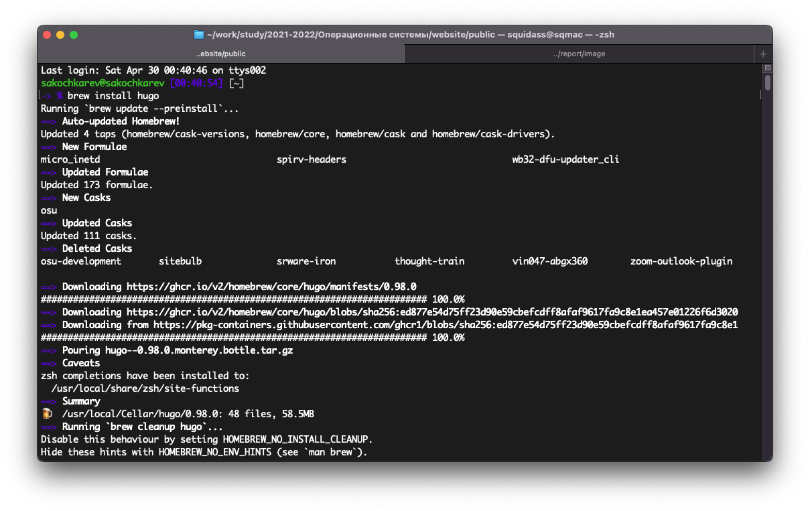

##

Генерация репозитория на основе макета *starter-hugo-academic*

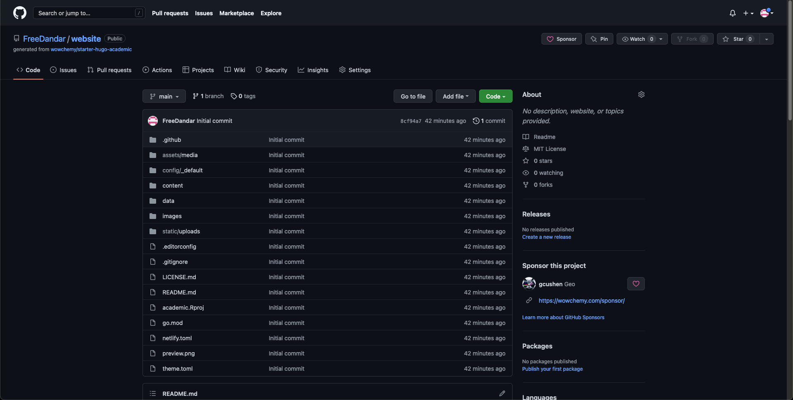

##

Клонирование на локальную машину

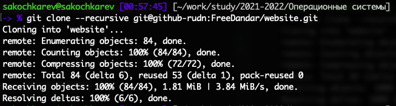

##

Доустановка языка **go**

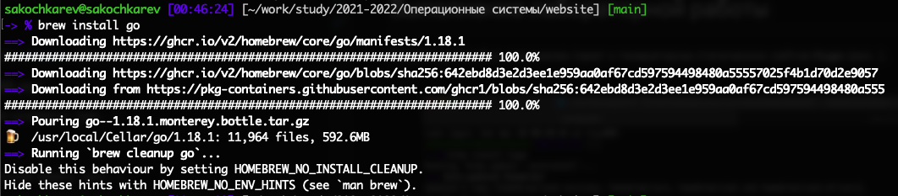

##

Тестирование сервера

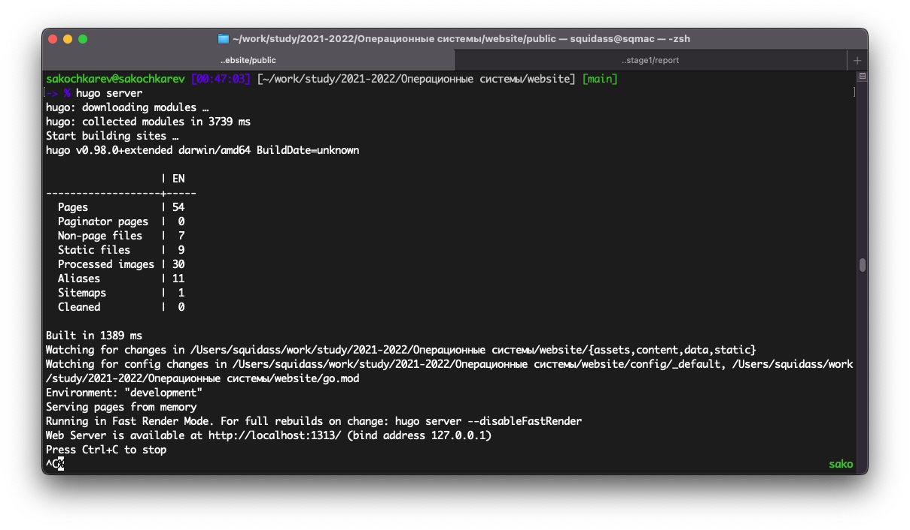

##

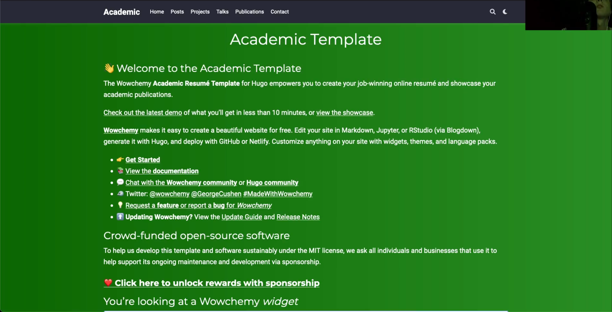

##

Удаление ненужного файла

##

Создание репозитория *GitHub Pages*[^1]

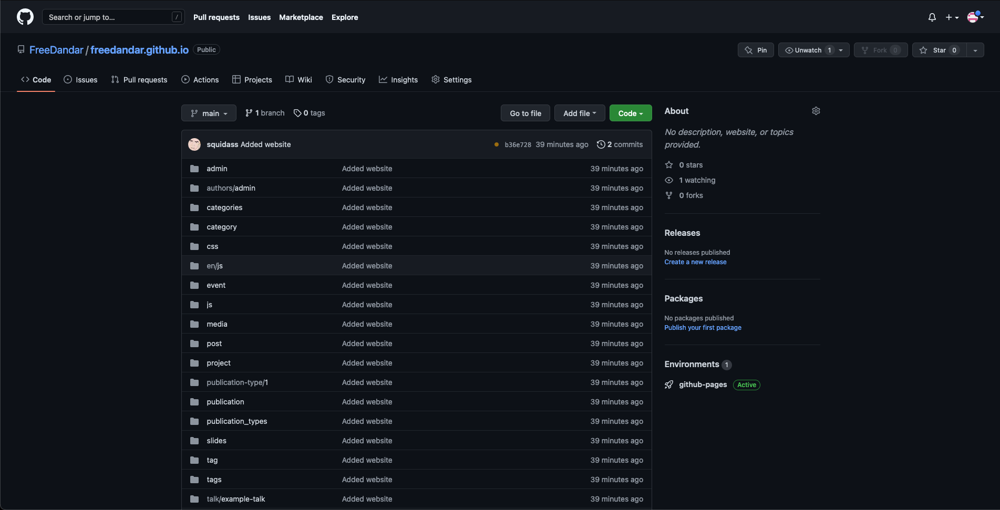

[^1]: GitHub Pages -- это хостинг статических сайтов от GitHub.

##

Клонирование созданного репозитория на локальную машину

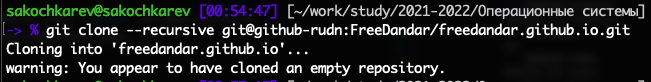

##

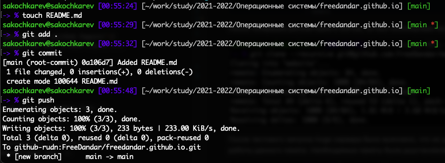

## {.standout}

Следующим шагом была настройка репозитория website с шаблоном сайта. 

##

Изменение `.gitignore` файла

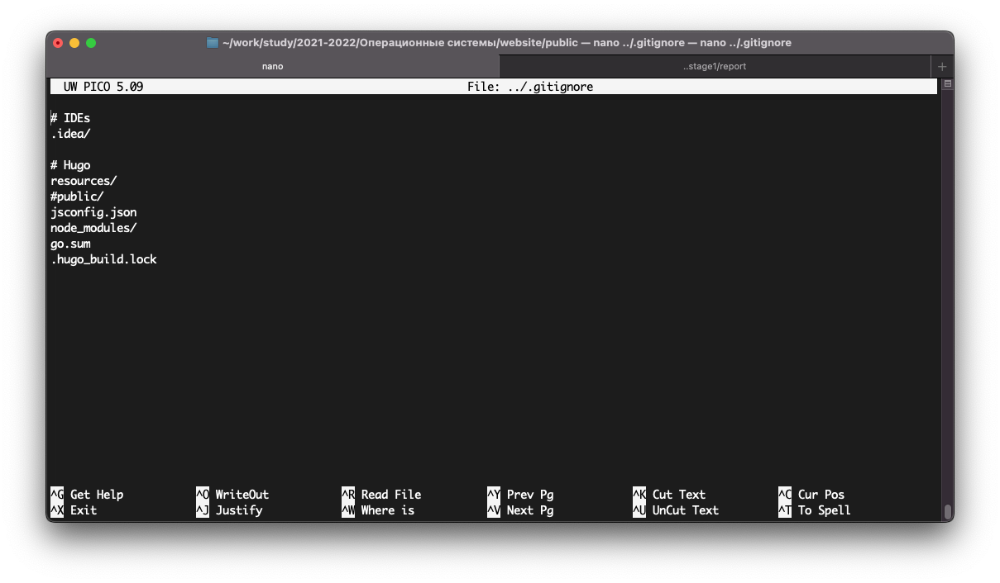

##

Выполнение команды `git submodule add -b main git@github-rudn:FreeDandar/freedandar.github.io.git public`

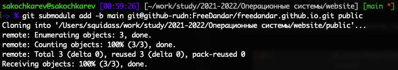

##

"Конструирование" сайта

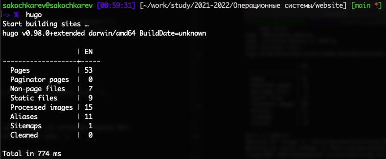

##

Обновление сайта на GitHub

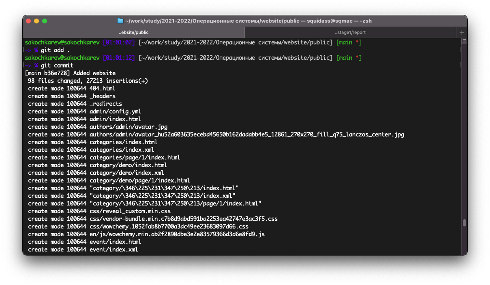

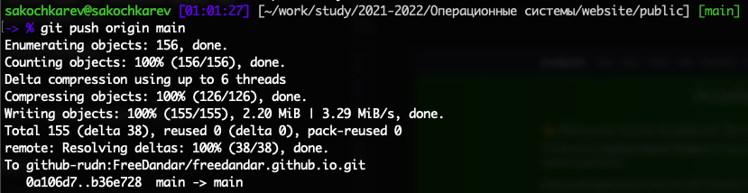

##

Проверка сайта на публичном адресе `freedandar.github.io`

## Выводы

По окончании первого этапа индивидуального проекта мы познакомились с генератором статических сайтов **Hugo**, а также изучили дополнительные команды git.