# Цель работы

Цель индивидуального проекта -- создание персонального сайта научного работника. 
Сайт должен быть по шаблону и включать в себя такие блоки, как посты, информацию о себе, 
информацию об образовании и др. Сайт должен находится на GitHub Pages. 

# Задание

- Установить необходимое программное обеспечение.
- Скачать шаблон темы сайта.
- Разместить его на хостинге git.
- Установить параметр для URLs сайта.
- Разместить заготовку сайта на Github pages.

# Выполнение лабораторной работы

Первым делом был установлен пакет с генератором статических сайтов **Hugo** (рис. [-@fig:001]).

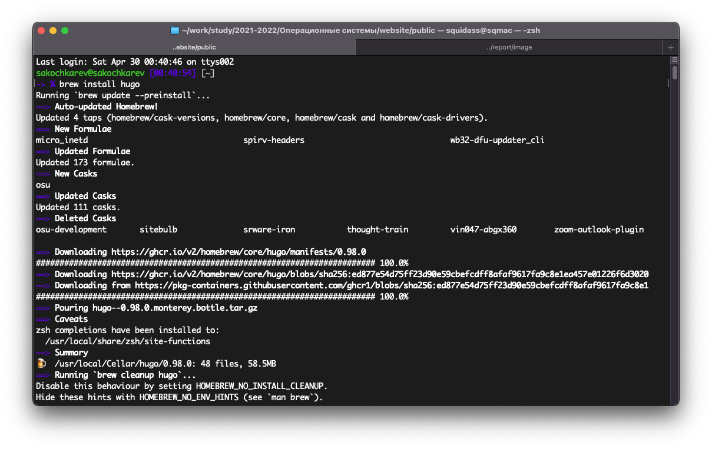{#fig:001}

Далее был сгенерирован репозиторий на основе макета *starter-hugo-academic* (рис. [-@fig:002]).

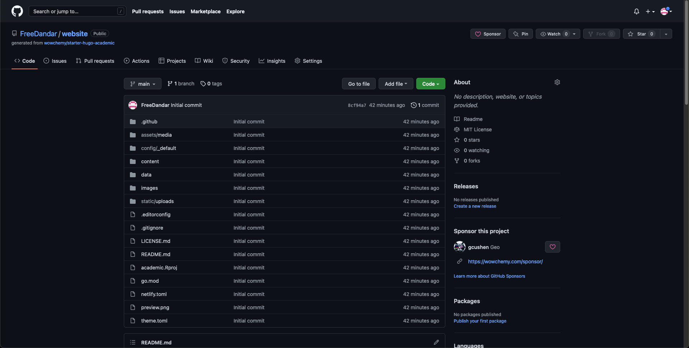{#fig:002}

После генерации репозитория в GitHub, он был склонирован на локальную машину (рис. [-@fig:003]).

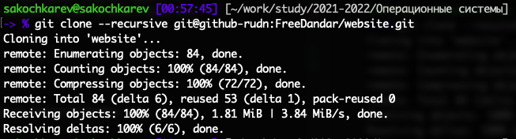{#fig:003}

После тестового запуска Hugo сервера было выяснено, что не установлен язык **go**, который является необходимым для работы данного пакета. Необходимые пакеты были доустановлены (рис. [-@fig:004]).

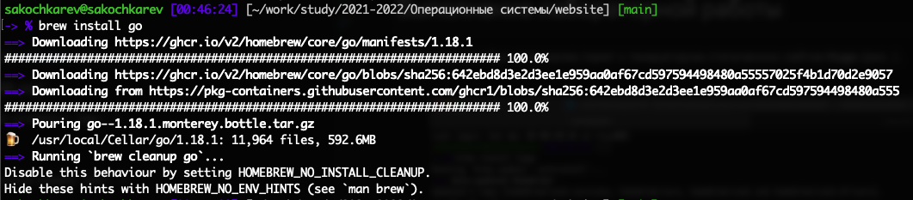{#fig:004}

После доустановки дополнительных пакетов, сервер успешно заработал и был также успешно протестирован (рис. [-@fig:005], [-@fig:006]).

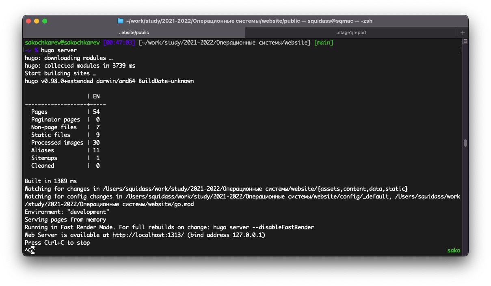{#fig:005}

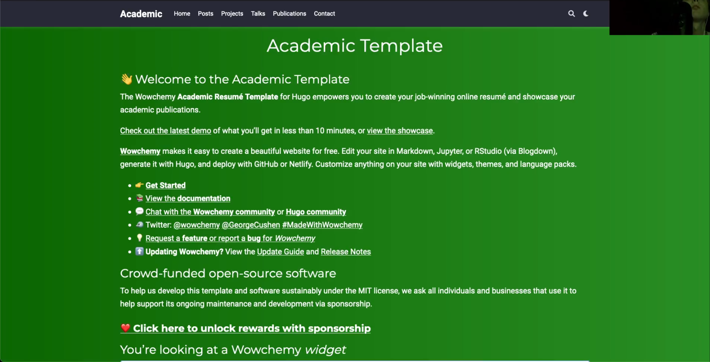{#fig:006}

После этого командой `rm content/home/demo.md` был удален лишний файл, и после этого сайт стал более презентабельного вида (рис. [-@fig:007]).

{#fig:007}

Далее в GitHub был создан еще один репозиторий, который является репозиторием *GitHub Pages*[^1] (рис. [-@fig:008]). Для того, чтобы он был таким, необходимо чтобы он имел специальное имя. В моем случае это `freedandar.github.io`.

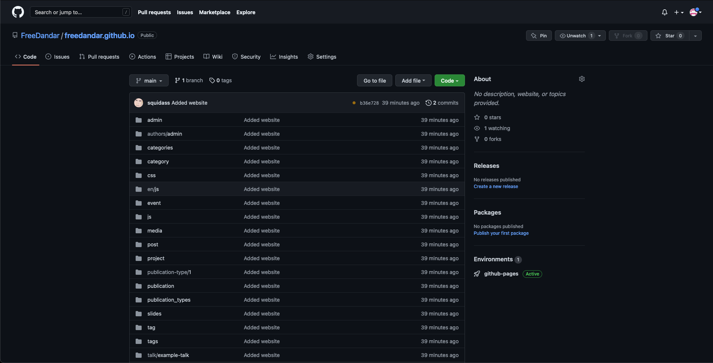{#fig:008}

[^1]: GitHub Pages -- это хостинг статических сайтов от GitHub.

После того, как данный репозиторий был создан, он был склонирован на локальную машину (рис. [-@fig:009]).

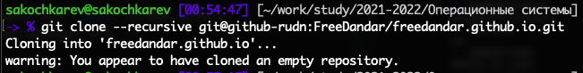{#fig:009}

Далее, для тестирования работоспособности и правильной настройки репозитория на локальной машине был добавлен файл `README.md`, который позже был успешно загружен в репозиторий (рис. [-@fig:010]).

{#fig:010}

Следующим шагом была настройка репозитория website с шаблоном сайта. 

Для этого, первым делом был изменен `.gitignore` файл, в котором была закомментирована строка с игнорированием папки public (рис. [-@fig:011]).

{#fig:011}

После этого была выполнена команда `git submodule add -b main git@github-rudn:FreeDandar/freedandar.github.io.git public` (рис. [-@fig:012]), которая позволила контролировать оба репозитория, работая только над одним. Таким образом изменяя website репозиторий, в GitHub Pages репозиторий будет автоматически грузится публичная (измененная) версия сайта.

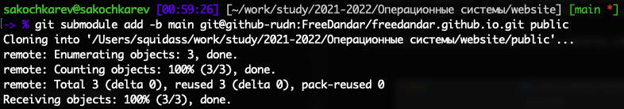{#fig:012}

После того, как два репозитория были успешно "связаны", командой `hugo` был "сконструирован" сайт и все статические файлы (рис. [-@fig:013]).

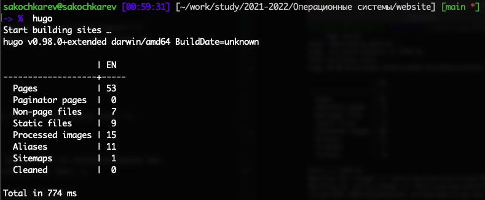{#fig:013}

По окончании процесса все новые файлы были добавлены в отслеживание git и загружены в репозиторий (рис. [-@fig:015]). Как уже было сказано ранее, этот процесс также автоматически добавляет "сконструированный" сайт в репозиторий GitHub Pages.

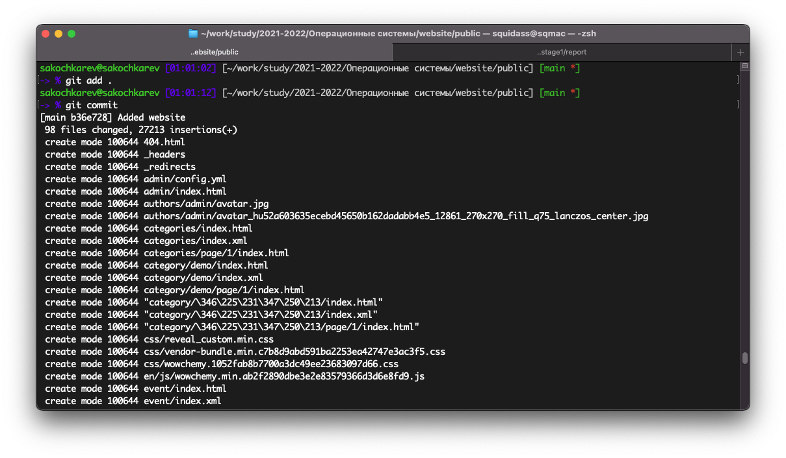

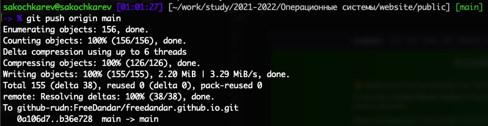{#fig:015}

После загрузки сконструированного сайта, был проверен репозиторий GitHub Pages, а вернее его публичный адрес `freedandar.github.io`, на котором появился загруженный сайт (рис. [-@fig:016]). Это ознаменовало успешное завершение первого этапа индивидуального проекта.

{#fig:016}

# Выводы

По окончании первого этапа индивидуального проекта мы познакомились с генератором статических сайтов **Hugo**, а также изучили дополнительные команды git.

# Приложения

- Генератор статических сайтов Hugo
- Шаблон Hugo Academic Theme
