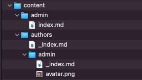
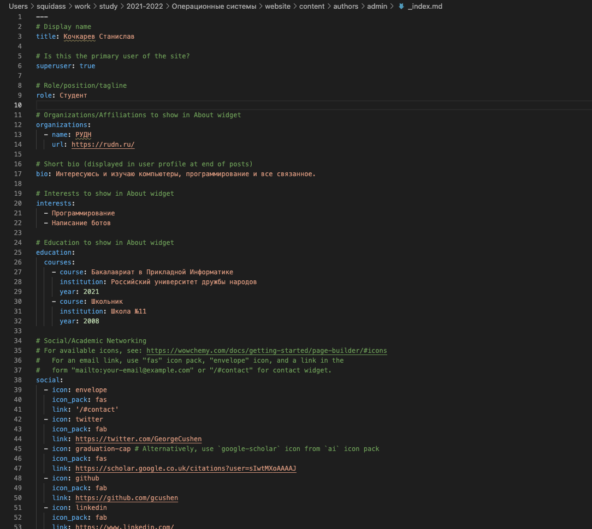
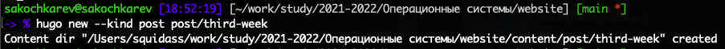
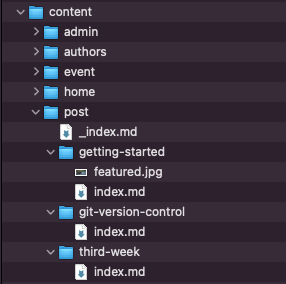
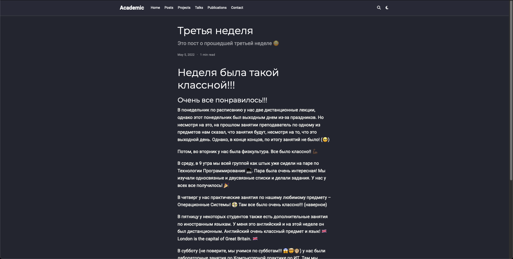
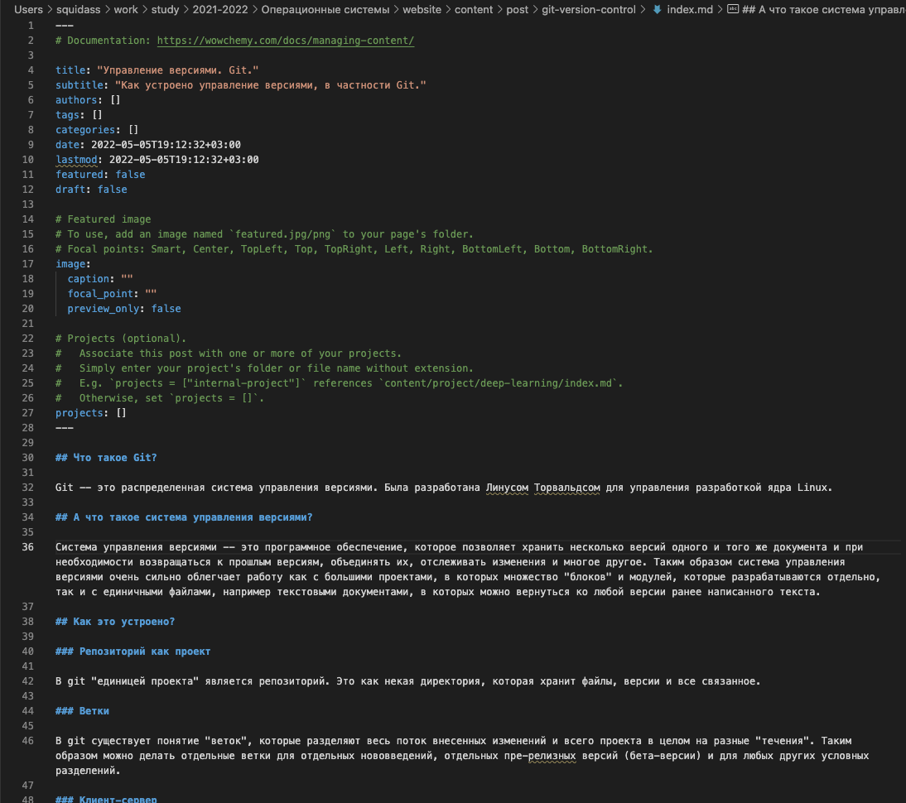
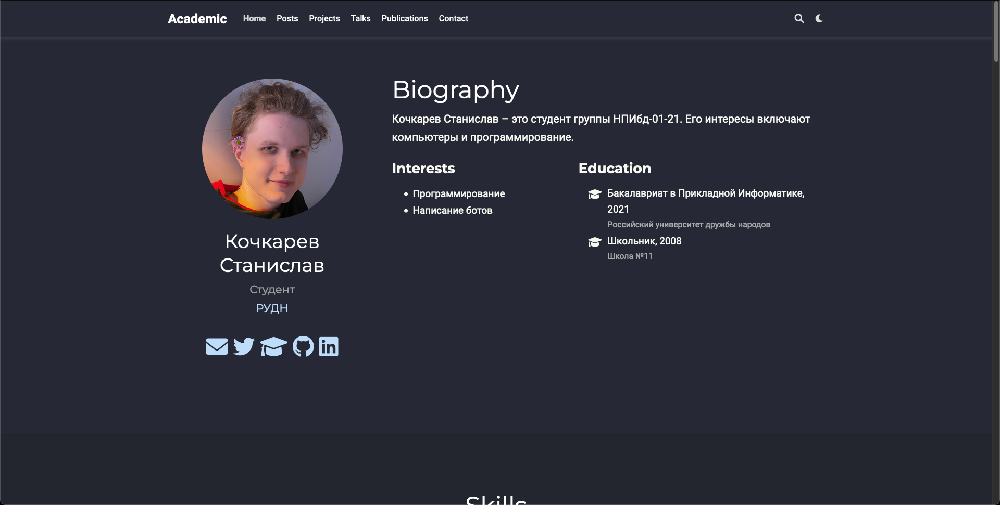

## Цель работы

Цель индивидуального проекта -- создание персонального сайта научного работника. 
Сайт должен быть по шаблону и включать в себя такие блоки, как посты, информацию о себе, 
информацию об образовании и др. Сайт должен находится на GitHub Pages. 

## Задание

- Список добавляемых данных.
  - Разместить фотографию владельца сайта.
  - Разместить краткое описание владельца сайта (Biography).
  - Добавить информацию об интересах (Interests).
  - Добавить информацию от образовании (Education).
- Сделать пост по прошедшей неделе.
- Добавить пост на тему по выбору:
  - Управление версиями. Git.
  - Непрерывная интеграция и непрерывное развертывание (CI/CD).

# Выполнение лабораторной работы

## {.standout}

Первым заданием было размещение персональных данных на вебсайте.

##

Определения названия файла, который отображается как аватар. `avatar.png`, по пути `authors/admin/avatar.png`.

## {.standout}

Для размещения краткого описания владельца сайта было необходимо понять структуру и расположение файлов со всей информацией. Было выяснено, что большая часть необходимой для изменения информации размещена в *.md* файлах, которые иерархически расположены в папке content.

##

Файл `_index.md`, находящийся в `content/authors/admin/_index.md`. Все пункты первого задания: краткое описание, интересы и образование находились в этом одном файле.

## {.standout}

Следующим заданием было создание первого поста -- поста про прошедшую неделю.

##

В документации статья про добавление поста. Делалось это командой `hugo new  --kind post post/third-week`. По выполнении данной команды по пути `content/post/` создавалась директория с указанным именем и `index.md` файлом внутри.

##

##

##

## {.standout}

Последние задание было аналогичным предыдущему -- нужно было написать пост по выбранной теме. 

##

Выбранная тема -- "**Управление версиями. Git.**". Командой `hugo new  --kind post post/git-version-control`) был создан шаблон поста.

##

> Для теста сайта и правильности внесенных изменений сайт работал на локальной машине (`hugo server`).

##

# Выводы

По окончании второго этапа индивидуального проекта мы изучили файловую структуру сайта, внесли изменения и добавили персональные данные. Также было написано два поста.
