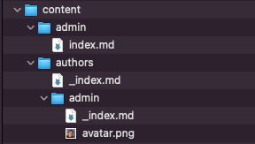
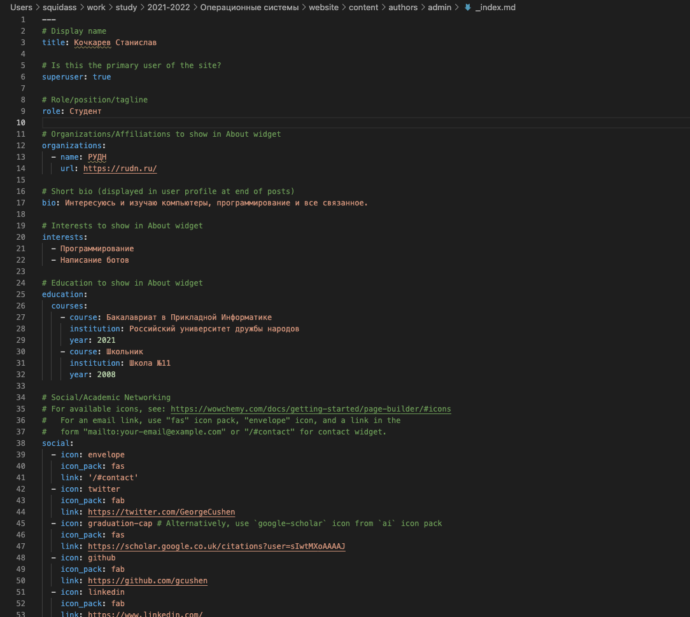
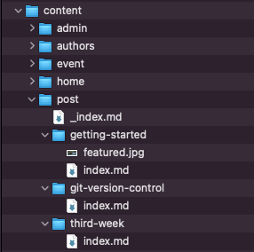
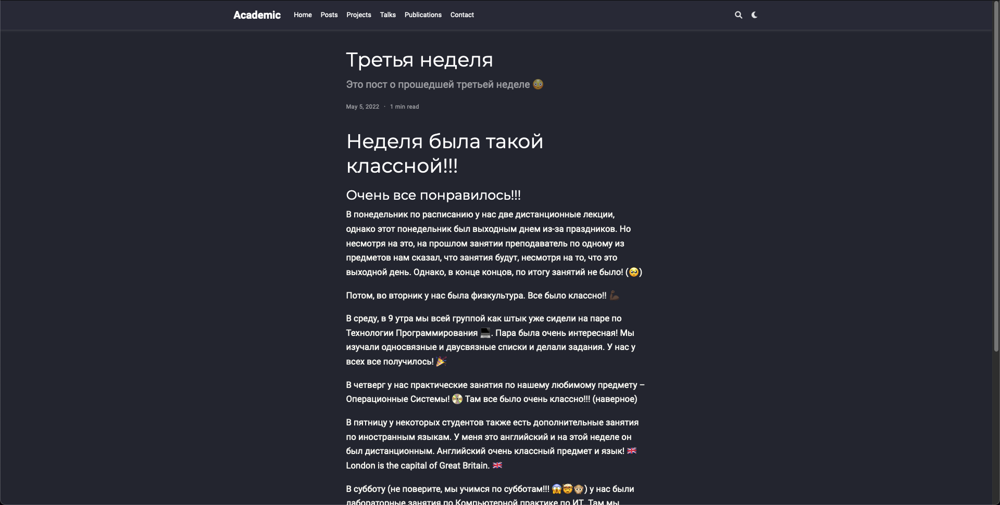
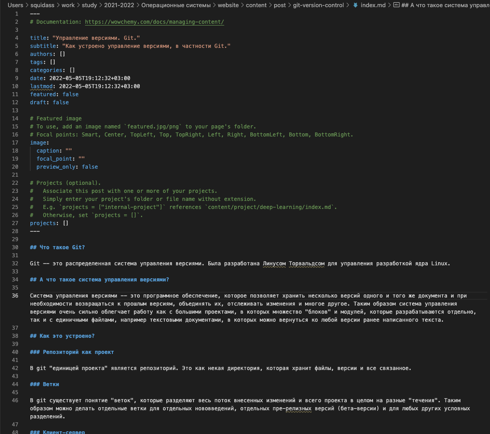
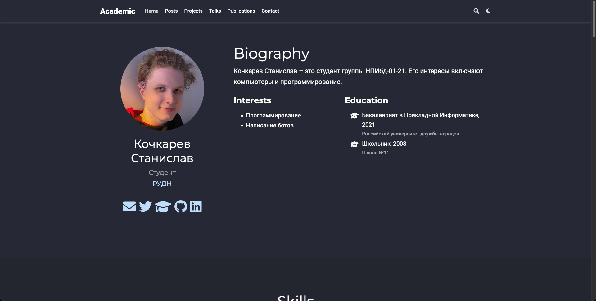

# Цель работы

Цель индивидуального проекта -- создание персонального сайта научного работника. 
Сайт должен быть по шаблону и включать в себя такие блоки, как посты, информацию о себе, 
информацию об образовании и др. Сайт должен находится на GitHub Pages. 

# Задание

- Список добавляемых данных.
  - Разместить фотографию владельца сайта.
  - Разместить краткое описание владельца сайта (Biography).
  - Добавить информацию об интересах (Interests).
  - Добавить информацию от образовании (Education).
- Сделать пост по прошедшей неделе.
- Добавить пост на тему по выбору:
  - Управление версиями. Git.
  - Непрерывная интеграция и непрерывное развертывание (CI/CD).

# Выполнение лабораторной работы

Первым заданием было размещение персональных данных на вебсайте.

Для размещения фотографии был использован инспектор элементов в браузере для определения названия файла, который отображается как аватар. Было определено, что это `avatar.png`, который находится по пути `authors/admin/avatar.png`. Замена фотографии была произведена простой заменой изначального файла на мой файл, который был также переименован в `avatar.png` (рис. [-@fig:001]).

{#fig:001}

Для размещения краткого описания владельца сайта было необходимо понять структуру и расположение файлов со всей информацией. Было выяснено, что большая часть необходимой для изменения информации размещена в *.md* файлах, которые иерархически расположены в папке `content`.

Конкретно для этого задания нас интересовал файл `_index.md`, находящийся в той же директории, что и аватар (`content/authors/admin/_index.md`). В нем достаточно просто было разобраться что, где и за что отвечает, поэтому изменение изначальной информации не составило труда. Все пункты первого задания: краткое описание, интересы и образование находились в этом одном файле. После изменения и удаления ненужной изначальной информации файл был сохранен (рис. [-@fig:002]).

{#fig:002}

Следующим заданием было создание первого поста -- поста про прошедшую неделю.

Для этого мы обратились к документации, в которой была статья про добавление поста. Делалось это командой `hugo new`, в нашем случае `hugo new  --kind post post/third-week` (рис. [-@fig:003]). По выполнении данной команды по пути `content/post/` создавалась директория с указанным именем и `index.md` файлом внутри (рис. [-@fig:004]). Именно его и нужно изменять чтобы написать пост. После написания поста и изменения некоторых настроек в метадата блоке достаточно было сохранить файл, чтобы сайт автоматически обработал его и перезагрузился с уже добавленным постом (рис. [-@fig:005]).

{#fig:003}

{#fig:004}

{#fig:005}

Последние задание было аналогичным предыдущему -- нужно было написать пост по выбранной теме. 

Тему я выбрал "**Управление версиями. Git.**". Идентичной командой (`hugo new  --kind post post/git-version-control`) был создан шаблон поста. Далее, в файле `index.md` был написан сам пост (рис. [-@fig:006]). После сохранения файла пост бал автоматически добавлен на сайт.

{#fig:006}

> Для теста сайта и правильности внесенных изменений сайт работал на локальной машине (`hugo server`).

После выполнения всех заданий изменения были записаны и выгружены в GitHub (рис. [-@fig:007]).

{#fig:007}

# Выводы

По окончании второго этапа индивидуального проекта мы изучили файловую структуру сайта, внесли изменения и добавили персональные данные. Также было написано два поста.

# Приложения

- Генератор статических сайтов Hugo
- Шаблон Hugo Academic Theme
