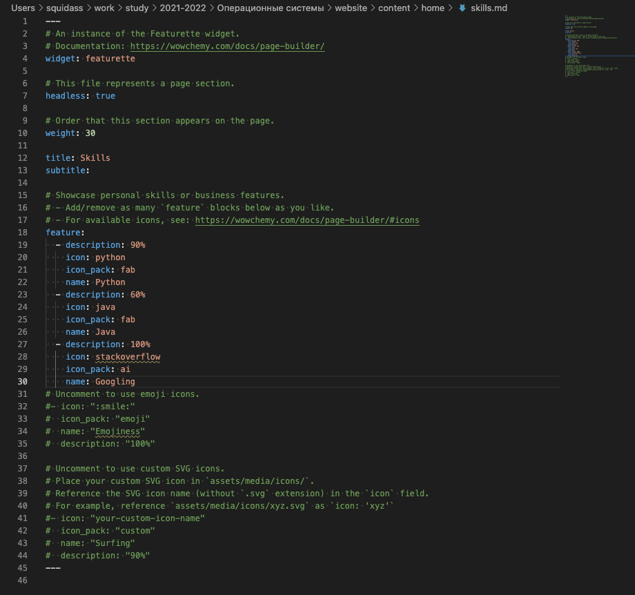
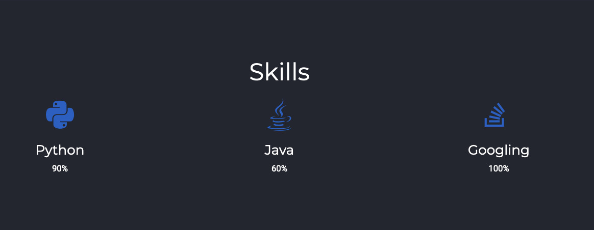
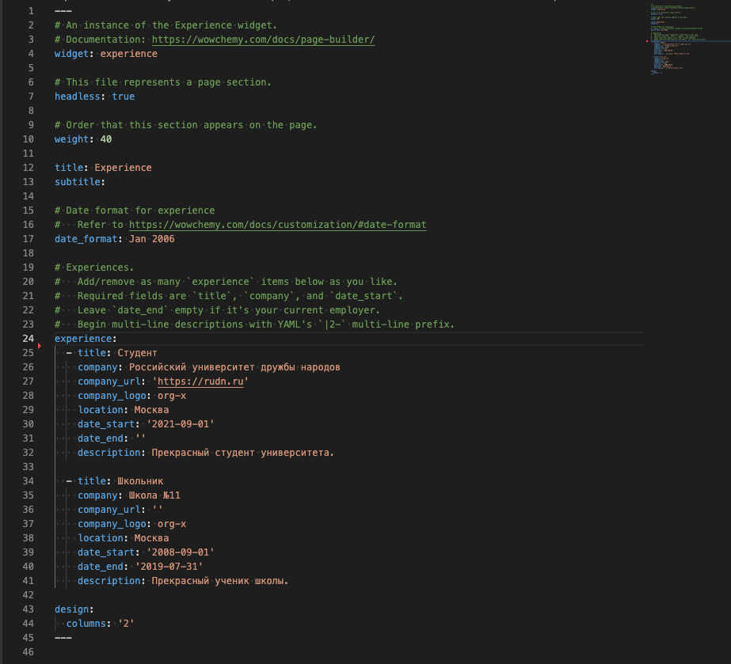
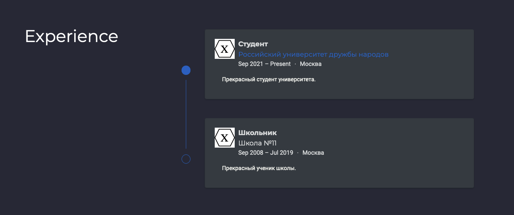
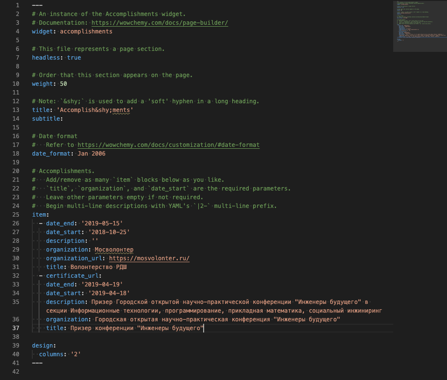
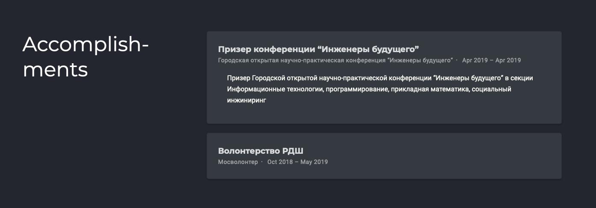
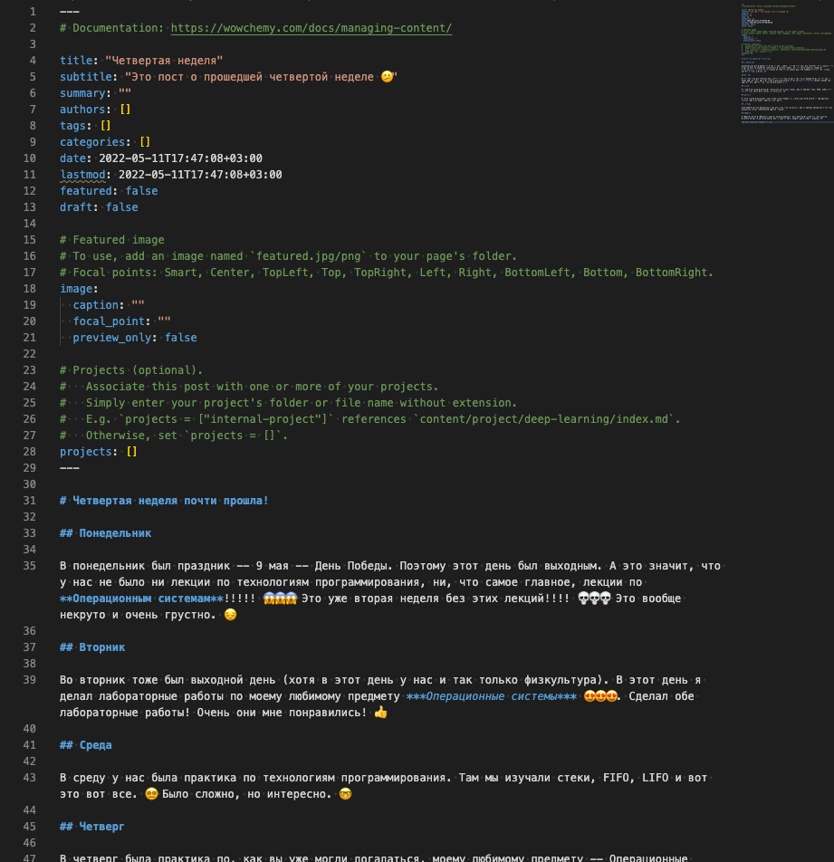
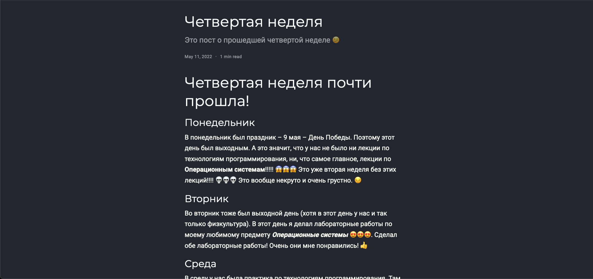
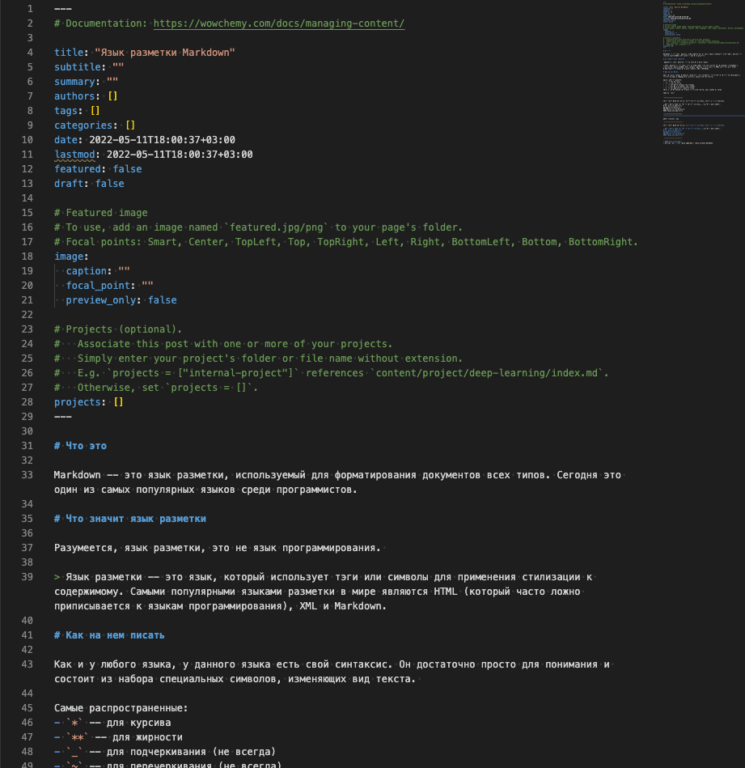
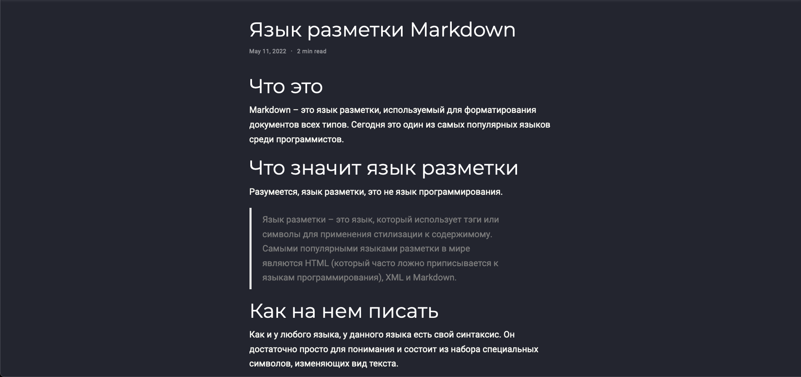

## Цель работы

Цель индивидуального проекта -- создание персонального сайта научного работника. 
Сайт должен быть по шаблону и включать в себя такие блоки, как посты, информацию о себе, 
информацию об образовании и др. Сайт должен находится на GitHub Pages. 

## Задание

- Список добавляемых данных.
  - Добавить информацию о навыках (Skills)
  - Добавить информацию об опыте (Experience)
  - Добавить информацию о достижениях (Accomplishments)
- Сделать пост по прошедшей неделе.
- Добавить пост на тему по выбору:
  - Легковесные языки разметки.
  - Языки разметки. LaTeX.
  - Язык разметки Markdown.

# Выполнение лабораторной работы

## {.standout}

Первым заданием было размещение дополнительных данных о себе и своих достижениях на вебсайте.

Файлы skills.md, experience.md и accomplishments.md.

##

Изменение файла `skills.md`.

##

##

Изменение файла `experience.md`

##

##

Изменение файла `accomplishments.md`

##

## {.standout}

Следующим заданием было написание поста про прошедшую неделю.

##

Команда `hugo new  --kind post post/fourth-week`. В файле `index.md` был написан текст поста.

##

## {.standout}

И последним заданием было добавление поста на выбранную тему. Тему я выбрал "Язык разметки Markdown".

##

`hugo new  --kind post post/markdown`

##

##

> Для теста сайта и правильности внесенных изменений сайт работал на локальной машине (`hugo server`).

## {.standout}

После выполнения всех заданий изменения были записаны и выгружены в GitHub.

## Выводы

По окончании второго этапа индивидуального проекта мы дополнительно изучили расположение информации внутри структуры сайта и добавили еще персональных данных. Также было написано два поста.
