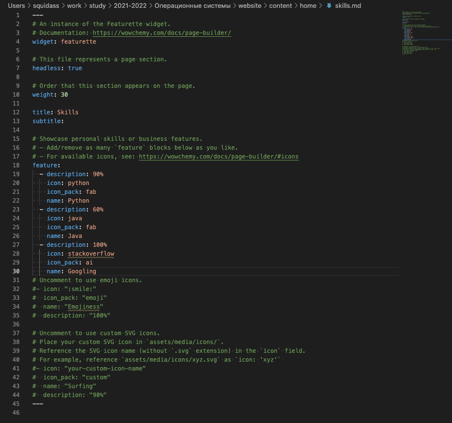
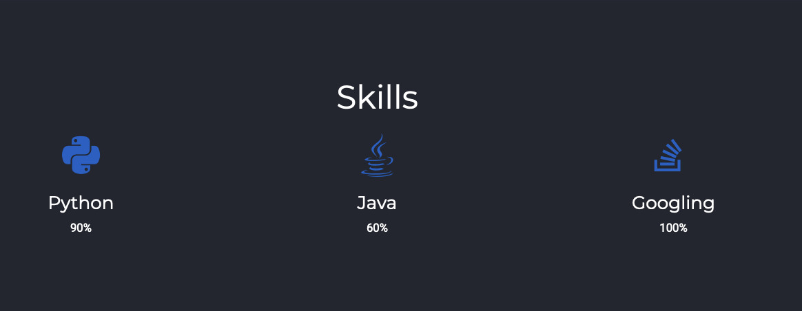
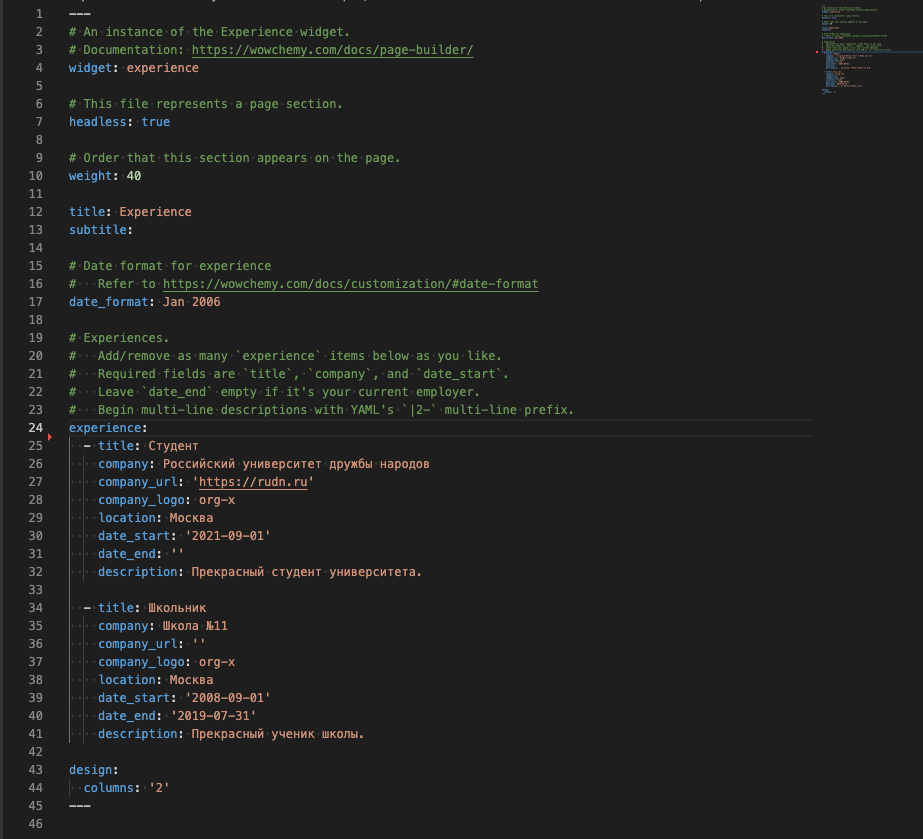
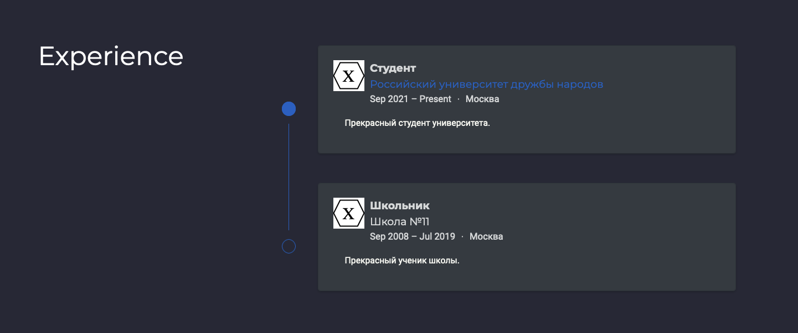
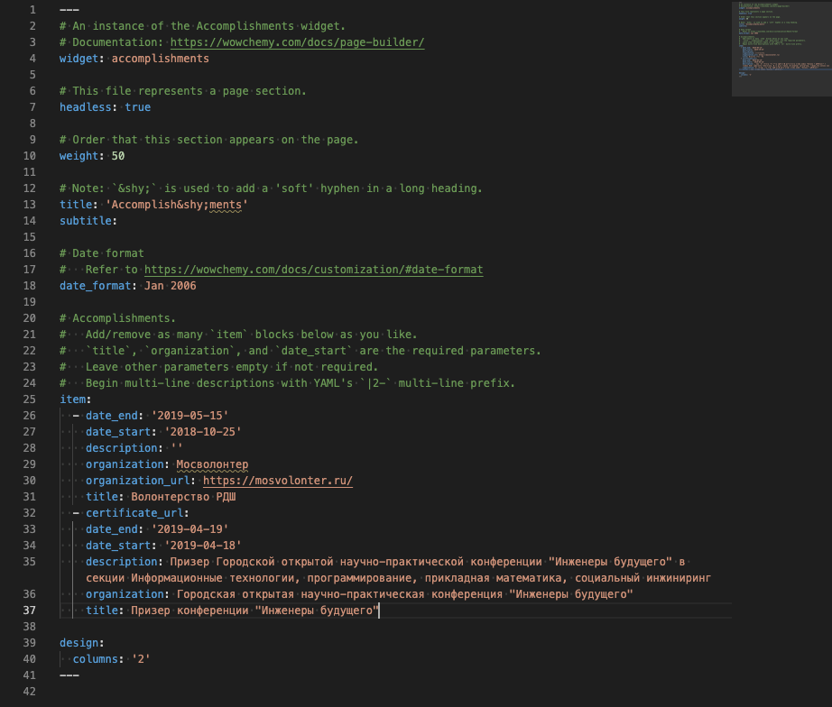
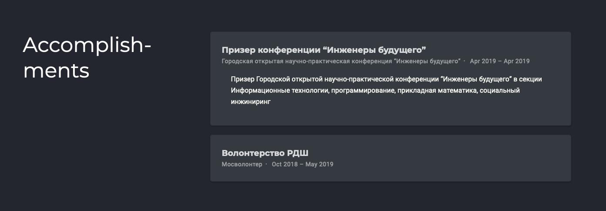
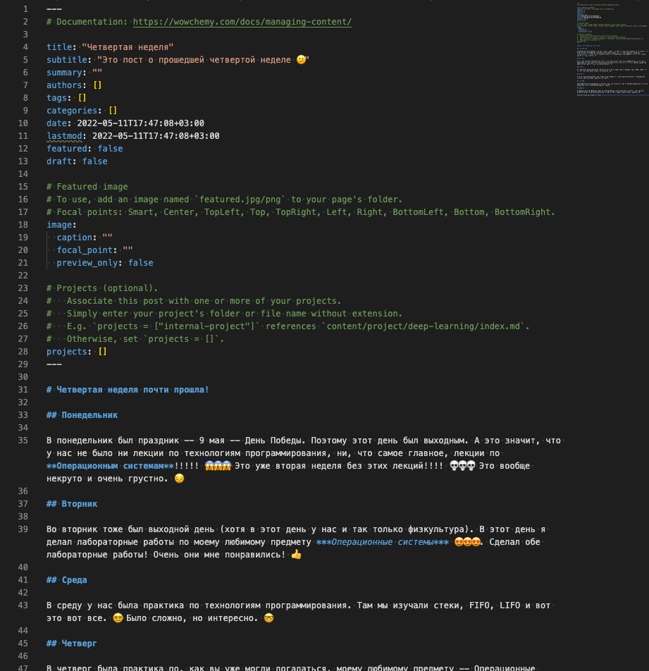
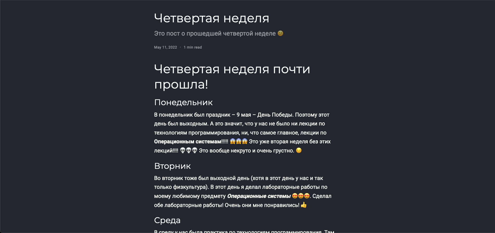
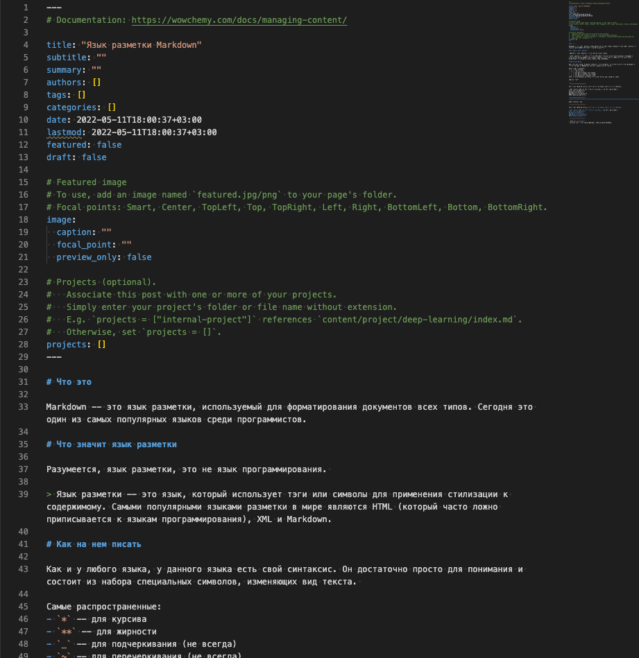
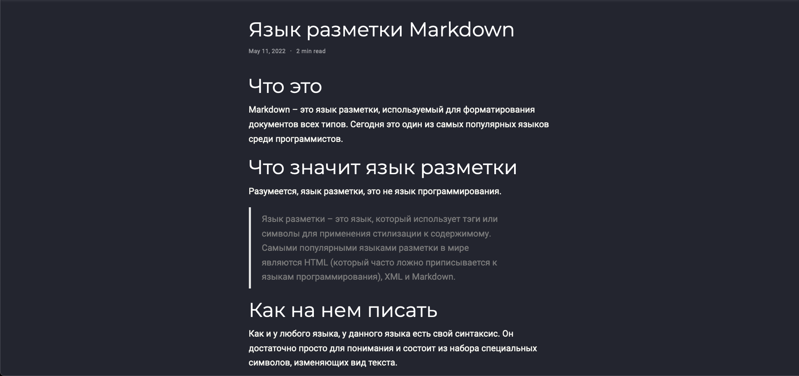

# Цель работы

Цель индивидуального проекта -- создание персонального сайта научного работника. 
Сайт должен быть по шаблону и включать в себя такие блоки, как посты, информацию о себе, 
информацию об образовании и др. Сайт должен находится на GitHub Pages. 

# Задание

- Список добавляемых данных.
  - Добавить информацию о навыках (Skills)
  - Добавить информацию об опыте (Experience)
  - Добавить информацию о достижениях (Accomplishments)
- Сделать пост по прошедшей неделе.
- Добавить пост на тему по выбору:
  - Легковесные языки разметки.
  - Языки разметки. LaTeX.
  - Язык разметки Markdown.

# Выполнение лабораторной работы

Первым заданием было размещение дополнительных данных о себе и своих достижениях на вебсайте.

По опыту предыдущего этапа были найдены интересующие файлы для изменения, а конкретно `skills.md`, `experience.md` и `accomplishments.md`. Каждый файл отвечал за свою категорию (блок) на сайте.

Первым делом было произведено изменение файла `skills.md`, в который были вписаны умения (рис. [-@fig:001]). После сохранения файла на сайте было проверено отображение блока (рис. [-@fig:002]).

{#fig:001}

{#fig:002}

После этого был изменен файл `experience.md`, в который были внесены соответствующие изменения (рис. [-@fig:003]). После перезагрузки на сайте было проверено отображение блока (рис. [-@fig:004]).

{#fig:003}

{#fig:004}

Последними данными для добавления была информация о достижениях. Она находилась в файле `accomplishments.md`. Данный файл был изменен с учетом личной информации (рис. [-@fig:005]) и после его сохранения на сайте было проверено отображение блока (рис. [-@fig:006]).

{#fig:005}

{#fig:006}

Следующим заданием было написание поста про прошедшую неделю.

Используя опыт предыдущего этапа была выполнена команда `hugo new  --kind post post/fourth-week`, которая создала папку с `index.md` файлом, которые в совокупности представляют пост. В файле `index.md` был написан текст поста (рис. [-@fig:007]) и после сохранения файла сайт автоматически перезагрузился и добавил пост (рис. [-@fig:008]).

{#fig:007}

{#fig:008}

И последним заданием было добавление поста на выбранную тему. Тему я выбрал "Язык разметки Markdown".

Сделав ту же самую операцию по созданию нового поста (`hugo new  --kind post post/markdown`) я приступил к написанию поста и изменению файла. После того, как был написан текст поста (рис. [-@fig:009]), файл был сохранен и успешно обновлен на сайте (рис. [-@fig:010]).

{#fig:009}

{#fig:010}

> Для теста сайта и правильности внесенных изменений сайт работал на локальной машине (`hugo server`).

После выполнения всех заданий изменения были записаны и выгружены в GitHub.

# Выводы

По окончании второго этапа индивидуального проекта мы дополнительно изучили расположение информации внутри структуры сайта и добавили еще персональных данных. Также было написано два поста.

# Приложения

- Генератор статических сайтов Hugo
- Шаблон Hugo Academic Theme
