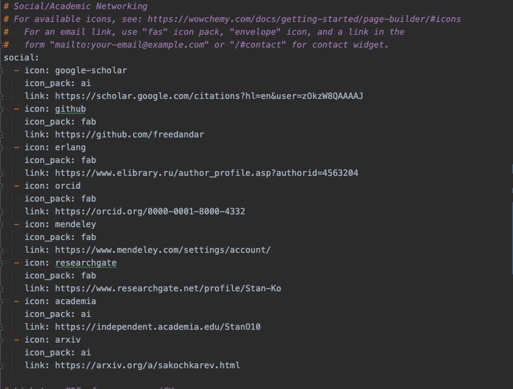
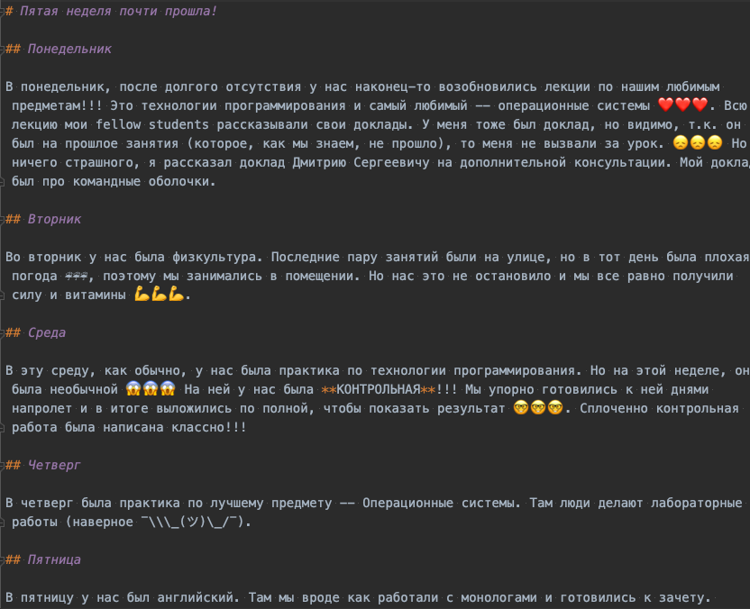
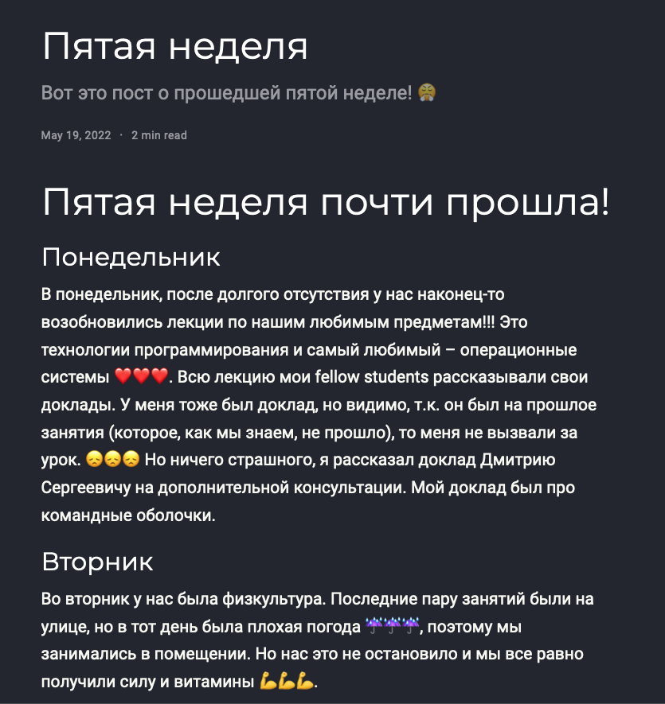
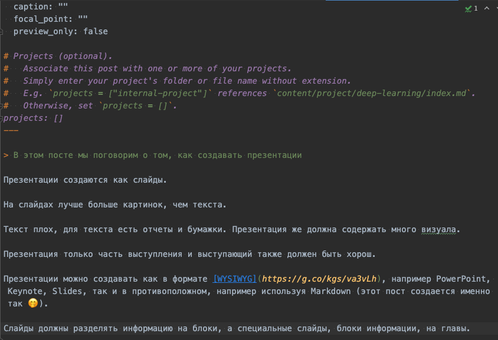

# Цель работы

Цель индивидуального проекта -- создание персонального сайта научного работника. 
Сайт должен быть по шаблону и включать в себя такие блоки, как посты, информацию о себе, 
информацию об образовании и др. Сайт должен находится на GitHub Pages. 

# Задание

- Список добавляемых данных.
  - Ссылки на ресурсы
    - eLibrary : https://elibrary.ru/;
    - Google Scholar : https://scholar.google.com/;
    - ORCID : https://orcid.org/;
    - Mendeley : https://www.mendeley.com/;
    - ResearchGate : https://www.researchgate.net/;
    - Academia.edu : https://www.academia.edu/;
    - arXiv : https://arxiv.org/;
    - github : https://github.com/.
- Сделать пост по прошедшей неделе.
- Добавить пост на тему по выбору:
  - Оформление отчёта.
  - Создание презентаций.
  - Работа с библиографией.

# Выполнение лабораторной работы

Первым заданием была регистрация аккаунтов на приведенных интернет-ресурах.

За кадром (по конфиденциальным причинам) на всех сайтах были зарегистрированы аккаунты. Далее под запись ссылки на ресурсы были добавлены на сайт.

Изменения происходили в файле `content/authors/admin/_index.md`, т.е. том же, где в предыдущих этапах мы изменяли и дополняли информацию о себе (рис. [-@fig:001]). После сохранения файла на сайте было проверено отображение всех ссылок (рис. [-@fig:002]).

{#fig:001}

{#fig:002 width=60%}

Стоит отметить, что изначально не все ссылки отобразились из-за неправильности введенных названий иконок, но после изучения все названия были починены и иконки стали нормально отображаться.

Следующим заданием было создание поста по прошедшей неделе.

Используя уже изученную команду `hugo new  --kind post post/fifth-week`, был создан макет поста. В файле `index.md` был написан текст поста (рис. [-@fig:003]) и после сохранения файла сайт автоматически перезагрузился и добавил пост (рис. [-@fig:004]).

{#fig:003}

{#fig:004}

И последним заданием было добавление поста на выбранную тему. Тему я выбрал "Создание презентаций".

Выполнив ту же команду по созданию нового поста (`hugo new  --kind post post/presentation-creation`) я приступил к написанию поста и изменению файла. После того, как был написан текст поста (рис. [-@fig:005]), файл был сохранен и успешно обновлен на сайте (рис. [-@fig:006]).

{#fig:005}

{#fig:006}

> Для теста сайта и правильности внесенных изменений сайт работал на локальной машине (`hugo server`).

После выполнения всех заданий изменения были записаны и выгружены в GitHub.

# Выводы

По окончании второго этапа индивидуального проекта мы дополнительно изучили расположение информации внутри структуры сайта и добавили еще персональных данных. Также было написано два поста.

# Приложения

- Генератор статических сайтов Hugo
- Шаблон Hugo Academic Theme
