# Цель работы

Цель индивидуального проекта -- создание персонального сайта научного работника. 
Сайт должен быть по шаблону и включать в себя такие блоки, как посты, информацию о себе, 
информацию об образовании и др. Сайт должен находится на GitHub Pages. 

# Задание

- Сделать записи для персональных проектов
- Сделать пост по прошедшей неделе
- Добавить пост на тему по выбору
  - Языки научного программирования

# Выполнение лабораторной работы

Первым заданием было создание записей для персональных проектов.

В качестве персональных проектов и записей по ним были выбраны работы прошлой недели: лабораторная работа №9, лабораторная работа №10 и четвертый этап индивидуального проекта.

Для выполнения данного задания была изучена документация, где была найдена команда создания нового проекта -- `hugo new --kind project project/project-name`. По выполнении данной команды (рис. [-@fig:001]) создалась новая директория в каталоге `content/project` с шаблонным файлом самого проекта. В данном файле и был написан текст проекта (рис. [-@fig:002]). После сохранения файла сайт автоматически перезагрузился и добавил проект (рис. [-@fig:003]).

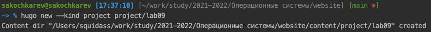{#fig:001}

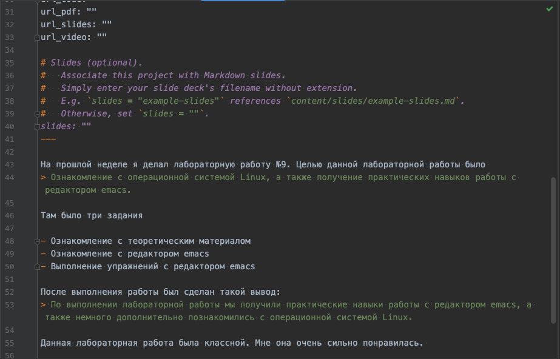{#fig:002}

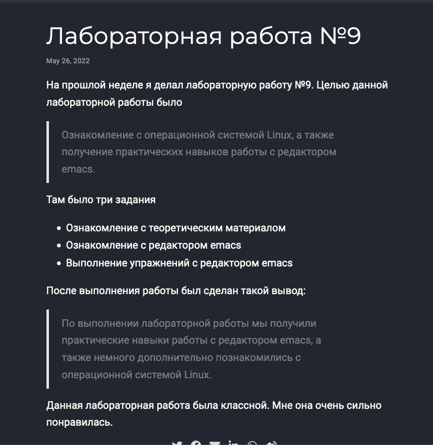{#fig:003}

Те же шаги были выполнены для лабораторной работы №10 (рис. [-@fig:004]) (рис. [-@fig:005]) и четвертого этапа индивидуального проекта (рис. [-@fig:006]) (рис. [-@fig:007]). 

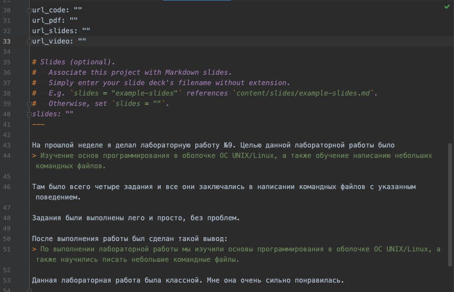{#fig:004}

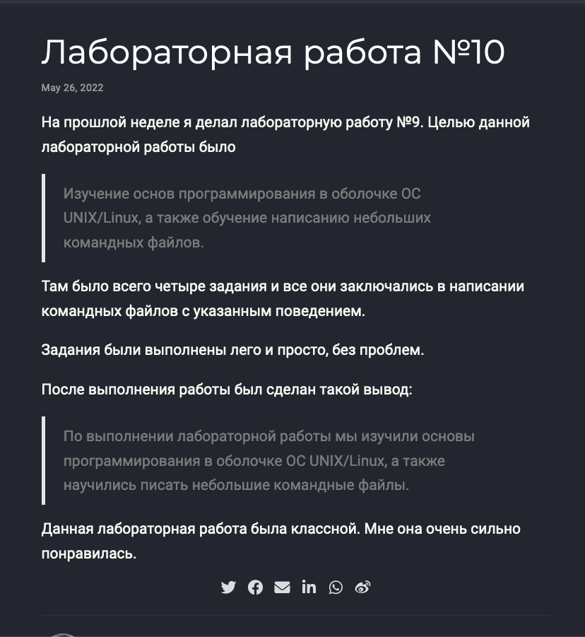{#fig:005}

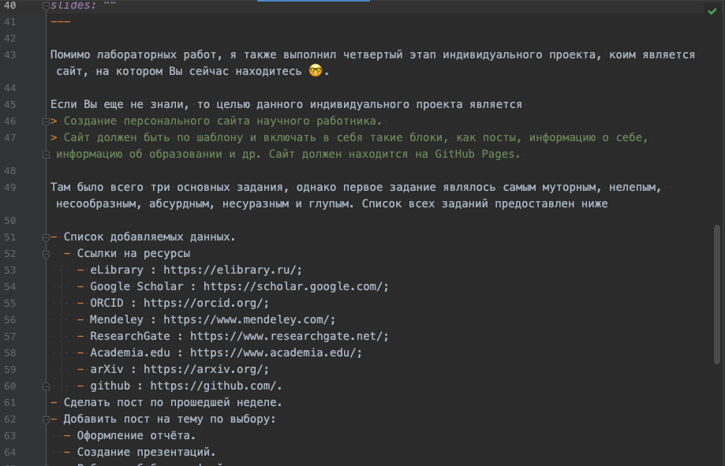{#fig:006}

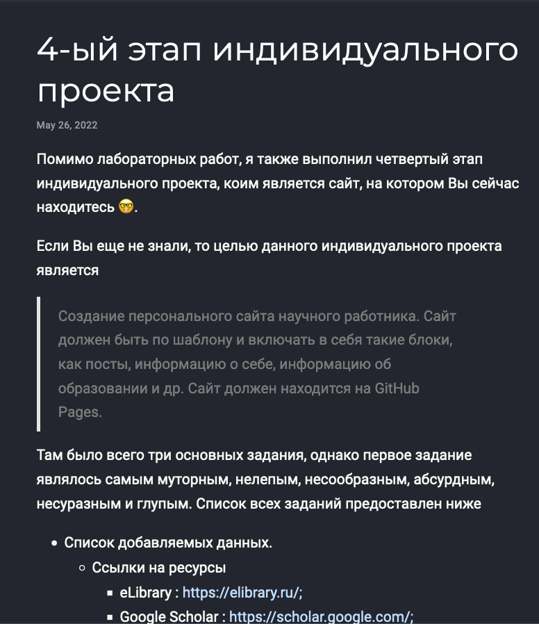{#fig:007}

Следующим заданием было написание стандартного поста по прошедшей неделе.

Используя уже изученную команду `hugo new --kind post post/sixth-week`, был создан макет поста. В файле `index.md` был написан текст поста (рис. [-@fig:008]) и после сохранения файла сайт автоматически перезагрузился и добавил пост (рис. [-@fig:009]).

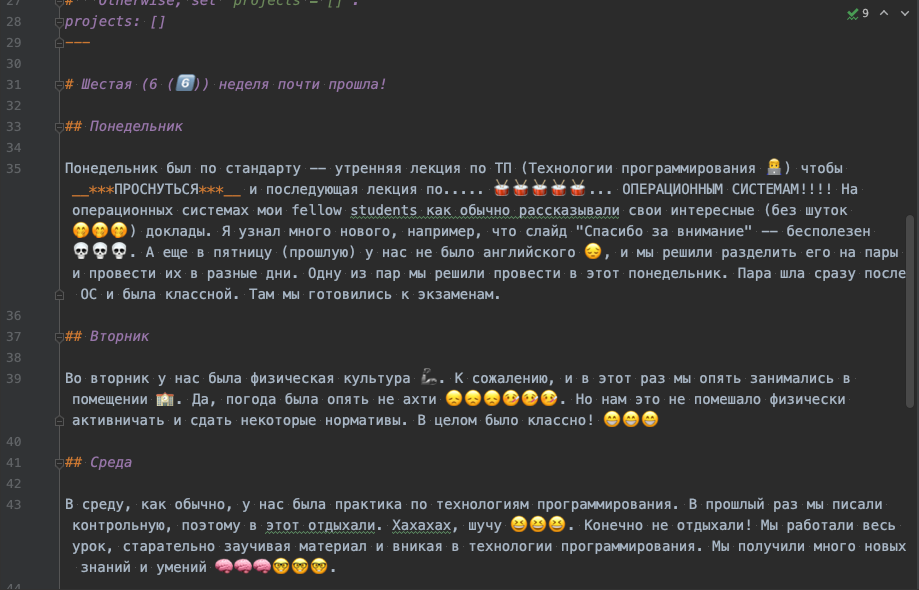{#fig:008}

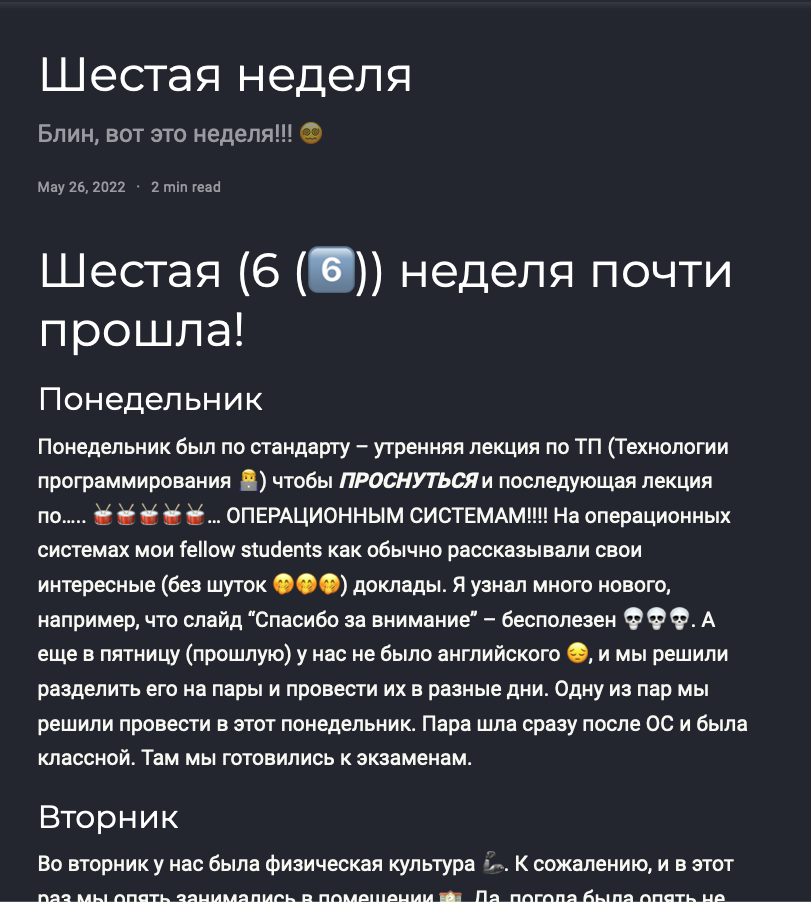{#fig:009}

И последним заданием было добавление поста на выбранную тему. Тем на выбор было много и было трудно выбрать, но в итоге я остановился на "Языки научного программирования".

Выполнив ту же команду по созданию нового поста (`hugo new --kind post post/sci-langs`) я приступил к написанию поста и изменению файла. После того, как был написан текст поста (рис. [-@fig:010]), файл был сохранен и успешно обновлен на сайте (рис. [-@fig:011]).

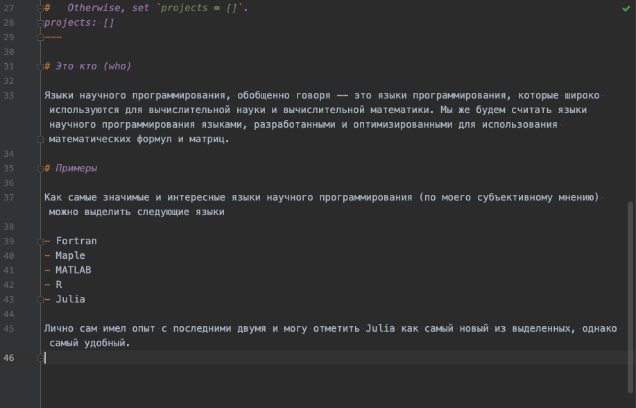{#fig:010}

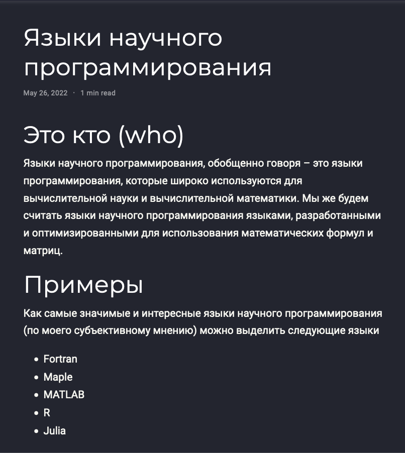{#fig:011}

> Для теста сайта и правильности внесенных изменений сайт работал на локальной машине (`hugo server`).

После выполнения всех заданий изменения были записаны и выгружены в GitHub.

# Выводы

По окончании пятого этапа индивидуального проекта мы дополнительно изучили расположение информации внутри структуры сайта и добавили еще персональных данных. Также было написано два поста.

# Приложения

- Генератор статических сайтов Hugo
- Шаблон Hugo Academic Theme
