# Цель работы

Цель индивидуального проекта -- создание персонального сайта научного работника. 
Сайт должен быть по шаблону и включать в себя такие блоки, как посты, информацию о себе, информацию об образовании и др. Сайт должен находится на GitHub Pages. 

# Задание

- Сделать поддержку английского и русского языков.
- Разместить элементы сайта на обоих языках.
- Разместить контент на обоих языках.
- Сделать пост по прошедшей неделе.
- Добавить пост на тему по выбору (на двух языках).

# Выполнение лабораторной работы

Первые три задания по сути являются одним заданием по поддержке двух языков. 

Первым делом была открыта документация wowchemy, а конкретно [страница про языки](https://wowchemy.com/docs/hugo-tutorials/language/). Там содержатся основные шаги для преобразования сайта в двуязычный.

Следуя инструкции, первым шагом было изменение файла `config/_default/languages.yaml`. Следуя подсказкам в самом файле были раскомментированы и скорректированы строки так, чтобы сайт начал поддерживать два языка. Финальный вид файла приведен (рис. [-@fig:001]).

{#fig:001}

Следующим шагом было изменение языка элементов интерфейса.

Для этого, опять же, следуя инструкции на сайте был скачен файл с русифицированными названиями и помещен по пути `i18n/ru.yaml` (рис. [-@fig:002]). Сам файл выглядит как на (рис. [-@fig:003]).

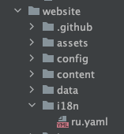{#fig:002}

{#fig:003}

Однако в данном файле содержатся не все элементы интерфейса. Поэтому было необходимо пройтись по другим файлам и изменить содержание каждого из них. 

Однако предварительно, согласно инструкции, содержимое директории `content/` было продублировано по двум папкам: `ru` и `en`. Теперь структура выглядела как на (рис. [-@fig:004]).

{#fig:004}

После этого был создан файл `config/_default/menus.ru.yaml` (рис. [-@fig:005]), который является дубликатом `menus.yaml`. Далее все названия в этом файле были русифицированы. После *navbar* на сайте отображался на русском (рис. [-@fig:006]).

{#fig:005}

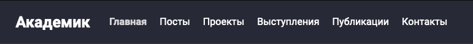{#fig:006}

Далее мы прошлись по всем директориям и файлам каталога `content/ru` и также изменили названия на русский перевод.

На этом работа с русификацией элементов была закончена.

Далее было необходимо перевести на английский все написанные ранее текста: био, посты, проекты и др.

Для этого мы опять обратились к директории `content/`, в которой и находились все написанные ранее материалы.

Там мы опять прошлись по всем файлам, сначала небольшим, таким как био, опыт, достижения и др.

После этого мы приступили к переписыванию всех текстов постов и проектов.

Через некоторое время, все было переписано и синхронизировано между языками.

Финальный облик сайта на русском (рис. [-@fig:007]).

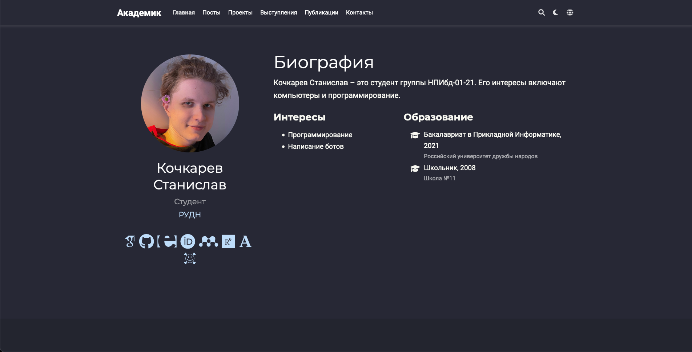{#fig:007}

И на английском (рис. [-@fig:008]).

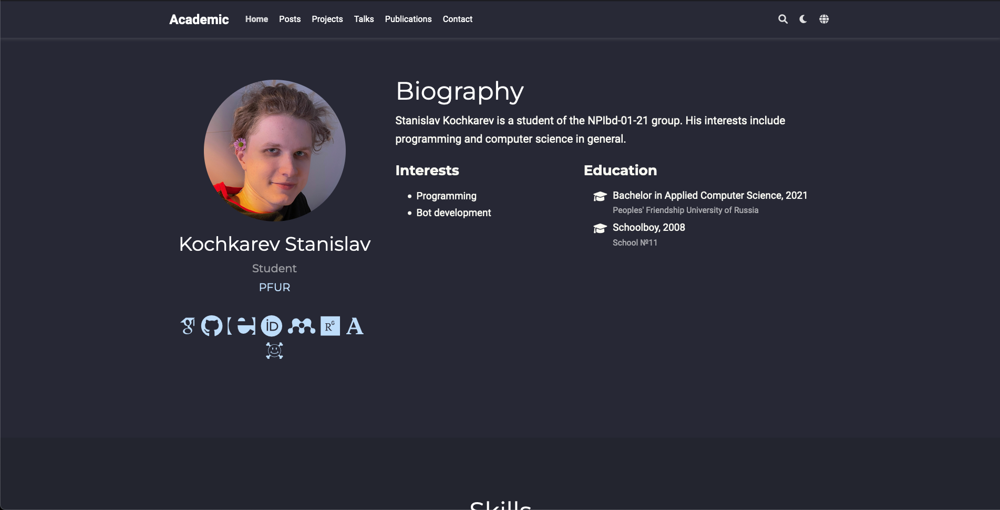{#fig:008}

Далее шли уже знакомые задания по написанию постов.

Первым делом мы написали пост по прошедшей неделе.

Используя уже изученную команду `hugo new --kind post post/seventh-week`, был создан макет поста. В файле `index.md` был написан текст поста (рис. [-@fig:009]) и после сохранения файла сайт автоматически перезагрузился и добавил пост (рис. [-@fig:010]).

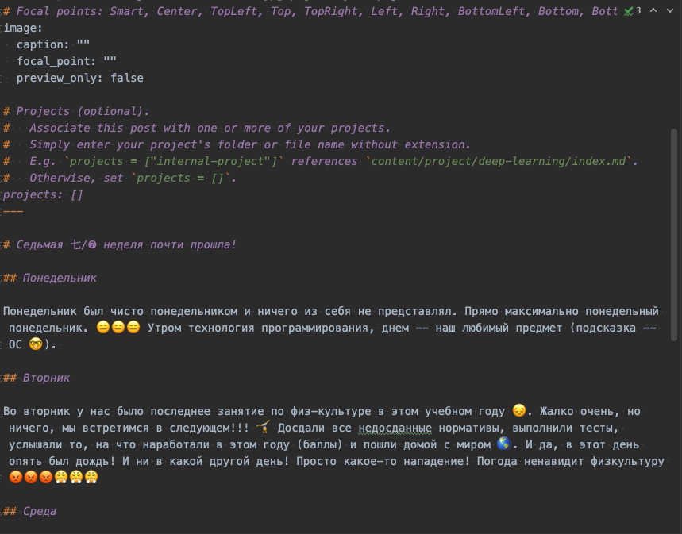{#fig:009}

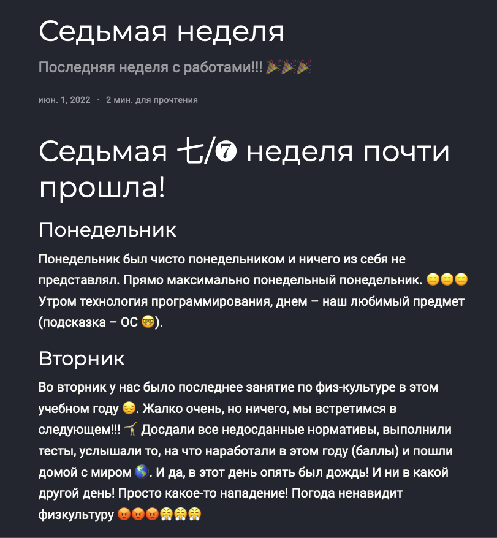{#fig:010}

И последним заданием было добавление поста на выбранную тему. Тем на выбор было еще больше, чем в прошлый раз, поэтому я выбрал тему `wowchemy`.

Выполнив ту же команду по созданию нового поста (`hugo new --kind post post/wowchemy`) я приступил к написанию поста и изменению файла. После того, как был написан текст поста на русском (рис. [-@fig:011]), я перевел его на английский (рис. [-@fig:012]). После файл был сохранен и успешно обновлен на сайте (рис. [-@fig:013]) (рис. [-@fig:014]).

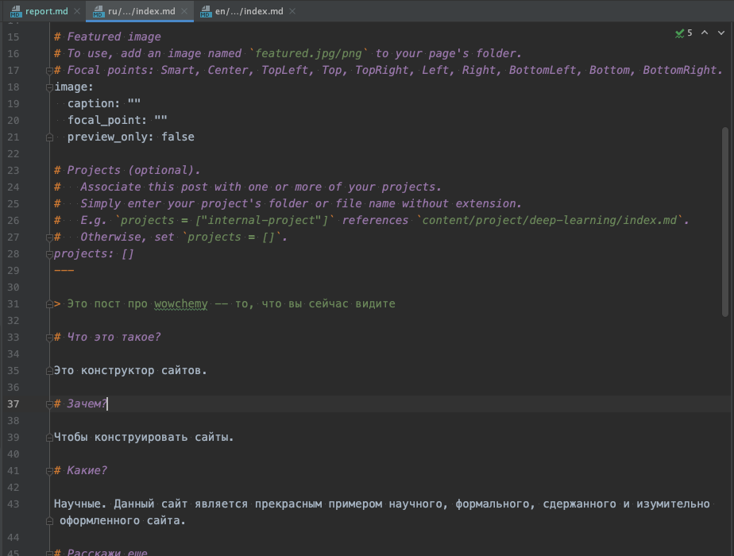{#fig:011}

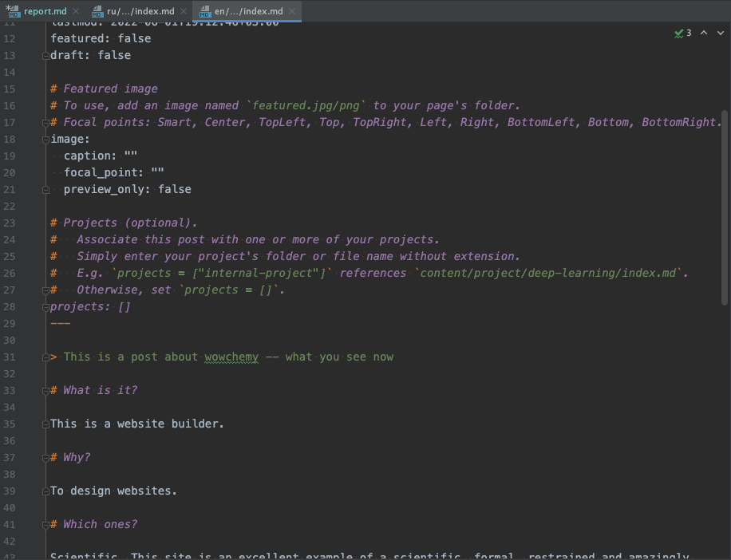{#fig:012}

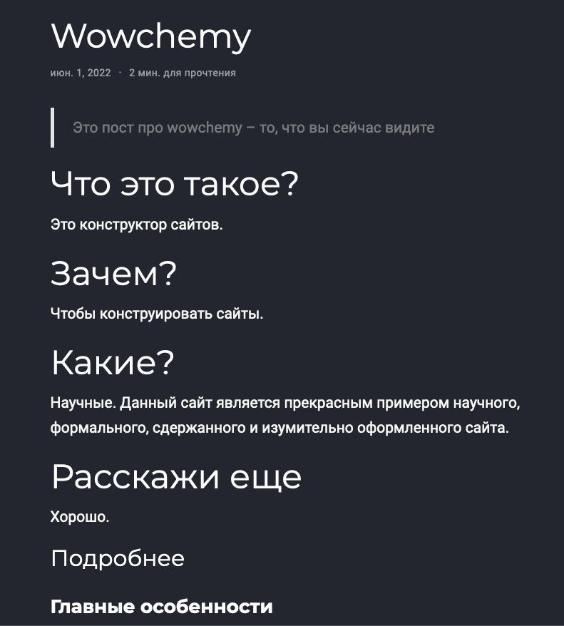{#fig:013}

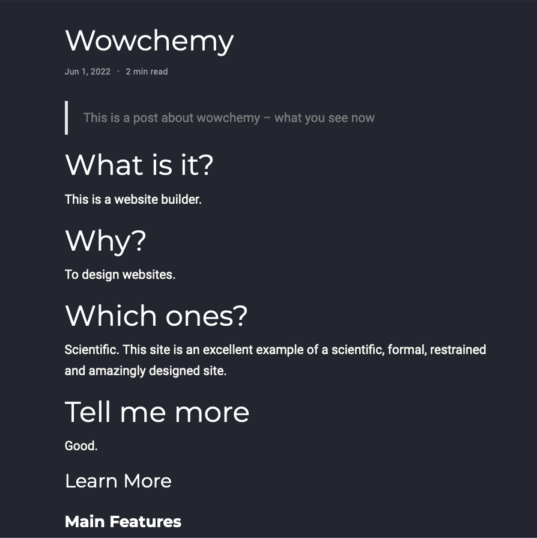{#fig:014}

После того, как все задания были выполнены, было необходимо проверить сайт на домене. После загрузки и проверки выяснилось, что русская версия не работает. Для решения это проблемы было необходимо исправить параметр `baseURL` в файле `config/_default/config.yaml` на домен моего сайта Github Pages -- `https://freedandar.github.io/` (рис. [-@fig:015]).

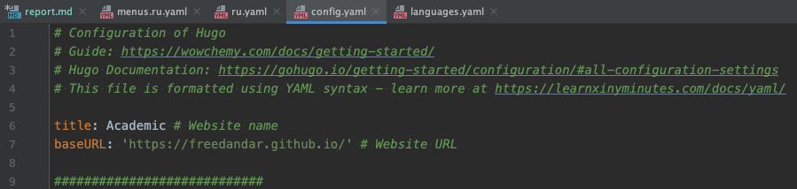{#fig:015}

После этого сайт успешно заработал и на этом индивидуальный проект был успешно завершен.

> Для теста сайта и правильности внесенных изменений сайт работал на локальной машине (`hugo server`).

# Выводы

По окончании шестого этапа индивидуального проекта мы дополнительно изучили расположение информации внутри структуры сайта, а также перевели весь сайт и сделали его двуязычным. Также было написано еще два поста.

# Приложения

- Генератор статических сайтов Hugo
- Шаблон Hugo Academic Theme
